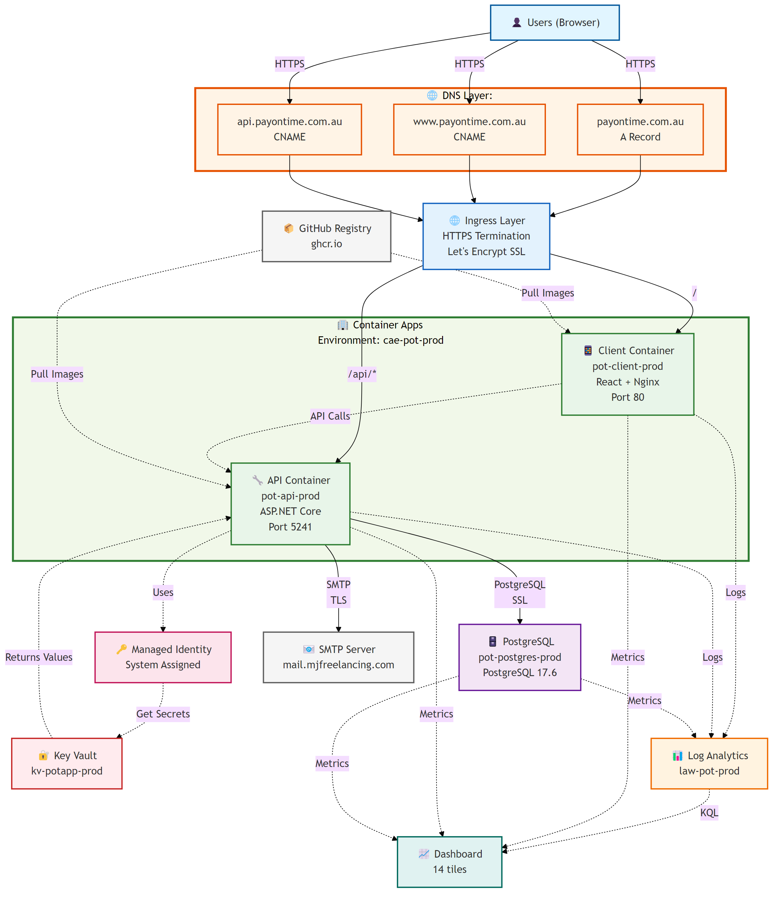

# Azure Deployment Blueprint

**Project**: POT (Personal Finance Tracker)  
**Date Created**: November 2, 2025  
**Deployment Type**: Azure Container Apps + PostgreSQL Flexible Server  
**Target Region**: Australia East  
**Estimated Monthly Cost**: ~$13-18 AUD

---

## Azure Architecture Diagram



**Architecture Overview:**

- **Entry Points**: Custom domains (apex, www, api) with Azure-managed SSL certificates
- **Frontend**: React SPA served by Nginx, static files compiled with Vite
- **Backend**: ASP.NET Core API with JWT authentication, CORS, health checks
- **Database**: PostgreSQL 17.6 with SSL-required connections, automated backups
- **Secrets**: Key Vault integration via Managed Identity (no passwords in env vars)
- **Monitoring**: Centralized logging in Log Analytics, visual dashboard with 14 metrics tiles
- **Deployment**: Container images from GitHub Container Registry (private)
- **Networking**: Shared Container Apps Environment, HTTPS termination at ingress, internal HTTP
- **Email**: External SMTP server for notifications (password reset, invitations)

**Key Security Features:**

- All external traffic uses HTTPS with Let's Encrypt certificates
- Database requires SSL connections
- Secrets stored in Key Vault, accessed via Managed Identity
- API uses JWT token authentication
- CORS restricts API access to client domain only
- Container images in private registry with PAT authentication
  **Diagram Source**: [`Azure-Diagram.mmd`](./Azure-Diagram.mmd)

**Generate High-Quality PNG**:

```powershell
mmdc -i Azure-Diagram.mmd -o pot-azure-diagram.png -w 3840 -H 2160 -s 2
```

**Command Options Explained**:

- `-i Azure-Diagram.mmd` - Input Mermaid diagram file
- `-o pot-azure-diagram.png` - Output PNG filename
- `-w 3840` - Width in pixels (4K resolution for high detail)
- `-H 2160` - Height in pixels (4K resolution, maintains aspect ratio)
- `-s 2` - Scale factor (2x scaling for crisp text and sharp lines at high DPI)

---

## Requirements & Decisions

### Infrastructure & Architecture

**1. Database Backup Strategy**

- **Answer**: Disable automated backups in production (via environment variable)
- **Implementation**: Backups only run in development/local mode
- **Cloud Strategy**: Rely on Azure PostgreSQL automatic backups (7-35 day retention)
- **Decision**: No Azure Blob Storage for backups (cost savings)

**2. Environment Strategy**

- **Answer**: Single production environment
- **Local Development**: Continue using Docker Compose locally
- **Production**: Azure Container Apps

**3. CI/CD Platform**

- **Answer**: GitHub Actions
- **Goal**: Learn GitHub Actions while implementing deployment automation

**4. Domain & SSL Strategy**

- **Answer**: Start with Azure-provided subdomain
- **Future**: Add custom domain once initial setup is validated
- **SSL**: Free Let's Encrypt certificates via Azure Container Apps

**5. Traffic Patterns**

- **Answer**: Extremely low volume
- **Current**: 1-2 users/day, ~100s of requests/day
- **Future**: Ability to scale up if needed

**6. Data Residency**

- **Answer**: Australia East region (final decision)
- **Original Plan**: Southeast Asia for cost optimization
- **Changed**: Minimal cost difference, better latency for Australian users

**7. Static Assets**

- **Answer**: No large static assets
- **Application**: Primarily code bundles

**8. Rate Limiting**

- **Answer**: Implement ASP.NET Core middleware globally
- **Implementation**: Custom middleware or `Microsoft.AspNetCore.RateLimiting`
- **Strategy**: Global rate limiting for all requests

**9. Monitoring Requirements**

- **Answer**: Azure Application Insights
- **Purpose**: Educational + production monitoring
- **Free Tier**: 5GB/month included
- **Scope**: .NET API instrumentation + React frontend integration

**10. Scaling Expectations**

- **Answer**: Truly personal use (1-2 users)
- **Future Consideration**: May grow to 100s of users
- **Approach**: Design for easy scaling when needed

**11. Time vs. Cost Investment**

- **Answer**: Prefer lower maintenance
- **Approach**: Use managed services (PaaS) over VMs

**12. Acceptable Downtime**

- **Answer**: Cold starts and deployment downtime are acceptable
- **Benefit**: Enables consumption-based pricing

**13. Monthly Budget**

- **Answer**: ~$20/month acceptable, prefer cheaper
- **Approach**: Evaluate benefit vs. cost for each service

### Application-Specific Considerations

**14. Backup Strategy**

- **Decision**: Production backups disabled (environment variable controlled)
- **Reliance**: Azure PostgreSQL automatic backups (35-day PITR retention)
- **Local**: Continue backup scripts for development environment only

**15. Database Migration & Schema Changes**

- **Current Size**: 65MB
- **Migration Project**: `Pot.Data.Migrations` (EF Core)
- **Requirement**: Migrations must run before API/client startup
- **Initial Data Strategy**: Start with blank database + use existing import facility
- **Approach**: Mirror Docker entrypoint pattern in Azure Container Apps init containers

**16. Secrets Management**

- **Decision**: Use Azure Key Vault
- **Secrets**: Database connection strings, JWT secrets, SMTP credentials
- **Integration**: Container Apps environment variables reference Key Vault
- **Security**: Managed identities for authentication

**17. Custom Domain Timeline**

- **Decision**: Start with Azure default subdomain
- **Transition**: Add custom domain after initial setup is validated and stable
- **Rationale**: Simplify initial deployment, add complexity incrementally

**18. Database Access Strategy**

- **Primary**: Allow home/work IP address via firewall rules (Option A)
- **Secondary**: Just-in-time (JIT) access for emergencies or remote access (Option C)
- **Tools**: Azure Data Studio, pgAdmin, or psql
- **Configuration**: Manual firewall rule updates as needed

**19. Environment Variables & Configuration**

- **Current Secrets**: Database connection, JWT settings, SMTP credentials
- **Storage**: Azure Key Vault for all sensitive configuration
- **Non-Sensitive**: Container Apps environment variables
- **SMTP Question**: Can use existing SMTP host or migrate to SendGrid/Azure Communication Services
- **Decision Needed**: Verify existing SMTP host accessibility from Azure

**20. Rate Limiting Implementation**

- **Approach**: ASP.NET Core middleware
- **Scope**: Global rate limiting
- **Library Options**: `AspNetCoreRateLimit` or `Microsoft.AspNetCore.RateLimiting` (.NET 7+)

**21. Monitoring Solution**

- **Platform**: Azure Application Insights
- **Coverage**: .NET API + React frontend
- **Free Tier**: 5GB/month
- **Features**: Request tracking, exception logging, performance metrics, live dashboard

**22. Disaster Recovery Requirements**

- **Minimum**: 7 days point-in-time restore
- **Actual**: 35 days retention (maximum available at no additional cost)
- **Implementation**: Configure Azure PostgreSQL Flexible Server backup retention

**23. Security & Compliance**

- **Encryption**: Standard Azure encryption (in-transit and at-rest)
- **Compliance**: No specific requirements beyond standard security practices
- **Network**: SSL/TLS enforced for all connections

**24. Initial Deployment Approach**

- **Strategy**: Manual first deployment (Option A)
- **Purpose**: Learn and validate before automation
- **Documentation**: Capture steps and troubleshooting
- **Automation**: Implement GitHub Actions after successful manual deployment

---

## Cost Optimization Decisions

### Container Registry

- **Decision**: Use GitHub Container Registry (free)
- **Authentication**: GitHub personal access token
- **Tradeoff**: Images stored in GitHub vs. Azure
- **Savings**: ~$7/month

### Database Region

- **Decision**: Australia East (final)
- **Original Plan**: Southeast Asia for ~$3-5/month savings
- **Changed**: Minimal actual cost difference, better local latency

### Backup Storage

- **Decision**: Skip Azure Blob Storage
- **Reliance**: Azure PostgreSQL automatic backups only
- **Savings**: ~$1-2/month

---

## Final Architecture

### Services

1. **Azure Container Apps** (Consumption plan)

   - API Container (ASP.NET Core)
   - Client Container (React + Nginx)
   - Init Container (EF Core migrations)
   - Cost: ~$0-2/month

2. **Azure Database for PostgreSQL Flexible Server**

   - Tier: Burstable B1ms
   - Region: Australia East
   - Backup Retention: 35 days
   - Cost: ~$13-16/month AUD

3. **GitHub Container Registry**

   - Image storage
   - Cost: Free

4. **Azure Key Vault**

   - Secrets management
   - Cost: Free tier (10,000 operations/month)

5. **Azure Application Insights**

   - Monitoring and logging
   - Cost: Free tier (5GB/month)

6. **GitHub Actions**
   - CI/CD pipeline
   - Cost: Free (within included minutes)

### Total Estimated Cost

**~$13-18 AUD/month** (primarily PostgreSQL Flexible Server)

---

## Open Questions

~~1. **SMTP Configuration**: Can existing SMTP host be accessed from Azure, or migrate to SendGrid/Azure Communication Services?~~

- ✅ **RESOLVED**: Existing SMTP works. See Step 3 below.

---

## Deployment Phases

### Phase 1: Azure Infrastructure Setup

- Create Azure subscription and resource group
- Provision PostgreSQL Flexible Server
- Configure firewall rules for database access
- Create Azure Key Vault and store secrets
- Test database connectivity from local machine

### Phase 2: Container Preparation

- Update application configuration for cloud deployment
- Create Dockerfile optimizations for production
- Build and test containers locally
- Push images to GitHub Container Registry

### Phase 3: Database Migration

- Create init container for EF Core migrations
- Test migration process locally
- Migrate schema to Azure PostgreSQL
- Import initial data using existing import facility

### Phase 4: Container Apps Deployment

- Create Azure Container App environment
- Deploy API container with init container
- Deploy React client container
- Configure environment variables and Key Vault references
- Test end-to-end functionality

### Phase 5: Monitoring & Security

- Configure Application Insights
- Implement rate limiting middleware
- Set up alerts and dashboards
- Document database access procedures

### Phase 6: CI/CD Automation

- Create GitHub Actions workflow
- Automate build and push to container registry
- Automate deployment to Container Apps
- Test automated deployment process

### Phase 7: Infrastructure as Code (Future)

- Export ARM/Bicep templates from deployed resources
- Create Bicep/Terraform configuration files
- Store infrastructure templates in version control
- Document infrastructure recreation process
- Benefits: Disaster recovery, environment replication, audit trail

### Phase 8: Custom Domain (Future)

- Purchase custom domain
- Configure DNS records
- Add custom domain to Container Apps
- Configure SSL certificate

---

## Notes

- This document will be updated as deployment progresses
- Troubleshooting steps and lessons learned will be added to each phase
- Configuration samples and scripts will be referenced or embedded as needed

# Actual Steps

## Step 1: Setup Budget and Cost Alerts

**Purpose**: Prevent unexpected Azure charges

1. Navigate to **Cost Management + Billing** → **Budgets**
2. Click **+ Add**
3. Configure:
   - **Name**: `POT-Monthly-Budget`
   - **Reset period**: Monthly
   - **Budget amount**: $25 USD
   - **Alert conditions**: 50%, 75%, 90%, 100%
   - **Action**: Email notification

**Result**: Budget created with 4 alert thresholds

---

## Step 2: Create Resource Group

**Purpose**: Logical container for all POT Azure resources

1. Search for **Resource groups** in Azure Portal
2. Click **+ Create**
3. Configure:
   - **Subscription**: (select subscription)
   - **Resource group name**: `rg-pot-prod`
   - **Region**: `Australia East`
4. Click **Review + create** → **Create**

**Result**: Resource group `rg-pot-prod` created in Australia East

---

## Step 3: Verify SMTP Connectivity from Azure

**Purpose**: Confirm existing SMTP server is accessible from Azure cloud environment

1. Open **Azure Cloud Shell** (click `>_` icon in top menu)
2. Select **Bash** environment
3. Run connectivity test:
   ```bash
   openssl s_client -connect mail.mjfreelancing.com:465
   ```

**Actual Output Received**:

```bash
Connecting to 103.27.34.113
CONNECTED(00000003)
depth=2 C=US, O=Internet Security Research Group, CN=ISRG Root X1
verify return:1
depth=1 C=US, O=Let's Encrypt, CN=R13
verify return:1
depth=0 CN=*.mjfreelancing.com
verify return:1
---
Certificate chain
 0 s:CN=*.mjfreelancing.com
   i:C=US, O=Let's Encrypt, CN=R13
   a:PKEY: rsaEncryption, 2048 (bit); sigalg: RSA-SHA256
   v:NotBefore: Oct  1 19:23:31 2025 GMT; NotAfter: Dec 30 19:23:30 2025 GMT
 1 s:C=US, O=Let's Encrypt, CN=R13
   i:C=US, O=Internet Security Research Group, CN=ISRG Root X1
   a:PKEY: rsaEncryption, 2048 (bit); sigalg: RSA-SHA256
   v:NotBefore: Mar 13 00:00:00 2024 GMT; NotAfter: Mar 12 23:59:59 2027 GMT
---
Server certificate
-----BEGIN CERTIFICATE-----
MIIFFjCCA/6gAwIBAgISBuSZQ2ucnvscv8mqEzBueL5mMA0GCSqGSIb3DQEBCwUA
MDMxCzAJBgNVBAYTAlVTMRYwFAYDVQQKEw1MZXQncyBFbmNyeXB0MQwwCgYDVQQD
EwNSMTMwHhcNMjUxMDAxMTkyMzMxWhcNMjUxMjMwMTkyMzMwWjAeMRwwGgYDVQQD
DBMqLm1qZnJlZWxhbmNpbmcuY29tMIIBIjANBgkqhkiG9w0BAQEFAAOCAQ8AMIIB
CgKCAQEAuuzdNX8CwRkiEasaV7SI+lfU35RvaDYEoLmLJerEqNiFlAEMmRVQSpVn
mDX1c4CSd30+N7hrcVs5iPBMuVKpP8E1wCz6bHydWWDfUbaAJBe56Tv2WXVHzR+/
sdyIi+eSDmiV90vXO2XUoinFTXkOjsMk5hWS8F11oTQTaI6C1PHFosckkyp2Mzkr
X9Yp6ox0AVT6iSaquxfE881fSoz6cD+zI5I91LipVUS31gKIS/eezK69WP0iYMBR
10eGLXri8bjeb0OmYFcoXlqTT87f3ER2xeJNEAdgj1Hr9ZFvsbO/rxnFZsCZg5qK
dBQ+Lp92uij1/8uAR5mUmpioBMm80wIDAQABo4ICNzCCAjMwDgYDVR0PAQH/BAQD
AgWgMB0GA1UdJQQWMBQGCCsGAQUFBwMBBggrBgEFBQcDAjAMBgNVHRMBAf8EAjAA
MB0GA1UdDgQWBBTZgTU4qMrD739eQ/JI0btK2EgWDjAfBgNVHSMEGDAWgBTnq58P
LDOgU9NeT3jIsoQOO9aSMzAzBggrBgEFBQcBAQQnMCUwIwYIKwYBBQUHMAKGF2h0
dHA6Ly9yMTMuaS5sZW5jci5vcmcvMDEGA1UdEQQqMCiCEyoubWpmcmVlbGFuY2lu
Zy5jb22CEW1qZnJlZWxhbmNpbmcuY29tMBMGA1UdIAQMMAowCAYGZ4EMAQIBMC8G
A1UdHwQoMCYwJKAioCCGHmh0dHA6Ly9yMTMuYy5sZW5jci5vcmcvMTAzLmNybDCC
AQQGCisGAQQB1nkCBAIEgfUEgfIA8AB2ABLxTjS9U3JMhAYZw48/ehP457Vih4ic
bTAFhOvlhiY6AAABmaFwZRAAAAQDAEcwRQIhAJ938+QczLtkh9MkABQtyt4zh/lp
yhewhqiSa2s4bLRVAiBydt63u+W0irQMjTx5KBbQ2WPHOspWTivZ5wmpOpxKrAB2
AMz7D2qFcQll/pWbU87psnwi6YVcDZeNtql+VMD+TA2wAAABmaFwbO0AAAQDAEcw
RQIgVUvsipXdIGmO/fWt91SNt52tduTgS5nLlfvZJ8+P2/ACIQDwn9POK8bFaRML
jyumCj2yLcEgLADCmOuSmmmQbvpFWTANBgkqhkiG9w0BAQsFAAOCAQEAgkxu6EJT
Q5eHhveDX21P0IVp0glNuVzO7mk3Qhs8rmGjclID+GPK+AlyFdV23cS/n8oenBEY
vce40kBbgV8K1fk9/nf/F6OZhzJlRlTkDl++KDVpb3dZr+vZFprdld999mySs8l8
h+aN4ItV1cRfM+1mMh1krJF3Fyb7SISTvzmvORVriu905MsE9JFSLBAI7QEchtBZ
zdze5PHXHaEuGYgY3BaRZHJ7jL16BqLi/wKsLtHkIZsB8YQ8T7hpz9BqcRi/f5Yy
UxoOQtdneuAZZa44r32wfLDdH66zLs3hVcIdX0TVBXx5NBieEywBFlT14wtNJl+0
acaMZ8H3TooZPA==
-----END CERTIFICATE-----
subject=CN=*.mjfreelancing.com
issuer=C=US, O=Let's Encrypt, CN=R13
---
No client certificate CA names sent
Peer signing digest: SHA256
Peer signature type: RSA-PSS
Server Temp Key: X25519, 253 bits
---
SSL handshake has read 3154 bytes and written 398 bytes
Verification: OK
---
New, TLSv1.3, Cipher is TLS_AES_256_GCM_SHA384
Server public key is 2048 bit
This TLS version forbids renegotiation.
No ALPN negotiated
Early data was not sent
Verify return code: 0 (ok)
---
220-s132.syd1.hostingplatform.net.au ESMTP Exim 4.98.2 #2 Sun, 02 Nov 2025 12:23:19 +1100
220-We do not authorize the use of this system to transport unsolicited,
220 and/or bulk e-mail.
```

**Key Indicators of Success**:

- `CONNECTED` status
- `Verification: OK`
- SMTP server banner (220 response)
- Valid SSL certificate

**Result**: ✅ Existing SMTP host (`mail.mjfreelancing.com:465`) is accessible from Azure. No code changes or migration needed.

**Decision**: Keep current MailKit implementation. SMTP credentials will be stored in Azure Key Vault (Step 7).

**Future Option**: Consider Azure Communication Services Email (~$0.001 per email, first 100/month free) if SMTP becomes unreliable or if moving email logic to Azure Functions.

---

## Step 4: Provision Azure PostgreSQL Flexible Server

**Purpose**: Create managed PostgreSQL database for production

1. Search for **Azure Database for PostgreSQL servers**
2. Click **+ Create**
3. **Basics tab - Project details**:
   - **Subscription**: (select subscription)
   - **Resource group**: `rg-pot-prod`
4. **Basics tab - Server details**:
   - **Server name**: `pot-postgres-prod` (must be globally unique)
   - **Region**: `Australia East`
   - **PostgreSQL version**: `17` (latest stable)
   - **Workload type**: `Dev/Test` (selects Burstable tier for cost savings: ~$13-16/month vs ~$110+/month for Production)
   - **Compute + storage**: Click **Configure server**
     - **Compute tier**: `Burstable`
     - **Compute size**: `Standard_B1ms` (1 vCore, 2 GiB RAM)
     - **Storage**: `32 GiB`
     - **Storage type**: `Premium SSD` (only option for Burstable tier)
     - **Backup retention**: `35 days` (maximum available, no additional cost)
     - **Backup redundancy**: `Zone redundant` (default)
     - Click **Save**
   - **Availability zone**: `No preference`
5. **Basics tab - Business Critical (High Availability)**:
   - **Zonal resiliency**: `Disabled (99.9% SLA)` (cost-effective for personal use)
   - Leave checkbox unchecked for automatic zone migration
6. **Basics tab - Authentication**:
   - **Authentication method**: `PostgreSQL authentication only`
   - **Administrator login**: `potadmin` (save securely)
   - **Password**: (create strong password, save securely)
   - **Confirm password**: (re-enter password)
   - **Note**: Microsoft Entra (Azure AD) authentication adds unnecessary complexity for personal projects. Current security is sufficient with: firewall IP restrictions, SSL enforcement, strong passwords in Key Vault, and managed identities for app access. Consider Entra authentication if scaling to enterprise with centralized identity management needs.
7. **Networking tab**:
   - **Connectivity method**: `Public access (allowed IP addresses) and Private endpoint` (default selection)
   - **Public access**: Check ✅ "Allow public access to this resource through the internet using a public IP address"
   - **Firewall rules**:
     - Click **"+ Add current client IP address"** to add current IP
     - **Firewall rule name**: Auto-generated (e.g., `Home_2025-11-2_15-22-25`) or customize
     - **Start IP address**: Current IP (auto-filled)
     - **End IP address**: Same as start IP (single IP access)
     - Leave **unchecked** ❌ "Allow public access from any Azure service within Azure to this server"
   - **Private endpoints**: Leave empty (not using for cost savings)
   - **Note**: If IP address changes, update the firewall rule. Add additional rules for other locations (work, etc.) as needed.
8. **Security tab**:
   - **Data encryption key**: `Service-managed key` (default, no additional cost)
   - **Note**: Customer-managed key requires Azure Key Vault for encryption keys (adds complexity). Service-managed encryption is sufficient for personal projects.
9. **Tags tab**: Skip (optional, can add later for organization)
10. Click **Review + create** → **Create**

**Deployment Time**: 5-10 minutes

**Deployment Completed**: 2 November 2025

**Deployment Results**:

- **Connection endpoint**: `pot-postgres-prod.postgres.database.azure.com`
- **Administrator login**: `potadmin`
- **Configuration**: Burstable, B1ms (1 vCore, 2 GiB RAM, 32 GiB storage)
- **PostgreSQL version**: 17.6
- **Availability zone**: 2 (automatically assigned)
- **High availability**: Not enabled (99.9% SLA)
- **Virtual endpoint**: Not enabled
- **Backup retention**: 35 days with zone redundancy

**Important**: Admin credentials saved securely for Key Vault connection string

---

## Step 5: Database Configuration and Testing

**Purpose**: Test database connectivity, enable required extensions, and verify SSL enforcement

### A. Test Database Connection

**Using Azure Data Studio or pgAdmin or DBeaver**:

- **Host**: `pot-postgres-prod.postgres.database.azure.com`
- **Port**: `5432` (default)
- **Database**: `postgres` (default system database)
- **Username**: `potadmin`
- **Password**: (saved admin password)
- **SSL Mode**: `Require` (mandatory for Azure PostgreSQL)

**Connection String Format**:

```
Host=pot-postgres-prod.postgres.database.azure.com;Database=postgres;Username=potadmin;Password=[admin-password];Port=5432;SSL Mode=require;
```

**Verification Steps**:

- Confirm connection succeeds
- Verify SSL encryption is active
- Test basic query: `SELECT version();`
- Expected result: `PostgreSQL 17.6 on x86_64-pc-linux-gnu, compiled by gcc (GCC) 11.2.0, 64-bit`

**Result**: Database connection tested successfully, SSL enforcement confirmed

### B. Enable citext Extension

**Background**: The POT application uses the PostgreSQL `citext` extension for case-insensitive text columns (emails, usernames, account names). Azure PostgreSQL Flexible Server maintains an extension whitelist for security. The `citext` extension must be explicitly enabled via server parameters before migrations can create it.

**Steps**:

1. Navigate to **Azure Database for PostgreSQL flexible servers** → **pot-postgres-prod**
2. In left menu, go to **Settings** → **Server parameters**
3. In the search box at the top, type: `azure.extensions`
4. Click on the **azure.extensions** parameter row
5. In the **Value** dropdown, find and select **CITEXT**
   - **Note**: The dropdown shows all available extensions. `citext` version 1.6 is available in Azure PostgreSQL Flexible Server.
6. Click **Save** at the top of the page
7. **Wait for the update to complete** (1-2 minutes)
   - You'll see a notification when the parameter is updated
   - **No server restart is required** for extension whitelist changes

**Verification**:

Connect to the database and run:

```sql
SELECT * FROM pg_available_extensions WHERE name = 'citext';
```

Expected result:

```
citext | 1.6 | | data type for case-insensitive character strings
```

**Result**: `citext` extension is now whitelisted and available for use. The application's EF Core migrations will automatically create the extension during first deployment.

**Important**: This must be completed **before** deploying the API container (Step 10), as the migrations will fail if `citext` is not whitelisted

---

## Step 6: Create Azure Key Vault

**Purpose**: Securely store application secrets (database credentials, SMTP settings, JWT keys)

1. Search for **Key vaults** in Azure Portal
2. Click **+ Create**
3. **Basics tab**:
   - **Subscription**: (select subscription)
   - **Resource group**: `rg-pot-prod`
   - **Key vault name**: `kv-potapp-prod` (must be globally unique, 3-24 characters) - `kv-pot-prod` was already taken
   - **Region**: `Australia East`
   - **Pricing tier**: `Standard` (sufficient for personal use, ~$0.03 per 10,000 operations)
   - **Days to retain deleted vaults**: `90` (default, allows recovery of accidentally deleted vault)
   - **Purge protection**: `Disable purge protection` (allows permanent deletion if needed)
4. **Access configuration tab**:
   - **Permission model**: `Vault access policy` (simpler than Azure RBAC for small projects)
   - **Access policies**: Leave empty for now (will add managed identity later when creating App Service)
   - **Note**: Creator user account will automatically get full permissions
5. **Networking tab**:
   - **Connectivity method**: `Public endpoint (all networks)` (default)
   - **Note**: Can restrict to specific IP addresses or private endpoints later if needed
6. **Tags tab**: Skip (optional)
7. Click **Review + create** → **Create**

**Deployment Time**: 1-2 minutes

**Deployment Completed**: 2 November 2025

**Result**: Key Vault `kv-potapp-prod` created successfully

---

## Step 7: Add Secrets to Key Vault

**Purpose**: Store sensitive application secrets securely in Key Vault

**Key Vault Strategy**: Only store sensitive data (passwords, secrets, API keys). Non-sensitive configuration (hosts, ports, usernames) will be environment variables.

**What goes in Key Vault vs Environment Variables**:

- ✅ **Key Vault**: Passwords, API keys, signing keys (data that would cause security issues if exposed)
- ❌ **Environment Variables**: Hosts, ports, usernames, feature flags (non-sensitive configuration)

1. **Navigate to Key Vault**:

   - In Azure Portal, go to **Key vaults**
   - Click on **kv-potapp-prod**

2. **Add Database Password**:

   - In left menu under **Objects**, click **Secrets**
   - Click **+ Generate/Import**
   - **Upload options**: `Manual`
   - **Name**: `DatabasePassword`
   - **Value**: (PostgreSQL admin password from Step 4)
   - **Content type**: (leave empty)
   - **Enabled**: `Yes` (default)
   - Click **Create**
   - **Note**: The code builds the connection string from individual parts: `Database:Name`, `Database:Host`, `Database:Username`, `Database:Password`. Only the password is sensitive.

3. **Add SMTP Username**:

   - Click **+ Generate/Import**
   - **Upload options**: `Manual`
   - **Name**: `SmtpUsername`
   - **Value**: (SMTP username)
   - Click **Create**

4. **Add SMTP Password**:

   - Click **+ Generate/Import**
   - **Upload options**: `Manual`
   - **Name**: `SmtpPassword`
   - **Value**: (SMTP password)
   - Click **Create**

5. **Add JWT Signing Key**:
   - Click **+ Generate/Import**
   - **Upload options**: `Manual`
   - **Name**: `JwtSecretKey`
   - **Value**: (JWT secret key - long random string, e.g., 256-bit base64 encoded)
   - Click **Create**

**Naming Convention**: Use PascalCase for secret names (no spaces, hyphens allowed)

**Secrets to Create** (4 total):

- `DatabasePassword` - PostgreSQL admin password only
- `SmtpUsername` - SMTP authentication username
- `SmtpPassword` - SMTP authentication password
- `JwtSecretKey` - JWT signing key

**Non-Sensitive Configuration** (will be environment variables in Step 11):

- Database: Host, Name, Username, Port, SSL Mode
- SMTP: Host, Port
- JWT: Issuer, Audience

**Result**: Only sensitive secrets stored securely in Key Vault (4 secrets total)

---

## Step 8: Prepare Application for Azure Deployment

**Purpose**: Update configuration and create production-ready containers

**Next Phase**: Container preparation and deployment to Azure Container Apps

**What's needed**:

1. Review and update application configuration for cloud environment
2. Create optimized Dockerfiles for production
3. Build and test containers locally
4. Push images to GitHub Container Registry
5. Create Azure Container Apps environment
6. Deploy containers with Key Vault integration

**Current Status**: Infrastructure setup complete (PostgreSQL, Key Vault). Ready to begin container preparation.

---

## Step 9: Build and Push Docker Images to GitHub Container Registry

**Purpose**: Create production Docker images and push to GitHub Container Registry for deployment

**Prerequisites**:

- GitHub account with Container Registry access
- GitHub Personal Access Token (PAT) with `write:packages` scope

**Steps**:

1. **Create GitHub Personal Access Token** (if needed):

   - Go to GitHub → Settings → Developer settings → Personal access tokens → Tokens (classic)
   - Click **Generate new token (classic)**
   - Name: `GitHub Container Registry`
   - Select scope: `write:packages` (this includes `read:packages`)
   - Click **Generate token**
   - **Copy the token** - won't be visible again

2. **Login to GitHub Container Registry** (from local machine):

   ```powershell
   echo YOUR_PAT_TOKEN | docker login ghcr.io -u YOUR_GITHUB_USERNAME --password-stdin
   ```

   Replace `YOUR_PAT_TOKEN` with the token and `YOUR_GITHUB_USERNAME` with GitHub username

3. **Build Server Image**:

   ```powershell
   cd C:\Data\Dev\GitHub\mjfreelancing\POT\Source
   docker build -t ghcr.io/mjfreelancing/pot-server:latest -f Docker/Server/Dockerfile .
   ```

4. **Build Client Image for Azure** (from same directory):

   ```powershell
   docker build `
     --build-arg NGINX_CONFIG=nginx.azure.conf `
     --build-arg VITE_API_BASE_URL=https://pot-api-prod.whiteground-afd18a05.australiaeast.azurecontainerapps.io/api `
     --build-arg VITE_API_TIMEOUT_MS=30000 `
     -t ghcr.io/mjfreelancing/pot-client:latest `
     -f Docker/Client/Dockerfile `
     .
   ```

   **Important - Azure vs Local Builds**:

   - **Azure build** (above): Requires multiple build arguments

     - `NGINX_CONFIG=nginx.azure.conf` - Nginx serves static files only (no API proxy)
     - `VITE_API_BASE_URL` - **Must include `/api` path**: API endpoint URL with `/api` prefix (e.g., `https://pot-api-prod.../api`)
       - This is baked into JavaScript at build time
       - Required because the API routes all have `/api` prefix (`ApiBase = "api"` in server code)
       - nginx.azure.conf has NO proxy - React calls the API server directly
     - `VITE_API_TIMEOUT_MS` - Request timeout for Azure cold starts (30 seconds)
     - React app calls API directly using the baked-in URL
     - Required because Azure Container Apps isolate containers (no shared Docker network)
     - **Note**: Vite environment variables are embedded during build, not runtime

   - **Local build** (for Docker Compose): Omit all build arguments
     ```powershell
     docker build -t pot-client:latest -f Docker/Client/Dockerfile .
     ```
     - Uses default `nginx.conf` (includes API proxy: `/api/` → `http://server:5241/api/`)
     - `VITE_API_BASE_URL` can be empty or relative - nginx proxies API requests to server container
     - Uses `.env.development` file for local Vite configuration
     - Works with Docker Compose where containers share a network

   **Note**: Both images use `Source/` as build context (the `.` after Dockerfile path)

5. **Push Server Image**:

   ```powershell
   docker push ghcr.io/mjfreelancing/pot-server:latest
   ```

6. **Push Client Image**:

   ```powershell
   docker push ghcr.io/mjfreelancing/pot-client:latest
   ```

7. **Verify Images**:
   - Go to GitHub → Profile → Packages
   - Should see `pot-server` and `pot-client` packages
   - Packages will be **Private** by default

**Build Time**: 5-10 minutes (first build, cached builds will be faster)

**Result**: Two production images pushed to GitHub Container Registry:

- `ghcr.io/mjfreelancing/pot-server:latest`
- `ghcr.io/mjfreelancing/pot-client:latest`

**Next Step**: Configure Azure Container Apps to access private GitHub Container Registry

---

## Step 10: Deploy API Container App (and Create Environment)

**Purpose**: Deploy the API container and create the hosting environment

**What is a Container Apps Environment?**
Think of it as a secure boundary that hosts multiple related container apps. It's like a shared "neighborhood" where API and client containers will live together. The environment provides:

- Shared networking and communication between containers
- Shared logging and monitoring (Log Analytics)
- Shared configuration and secrets management
- Isolation from other environments

Create **one environment** (`cae-pot-prod`) while deploying the first app, and it will host **two container apps**:

1. `pot-api-prod` (ASP.NET Core API) ← Creating now
2. `pot-client-prod` (React frontend) ← Creating later

**Prerequisites**:
GitHub credentials needed to access private container images:

- **Registry login server**: `ghcr.io`
- **Username**: GitHub username (e.g., `mjfreelancing`)
- **Password**: GitHub Personal Access Token (from Step 9 - the one with `write:packages` scope)

**Steps to Create**:

1. Search for **Container Apps** in Azure Portal (top search bar)
2. Click **Container Apps** service
3. Click **+ Create**
4. Select **Container App** (NOT Container App Job)
5. **Basics tab - Project details**:
   - **Subscription**: (select subscription)
   - **Resource group**: `rg-pot-prod`
6. **Basics tab - Container App details**:
   - **Container app name**: `pot-api-prod`
7. **Basics tab - Deployment source**:
   - Select **"Container image"**
8. **Basics tab - Container Apps environment**:
   - **Region**: Change to `Australia East` (important: do this first!)
   - Click **"Create new environment"** link
   - **Environment creation dialog - Basics tab**:
     - **Environment name**: `cae-pot-prod`
     - **Zone redundancy**: `Disabled` (cost savings)
   - **Environment creation dialog - Monitoring tab**:
     - **Logs Destination**: Select `Azure Log Analytics` (default, recommended)
     - **Log Analytics workspace**: Select `(New) workspacergpotprod809e` or create new
       - **Suggested name**: `law-pot-prod` (follows Azure naming convention: law = Log Analytics Workspace)
       - This workspace will be used for container logs and monitoring
       - Cost: Free tier (5GB/month), then ~$0.30/GB AUD
   - **Environment creation dialog - Networking tab**:
     - **Public Network Access**: `Enable` (allows incoming traffic from the public internet - default)
       - This is required for your app to be accessible from the internet
     - **Use your own virtual network**: `No` (default, cost-effective)
       - Virtual networks are for advanced scenarios (connecting to on-premises resources, private endpoints)
     - **Enable private endpoints**: `No` (default)
   - Click **Create** (this creates the environment with Log Analytics workspace)
9. Click **Next: Container >**
10. **Container tab**:
    - **Container details**:
      - **Name**: `pot-api-prod`
      - **Image source**: Select `Docker Hub or other registries`
      - **Image type**: Select `Private`
      - **Registry login server**: `ghcr.io`
    - **Registry authentication**:
      - **Authentication type**: `Secret-based` (should be selected by default)
      - **Registry user name**: GitHub username (e.g., `mjfreelancing`)
      - **Registry password**: GitHub Personal Access Token (from Step 9)
    - **Image and tag**:
      - **Image and tag**: `mjfreelancing/pot-server:latest` (full image path with tag)
      - Note: Use format `username/image-name:tag`
    - **Development stack-specific features**:
      - **Development stack**: Select `.NET` (optimizes for ASP.NET Core)
    - **Container resource allocation**:
      - **Workload profile**: `Consumption - Up to 4 vCPUs, 8 Gib memory` (default)
      - **CPU and memory**: `0.25 CPU cores, 0.5 Gi memory` (minimum for cost savings)
    - **Environment variables**: Leave empty (will configure in Step 11)
11. Click **Next: Ingress >**
12. **Ingress tab**:
    - **Ingress**: `Enabled`
    - **Ingress traffic**: `Accepting traffic from anywhere`
      - **Why public access?** React client runs in users' browsers (not in Azure), so it needs internet access to call the API. Security is handled by: CORS configuration (restricts allowed origins), JWT authentication (requires valid tokens), rate limiting middleware, and HTTPS enforcement.
      - **Note**: "Limited to Container Apps Environment" is only for internal microservices that don't need external access.
    - **Ingress type**: `HTTP`
    - **Target port**: `5241` (configured via ASPNETCORE_URLS environment variable)
13. Click **Review + create** → **Create**

**Deployment Time**: 3-5 minutes

**What gets created**:

- Container Apps Managed Environment: `cae-pot-prod`
- Log Analytics Workspace: `law-pot-prod`
- Container App: `pot-api-prod`

**After Deployment**:

- Note the **Application URL**: `https://pot-api-prod.whiteground-afd18a05.australiaeast.azurecontainerapps.io`
- This is the API base URL

**Cost**:

- Environment: No fixed cost (consumption-based)
- Log Analytics: Free tier (5GB/month), then ~$0.30/GB AUD
- Container App: Consumption-based (~$0-1/month for low traffic)

**Security Notes**:

- Azure credentials are encrypted at rest
- PAT can be rotated later by updating the Container App's registry settings (Settings → Containers → Edit and deploy)
- To make packages public later: GitHub → Profile → Packages → Package settings → Change visibility → Public

**Next Step**: Configure environment variables and Key Vault integration (Step 11)

---

## Step 11: Configure Environment Variables and Key Vault Integration

**Purpose**: Enable the API to access secrets from Key Vault and configure required settings

**Why the container is crashing**: The API needs database connection, SMTP settings, and JWT configuration to start. Without these, it crashes on startup.

### Part A: Enable Managed Identity

1. Navigate to **Container Apps** → **pot-api-prod**
2. In left menu, go to **Settings** → **Security** → **Identity**
3. Under **System assigned** tab:
   - Toggle **Status** to **On**
   - Click **Save**
   - Confirm when prompted
4. After saving, copy the **Object (principal) ID** that appears. It will be needed for Key Vault access.
   : `edbfcdea-fb07-4905-be15-94b7171b6a24`

**Result**: Managed identity created for pot-api-prod

### Part B: Grant Key Vault Access

1. Navigate to **Key vaults** → **kv-potapp-prod**
2. In left menu, go to **Access policies**
3. Click **+ Create**
4. **Permissions** tab:
   - **Secret permissions**: Check **Get** and **List** (only these two)
   - Click **Next**
5. **Principal** tab:
   - In search box, paste the **Object ID** copied earlier (`edbfcdea-fb07-4905-be15-94b7171b6a24`)
   - Select the managed identity that appears (should show `pot-api-prod`)
   - Click **Next**
6. **Application (optional)** tab:
   - Leave empty
   - Click **Next**
7. **Review + create** tab:
   - Verify permissions: Get, List
   - Verify principal: pot-api-prod
   - Click **Create**

**Result**: pot-api-prod can now read secrets from Key Vault

### Part C: Get Secret URIs from Key Vault

Before adding environment variables, the full URIs for each secret are needed:

1. In **kv-potapp-prod**, go to **Objects** → **Secrets**
2. For each secret, click on it, then click the current version
3. Copy the **Secret Identifier** (full URI)

URIs needed for:

- `DatabasePassword`
- `JwtSecretKey`
- `SmtpPassword`
- `SmtpUsername`

**URI Format**: `https://kv-potapp-prod.vault.azure.net/secrets/{SecretName}/{VersionId}`

**Note**: The `/{VersionId}` at the end can be removed to always use the latest version.

- `DatabasePassword`: `https://kv-potapp-prod.vault.azure.net/secrets/DatabasePassword`
- `JwtSecretKey`: `https://kv-potapp-prod.vault.azure.net/secrets/JwtSecretKey`
- `SmtpPassword`: `https://kv-potapp-prod.vault.azure.net/secrets/SmtpPassword`
- `SmtpUsername`: `https://kv-potapp-prod.vault.azure.net/secrets/SmtpUsername`

### Part D: Add Key Vault References and Environment Variables

**This is a two-step process**: First, add Key Vault secrets to Container App's secret store. Then, reference those secrets in environment variables.

#### Step 1: Add Key Vault References to Container App Secrets

1. Navigate to **Container Apps** → **pot-api-prod**
2. In left menu, go to **Security** → **Secrets**
3. Click **+ Add**
4. Add each Key Vault secret:

**Add database-password secret**:

- **Key**: `database-password`
- **Type**: Select **Key Vault reference** (radio button)
- **Key Vault secret URL**: Paste `https://kv-potapp-prod.vault.azure.net/secrets/DatabasePassword`
- **Managed identity**: Select **System assigned** (only option, already configured in Part A)
- Click **Add**

**Add smtp-username secret**:

- **Key**: `smtp-username`
- **Type**: **Key Vault reference**
- **Key Vault secret URL**: `https://kv-potapp-prod.vault.azure.net/secrets/SmtpUsername`
- **Managed identity**: **System assigned**
- Click **Add**

**Add smtp-password secret**:

- **Key**: `smtp-password`
- **Type**: **Key Vault reference**
- **Key Vault secret URL**: `https://kv-potapp-prod.vault.azure.net/secrets/SmtpPassword`
- **Managed identity**: **System assigned**
- Click **Add**

**Add jwt-secret-key secret**:

- **Key**: `jwt-secret-key`
- **Type**: **Key Vault reference**
- **Key Vault secret URL**: `https://kv-potapp-prod.vault.azure.net/secrets/JwtSecretKey`
- **Managed identity**: **System assigned**
- Click **Add**

**Result**: Container App now has 4 secrets that reference Key Vault. These will be available in the environment variables dropdown.

#### Step 2: Add Environment Variables

1. In left menu, go to **Application** → **Containers**
2. Select **Environment variables** tab
3. Click **+ Add**

Add the following environment variables one by one:

**Database Configuration**:

| Name                 | Source             | Value                                           |
| -------------------- | ------------------ | ----------------------------------------------- |
| `Database__Name`     | Manual entry       | `pot`                                           |
| `Database__Host`     | Manual entry       | `pot-postgres-prod.postgres.database.azure.com` |
| `Database__Username` | Manual entry       | `potadmin`                                      |
| `Database__Password` | Reference a secret | Select `database-password` from dropdown        |
| `Database__Port`     | Manual entry       | `5432`                                          |
| `Database__SslMode`  | Manual entry       | `Require`                                       |

**SMTP Configuration**:

| Name                             | Source             | Value                                |
| -------------------------------- | ------------------ | ------------------------------------ |
| `Smtp__Host`                     | Manual entry       | `mail.mjfreelancing.com`             |
| `Smtp__Port`                     | Manual entry       | `465`                                |
| `Smtp__From__Name`               | Manual entry       | `POT`                                |
| `Smtp__From__Address`            | Manual entry       | `malcolm@mjfreelancing.com`          |
| `Smtp__Authentication__Username` | Reference a secret | Select `smtp-username` from dropdown |
| `Smtp__Authentication__Password` | Reference a secret | Select `smtp-password` from dropdown |

**JWT Configuration**:

| Name             | Source             | Value                                                                           |
| ---------------- | ------------------ | ------------------------------------------------------------------------------- |
| `Jwt__SecretKey` | Reference a secret | Select `jwt-secret-key` from dropdown                                           |
| `Jwt__Issuer`    | Manual entry       | `https://pot-api-prod.whiteground-afd18a05.australiaeast.azurecontainerapps.io` |
| `Jwt__Audience`  | Manual entry       | `https://pot-api-prod.whiteground-afd18a05.australiaeast.azurecontainerapps.io` |

**CORS Configuration**:

| Name                   | Source       | Value                                                                              |
| ---------------------- | ------------ | ---------------------------------------------------------------------------------- |
| `Cors__AllowedOrigins` | Manual entry | `https://pot-client-prod.whiteground-afd18a05.australiaeast.azurecontainerapps.io` |

**Note on CORS Configuration**: The current implementation uses a single string value. If you need multiple allowed origins in the future, you have two options:

1. **Comma-separated string**: Update the code to split on commas: `allowedOrigins.Split(',', StringSplitOptions.RemoveEmptyEntries | StringSplitOptions.TrimEntries)`
2. **Array notation**: Use indexed environment variables:
   - `Cors__AllowedOrigins__0` = `https://first-origin.com`
   - `Cors__AllowedOrigins__1` = `https://second-origin.com`
   - Update code to use `Get<string[]>()` instead of `Get<string>()`

**Other**:

| Name                     | Source       | Value           |
| ------------------------ | ------------ | --------------- |
| `ASPNETCORE_ENVIRONMENT` | Manual entry | `Production`    |
| `ASPNETCORE_URLS`        | Manual entry | `http://+:5241` |

**Note on ASPNETCORE_URLS**: The `http://+:5241` value configures the ASP.NET Core app to listen on HTTP port 5241 **inside the container**. Azure Container Apps handles HTTPS termination at the ingress layer:

- **Client → Azure**: HTTPS (encrypted, port 443) with automatic Let's Encrypt certificates
- **Azure → Container**: HTTP (internal network, port 5241) - no SSL certificates needed in container
- This is the standard pattern for containerized apps - the reverse proxy handles HTTPS

**How to add each variable**:

- Click **+ Add**
- Enter the **Name** (e.g., `Database__Name`)
- Select **Source** from dropdown:
  - **Manual entry**: Type the value in the text field
  - **Reference a secret**: Select the secret from the dropdown (e.g., `database-password`)
- Click **Add** to save the variable
- Repeat for each variable in the tables above

4. After adding all environment variables, click **Save as a new revision** at the bottom

**What each variable does**:

- `Database__Name/Host/Username/Port`: PostgreSQL connection parts (code builds connection string from these)
- `Database__Password`: PostgreSQL password from Key Vault (only sensitive part)
- `Database__SslMode`: SSL mode for PostgreSQL connection (Azure requires `Require`)
- `Smtp__Host/Port`: SMTP server configuration (non-sensitive)
- `Smtp__Authentication__Username/Password`: SMTP credentials from Key Vault (sensitive)
- `Jwt__SecretKey`: JWT signing key from Key Vault (sensitive)
- `Jwt__Issuer/Audience`: API URL (for token validation)
- `Cors__AllowedOrigins`: Allowed origins for CORS (client URL that can make API requests from browsers)
- `ASPNETCORE_ENVIRONMENT`: Tells ASP.NET to use production settings
- `ASPNETCORE_URLS`: Configures which port the API listens on (must match ingress target port)

**Configuration Mapping** (ASP.NET Core):

- Colon notation in code (`:`) → Double underscore in Azure (`__`)
- Example: `Database:Password` in code → `Database__Password` environment variable

### Part E: Verify Deployment

1. Wait 1-2 minutes for the container to restart
2. Go to **Application** → **Revisions and replicas**
   - Should see a new revision being created
   - Under **Active revisions** tab, the newest revision should show status "Activating" then "Running"
   - Click **View details** to see more information about the revision
3. Check **Monitoring** → **Log stream**
   - Look for EF Core migration messages
   - Look for "Application started" message
   - Should NOT see crashes or secret access errors

### Part F: Test the API

1. Open API URL in a browser: `https://pot-api-prod.whiteground-afd18a05.australiaeast.azurecontainerapps.io`
2. Should see a response (even if 404 or health check endpoint)
3. Try `/swagger` if Swagger is enabled: `https://pot-api-prod.whiteground-afd18a05.australiaeast.azurecontainerapps.io/swagger`

**Expected Results**:

- ✅ Container starts successfully (no crashes)
- ✅ EF migrations run and create database schema
- ✅ API responds to HTTP requests
- ✅ No Key Vault access errors in logs

**Troubleshooting**:

- If still crashing: Check logs for specific error messages
- If Key Vault errors: Verify managed identity has Get/List permissions
- If database errors: Check PostgreSQL firewall allows Azure services
- If SMTP errors: These are non-critical (only affect email features)

**Result**: API configured with Key Vault integration and running successfully

---

## Step 12: Configure Health Probe

**Purpose**: Configure Azure to use the API's `/_health` endpoint for health checks

**Background**: The POT API exposes a health check endpoint at `/_health`. By default, Azure Container Apps probes the root path (`/`) which may return 404. Configuring a proper health probe ensures accurate health monitoring and prevents false failures.

1. Navigate to **Container Apps** → **pot-api-prod**
2. In left menu, go to **Application** → **Containers**
3. Select **Health probes** tab
4. Under **Liveness probes** section:
   - Check **Enable liveness probes** (if not already enabled)
   - **Transport**: `HTTP`
   - **Path**: `/_health`
   - **Port**: `5241`
   - **Initial delay seconds**: `30` (allows time for migrations to complete on startup)
   - **Period seconds**: `10` (check every 10 seconds)
   - Click **Additional settings** to expand more options:
     - **Time out seconds**: `5` (how long to wait for health check response)
     - **Success threshold**: `1` (consecutive successes needed to mark healthy)
     - **Failure threshold**: `3` (consecutive failures before marking unhealthy)
5. Click **Save as a new revision** at the bottom

**What this does**:

- Azure will check `http://container:5241/_health` every 10 seconds
- If the endpoint returns 200-299 status code → container is healthy
- If it fails 3 times in a row → container is marked unhealthy and restarted
- Initial delay prevents false failures during startup migrations

**Result**: Health probe configured to use API's dedicated health endpoint

---

## Step 13: Deploy Client Container App

**Purpose**: Deploy the React frontend application and connect it to the API

**Prerequisites**:

- API container (`pot-api-prod`) is running successfully
- Client image pushed to GitHub Container Registry: `ghcr.io/mjfreelancing/pot-client:latest`
- Same GitHub Personal Access Token from Step 9

**Steps to Create**:

1. Search for **Container Apps** in Azure Portal (top search bar)
2. Click **Container Apps** service
3. Click **+ Create**
4. Select **Container App** (NOT Container App Job)
5. **Basics tab - Project details**:
   - **Subscription**: (select subscription)
   - **Resource group**: `rg-pot-prod`
6. **Basics tab - Container App details**:
   - **Container app name**: `pot-client-prod`
7. **Basics tab - Deployment source**:
   - Select **"Container image"**
8. **Basics tab - Container Apps environment**:
   - **Region**: `Australia East` (should already be selected)
   - **Container Apps Environment**: Select **Use existing** → `cae-pot-prod`
   - **Important**: Do NOT create a new environment - use the existing one to share networking and logging with the API
9. Click **Next: Container >**
10. **Container tab**:

    - **Container details**:
      - **Name**: `pot-client-prod`
      - **Image source**: Select `Docker Hub or other registries`
      - **Image type**: Select `Private`
      - **Registry login server**: `ghcr.io`
    - **Registry authentication**:
      - **Authentication type**: `Secret-based` (should be selected by default)
      - **Registry user name**: GitHub username (e.g., `mjfreelancing`)
      - **Registry password**: GitHub Personal Access Token (from Step 9)
    - **Image and tag**:
      - **Image and tag**: `mjfreelancing/pot-client:latest` (full image path with tag)
      - Note: Use format `username/image-name:tag`
    - **Development stack-specific features**:
      - **Development stack**: Skip (no specific option for React/Nginx)
    - **Container resource allocation**:
      - **Workload profile**: `Consumption - Up to 4 vCPUs, 8 Gib memory` (default)
      - **CPU and memory**: `0.25 CPU cores, 0.5 Gi memory` (same as API)
    - **Environment variables**: Leave empty
      - **Important**: Vite environment variables (`VITE_API_BASE_URL`, `VITE_API_TIMEOUT_MS`) are baked into the JavaScript bundle at build time (see Step 9)
      - Container runtime environment variables have no effect on Vite apps
      - The API URL is already embedded in the JavaScript code from the build arguments

11. Click **Next: Ingress >**
12. **Ingress tab**:
    - **Ingress**: `Enabled`
    - **Ingress traffic**: `Accepting traffic from anywhere`
      - Note: Users access the React app from their browsers, so it needs public access
    - **Ingress type**: `HTTP`
    - **Target port**: `80` (Nginx listens on port 80 inside the container)
13. Click **Review + create** → **Create**

**Deployment Time**: 2-3 minutes

**After Deployment**:

- Note the **Application URL**: This will be the public URL for the POT application
- `https://pot-client-prod.whiteground-afd18a05.australiaeast.azurecontainerapps.io`

**Next**: Configure health probe for the client (Step 14)

---

## Step 14: Configure Client Health Probe

**Purpose**: Configure Azure to monitor the Nginx container health

1. Navigate to **Container Apps** → **pot-client-prod**
2. In left menu, go to **Application** → **Containers**
3. Select **Health probes** tab
4. Under **Liveness probes** section:
   - Check **Enable liveness probes**
   - **Transport**: `HTTP`
   - **Path**: `/health`
   - **Port**: `80`
   - **Initial delay seconds**: `5` (Nginx starts quickly, no migrations needed)
   - **Period seconds**: `10` (check every 10 seconds)
   - Click **Additional settings** to expand more options:
     - **Time out seconds**: `3` (Nginx responds very fast)
     - **Success threshold**: `1`
     - **Failure threshold**: `3`
5. Click **Save as a new revision** at the bottom

**Note**: The nginx.conf includes a `/health` endpoint that returns 200 with "healthy" text. This is separate from the API's `/_health` endpoint.

**Result**: Client health probe configured

---

## Step 15: Test the Application

**Purpose**: Verify the complete POT application is working end-to-end

1. **Open the client URL** in a browser:
   - Go to the Application URL from Step 13: `https://pot-client-prod.whiteground-afd18a05.australiaeast.azurecontainerapps.io`
2. **Expected behavior**:
   - React app loads (shows login page or dashboard)
   - No CORS errors in browser console
   - Can navigate through the app
3. **Test API connectivity**:

   - Try to log in (this calls the API)
   - Or register a new user
   - Check browser Network tab → Should see successful API calls to `pot-api-prod` domain

4. **Verify in Azure Portal**:
   - **Container Apps** → **pot-client-prod** → **Monitoring** → **Log stream**
   - Should see Nginx access logs for page requests
   - **Container Apps** → **pot-api-prod** → **Monitoring** → **Log stream**
   - Should see API requests from the client

**Troubleshooting**:

- **CORS errors**: Check API CORS configuration allows the client URL
- **404 on refresh**: Nginx try_files is configured correctly in nginx.conf (already done)
- **API not found**: Verify `VITE_API_URL` environment variable is correct (no trailing slash, no `/api`)
- **Blank page**: Check browser console for errors, verify React app built correctly

**Expected Results**:

- ✅ React app loads successfully
- ✅ Can interact with the application
- ✅ API calls succeed (login, data fetching, etc.)
- ✅ Both containers show "Running" status in Azure Portal

**Result**: POT application fully deployed and operational on Azure Container Apps

---

## Step 16: Monitoring and Viewing Logs

**Purpose**: Learn how to view application logs and monitor container health

### Understanding Log Stream Limitations

When you navigate to **Monitoring** → **Log stream** in Azure Portal, you may see:

```
Unable to open a connection to your app. This may be due to any network security groups
or IP restriction rules that you have placed on your app. To use log streaming, please
make sure you are able to access your app directly from your current network.
```

**This is normal and not an error**. Log streaming requires direct network access to the container's internal network, which isn't available after initial deployment. You can see log streams during deployment, but not for running containers.

### Alternative Methods to View Logs

#### Method 1: Query Logs with KQL (Recommended)

**What is KQL?** Kusto Query Language - a simple query language for searching logs, similar to SQL.

1. Navigate to **Container Apps** → **pot-api-prod** (or pot-client-prod)
2. In left menu, go to **Monitoring** → **Logs**
3. Close any popup tutorials
4. In the query editor, enter one of the queries below
5. Click **Run** button

**Common Queries**:

**View recent API logs (last 100 entries) - Local Time**:

```kql
ContainerAppConsoleLogs_CL
| where ContainerAppName_s == "pot-api-prod"
| extend LocalTime = TimeGenerated + 11h  // Adjust for Australian Eastern Time (UTC+11)
| project LocalTime, Log_s
| order by LocalTime desc
| take 100
```

**View recent client logs (last 100 entries) - Local Time**:

```kql
ContainerAppConsoleLogs_CL
| where ContainerAppName_s == "pot-client-prod"
| extend LocalTime = TimeGenerated + 11h
| project LocalTime, Log_s
| order by LocalTime desc
| take 100
```

**Search for errors in API - Local Time**:

```kql
ContainerAppConsoleLogs_CL
| where ContainerAppName_s == "pot-api-prod"
| where Log_s has "error" or Log_s has "exception" or Log_s has "fail"
| extend LocalTime = TimeGenerated + 11h
| project LocalTime, Log_s
| order by LocalTime desc
```

**View logs from last hour - Local Time**:

```kql
ContainerAppConsoleLogs_CL
| where ContainerAppName_s == "pot-api-prod"
| where TimeGenerated > ago(1h)
| extend LocalTime = TimeGenerated + 11h
| project LocalTime, Log_s
| order by LocalTime desc
```

**View logs between specific times - Local Time**:

```kql
ContainerAppConsoleLogs_CL
| where ContainerAppName_s == "pot-api-prod"
| where TimeGenerated between (datetime(2025-11-06 10:00) .. datetime(2025-11-06 12:00))
| extend LocalTime = TimeGenerated + 11h
| project LocalTime, Log_s
| order by LocalTime desc
```

**Note on Timezone**:

- Azure stores all timestamps in UTC
- `+ 11h` converts to Australian Eastern Daylight Time (AEDT, UTC+11)
- During standard time (AEST), use `+ 10h`
- Adjust the offset for your timezone if needed

**KQL Cheat Sheet**:

- `|` - Pipe operator (chains commands, like Unix pipes)
- `where` - Filter rows (like SQL WHERE)
- `project` - Select columns to display (like SQL SELECT)
- `order by` - Sort results
- `take` - Limit number of results
- `has` - Search for full term match (fast, recommended for keywords like "error")
- `contains` - Search for substring match (slower, use only when needed for partial matches)
- `ago(1h)` - Relative time (1h = 1 hour, 30m = 30 minutes, 1d = 1 day)
- `or` / `and` - Logical operators
- `extend` - Create calculated columns (e.g., timezone conversion)

#### Method 2: Revision Details

1. Navigate to **Container Apps** → **pot-api-prod** (or pot-client-prod)
2. In left menu, go to **Application** → **Revisions and replicas**
3. Under **Active revisions** tab, click on the latest revision name
4. View startup logs and container status in the details panel
5. Click **Console logs** if available

**Use case**: Good for checking if a new revision started successfully

#### Method 3: Container Console (Interactive)

1. Navigate to **Container Apps** → **pot-api-prod** (or pot-client-prod)
2. In left menu, go to **Application** → **Console**
3. Select **bash** or **/bin/sh** from dropdown
4. Click **Connect**
5. Run commands interactively:

   ```bash
   # Check running processes
   ps aux

   # View environment variables
   env

   # Check disk usage
   df -h

   # For client container - check nginx config
   cat /etc/nginx/conf.d/default.conf

   # For client container - test nginx
   nginx -t
   ```

**Use case**: Debugging runtime issues, checking configuration files

#### Method 4: Export Logs to Storage

For long-term log retention or compliance:

1. Navigate to **Log Analytics Workspace** → **law-pot-prod**
2. Go to **Settings** → **Diagnostic settings**
3. Click **+ Add diagnostic setting**
4. Configure export to Azure Storage Account or Event Hub
5. Select log categories to export

**Use case**: Audit trails, compliance requirements, long-term analysis

### Log Retention

- **Log Analytics**: 30 days by default (free tier), configurable up to 730 days
- **Cost**: Free tier includes 5GB/month, then ~$0.30/GB AUD
- **Query performance**: Recent logs (last 7 days) are fastest to query

### Troubleshooting with Logs

**Common Issues and What to Look For**:

1. **Container won't start**:

   - Check revision details for startup errors
   - Look for "Port already in use" or "Health check failed"
   - Verify environment variables are set correctly

2. **API errors**:

   - Search for "exception" or "error" in logs
   - Look for database connection failures
   - Check for CORS errors or authentication issues

3. **Performance issues**:

   - Query logs for slow requests
   - Check for memory or CPU warnings
   - Look for database timeout errors

4. **CORS errors**:
   - Search logs for "CORS" or "preflight"
   - Verify `Cors__AllowedOrigins` environment variable is correct
   - Check client URL matches exactly (no trailing slash)

---

## Step 17: Create a Health Monitoring Dashboard

**Purpose**: Set up a visual dashboard to monitor application health, performance metrics, and errors at a glance

**Why a Dashboard?** Instead of running KQL queries manually every time you want to check application status, a dashboard provides:

- Real-time visualization of key metrics
- Quick identification of errors and performance issues
- Historical trends and patterns
- Single pane of glass for API, client, and database health

### Approach: Azure Dashboard Hub (No Code Required)

Azure provides built-in dashboards that pull metrics from your deployed resources. This approach requires **no code changes** and is completely **free**.

**What You'll Monitor**:

- **API Container**: Request counts, CPU/memory usage, replica health
- **Client Container**: Request counts, replica health, CPU/memory usage
- **PostgreSQL Database**: Active connections, CPU, memory, storage usage
- **Application Logs**: Error counts and trends

### Part A: Create the Dashboard

1. **Navigate to Dashboard Hub**:

   - In Azure Portal, search for **"Dashboard hub"** or **"Dashboards"**
   - Click **Dashboard hub** service
   - Click **+ Create** → **Custom dashboard**

2. **Name your dashboard**:

   - Enter name: `POT Health Dashboard`
   - Click **Save** (must save before you can edit)

3. **Enter edit mode**:
   - Click **Edit** button at the top
   - **Tile Gallery** appears on the right side

**Result**: Dashboard ready for tile configuration

### Part B: Add API Container Metrics

**Understanding the Process**:

- Drag **Metrics chart** tiles from the **Tile Gallery** (right side) onto the canvas
- Click **Edit in Metrics** to configure each tile in the metrics explorer
- Set the **time range** using the dashboard's time selector (e.g., "Past 4 hours", "Local time")
- Edit tile **titles** by clicking the **pencil icon** on each tile

**Tile 1: API Requests**

1. Drag **Metrics chart** tile from Tile Gallery onto canvas
2. Click **Edit in Metrics** button on the tile
3. In the metrics explorer:
   - **Scope**: Click "Select a scope" → Choose `pot-api-prod` (Container App) → Click **Apply**
   - **Metric**: Select `Requests`
   - **Aggregation**: Select `Max`
   - **Chart type**: Select `Line chart`
4. Click **Save to dashboard** button
5. Back on the dashboard, click the **pencil icon** on the tile to edit title:
   - **Title**: `Max Requests for pot-api-prod`

**Tile 2: API Replica Count**

1. Drag **Metrics chart** from Tile Gallery
2. Click **Edit in Metrics**
3. Configure:
   - **Scope**: `pot-api-prod` → **Apply**
   - **Metric**: `Replica Count`
   - **Aggregation**: `Max`
   - **Chart type**: `Line chart`
4. Click **Save to dashboard**
5. Edit title: `Max Replica Count for pot-api-prod`

**Tile 3: API CPU Usage**

1. Drag **Metrics chart** from Tile Gallery
2. Click **Edit in Metrics**
3. Configure:
   - **Scope**: `pot-api-prod` → **Apply**
   - **Metric**: `CPU Usage Percentage (Preview)` (or `UsageNanoCores`)
   - **Aggregation**: `Avg`
   - **Chart type**: `Line chart`
4. Click **Save to dashboard**
5. Edit title: `Avg CPU Usage Percentage (Preview) for pot-api-prod`

**Tile 4: API Memory Usage**

1. Drag **Metrics chart** from Tile Gallery
2. Click **Edit in Metrics**
3. Configure:
   - **Scope**: `pot-api-prod` → **Apply**
   - **Metric**: `Memory Percentage (Preview)` (or `WorkingSetBytes`)
   - **Aggregation**: `Avg`
   - **Chart type**: `Line chart`
4. Click **Save to dashboard**
5. Edit title: `Avg Memory Percentage (Preview) for pot-api-prod`

### Part C: Add Client Container Metrics

**Tile 5: Client Requests**

1. Drag **Metrics chart** from Tile Gallery
2. Click **Edit in Metrics**
3. Configure:
   - **Scope**: `pot-client-prod` → **Apply**
   - **Metric**: `Requests`
   - **Aggregation**: `Max`
   - **Chart type**: `Line chart`
4. Click **Save to dashboard**
5. Edit title: `Max Requests for pot-client-prod`

**Tile 6: Client Replica Count**

1. Drag **Metrics chart** from Tile Gallery
2. Click **Edit in Metrics**
3. Configure:
   - **Scope**: `pot-client-prod` → **Apply**
   - **Metric**: `Replica Count`
   - **Aggregation**: `Max`
   - **Chart type**: `Line chart`
4. Click **Save to dashboard**
5. Edit title: `Max Replica Count for pot-client-prod`

**Tile 7: Client CPU Usage**

1. Drag **Metrics chart** from Tile Gallery
2. Click **Edit in Metrics**
3. Configure:
   - **Scope**: `pot-client-prod` → **Apply**
   - **Metric**: `CPU Usage Percentage (Preview)` (or `UsageNanoCores`)
   - **Aggregation**: `Avg`
   - **Chart type**: `Line chart`
4. Click **Save to dashboard**
5. Edit title: `Avg CPU Usage Percentage (Preview) for pot-client-prod`

**Tile 8: Client Memory Usage**

1. Drag **Metrics chart** from Tile Gallery
2. Click **Edit in Metrics**
3. Configure:
   - **Scope**: `pot-client-prod` → **Apply**
   - **Metric**: `Memory Percentage (Preview)` (or `WorkingSetBytes`)
   - **Aggregation**: `Avg`
   - **Chart type**: `Line chart`
4. Click **Save to dashboard**
5. Edit title: `Avg Memory Percentage (Preview) for pot-client-prod`

### Part D: Add PostgreSQL Database Metrics

**Tile 9: Database Connections**

1. Drag **Metrics chart** from Tile Gallery
2. Click **Edit in Metrics**
3. Configure:
   - **Scope**: `pot-postgres-prod` → **Apply**
   - **Metric**: `Active Connections`
   - **Aggregation**: `Avg`
   - **Chart type**: `Line chart`
4. Click **Save to dashboard**
5. Edit title: `Avg Active Connections for pot-postgres-prod`

**Tile 10: Database CPU Usage**

1. Drag **Metrics chart** from Tile Gallery
2. Click **Edit in Metrics**
3. Configure:
   - **Scope**: `pot-postgres-prod` → **Apply**
   - **Metric**: `CPU percent`
   - **Aggregation**: `Avg`
   - **Chart type**: `Line chart`
4. Click **Save to dashboard**
5. Edit title: `Avg CPU percent for pot-postgres-prod`

**Tile 11: Database Memory Usage**

1. Drag **Metrics chart** from Tile Gallery
2. Click **Edit in Metrics**
3. Configure:
   - **Scope**: `pot-postgres-prod` → **Apply**
   - **Metric**: `Memory percent`
   - **Aggregation**: `Avg`
   - **Chart type**: `Line chart`
4. Click **Save to dashboard**
5. Edit title: `Avg Memory percent for pot-postgres-prod`

**Tile 12: Database Storage Usage**

1. Drag **Metrics chart** from Tile Gallery
2. Click **Edit in Metrics**
3. Configure:
   - **Scope**: `pot-postgres-prod` → **Apply**
   - **Metric**: `Storage percent`
   - **Aggregation**: `Avg`
   - **Chart type**: `Line chart`
4. Click **Save to dashboard**
5. Edit title: `Avg Storage percent for pot-postgres-prod`

### Part E: Add Log Analytics Query for API Errors

**Understanding the Process**: Log query tiles are created in the Log Analytics Workspace and then pinned to the dashboard. You cannot drag them from the Tile Gallery.

**Tile 13: API Error Count**

1. Navigate to **Log Analytics Workspace** (`law-pot-prod`) → **Logs**
2. In the KQL query editor, paste:
   ```kql
   ContainerAppConsoleLogs_CL
   | where ContainerAppName_s == "pot-api-prod"
   | where Log_s has "error" or Log_s has "exception" or Log_s has "fail"
   | summarize ErrorCount = count() by bin(TimeGenerated, 1h)
   | render timechart
   ```
3. Click **Run** to test the query
4. Click **Pin to Azure dashboard** button (or **Save** dropdown → **Pin to dashboard**)
5. Select dashboard: `POT Health Dashboard`
6. Click **Pin**
7. Return to dashboard and edit title via pencil icon or **Edit Title** dialog

**Note**: Time range is controlled by the dashboard time selector, not the query itself.

### Part F: Add Application Health Status

**Understanding the Process**: Markdown tiles can be edited immediately after dragging them onto the canvas, and you can combine multiple sections in one tile.

**Tile 14: Application Health**

1. Drag **Markdown** tile from Tile Gallery onto canvas
2. Edit content immediately in the inline editor:

   ```markdown
   ## 🟢 API Health

   **Endpoint**: [/\_health](https://pot-api-prod.whiteground-afd18a05.australiaeast.azurecontainerapps.io/_health)

   **Expected**: HTTP 200

   Check manually if metrics show issues

   ---

   ## 🟢 Client Health

   **Endpoint**: [/health](https://pot-client-prod.whiteground-afd18a05.australiaeast.azurecontainerapps.io/health)

   **Expected**: HTTP 200 "healthy"

   Check manually if metrics show issues
   ```

3. Set title: `Application Health`
4. Click **Done** or close the editor

### Refresh and Time Range

**Dashboard updates**:

- Metrics tiles auto-refresh every 5 minutes
- Logs queries refresh when you reload the dashboard
- Manual refresh: Click **Refresh** button at top

**Adjusting time ranges**:

- Use the dashboard time selector at the top (e.g., "Past 4 hours", "Past 24 hours")
- **Local time** option available for time zone adjustment
- Time range applies to all tiles on the dashboard

### Cost

**Dashboard hub**: Free

- No additional cost for dashboards
- Underlying data queries are billed:
  - Container Apps metrics: Free (built-in)
  - PostgreSQL metrics: Free (built-in)
  - Log Analytics queries: Part of 5GB/month free tier

**Result**: Complete health monitoring dashboard at no additional cost with **14 tiles total** (12 metrics charts, 1 log query, 1 markdown tile)

---

## Step 18: Set Up Alerts (Optional)

**Purpose**: Receive notifications when critical issues occur

While the dashboard provides visibility, alerts proactively notify you of problems. This is optional but recommended for production monitoring.

**Common alerts to configure**:

1. **API Container Down**:

   - Metric: `Replica Count`
   - Condition: `Less than 1` for 5 minutes
   - Action: Send email

2. **High Error Rate**:

   - Metric: Custom log query (error count)
   - Condition: More than 10 errors in 5 minutes
   - Action: Send email

3. **Database CPU High**:

   - Metric: `CPU Percent`
   - Condition: `Greater than 80%` for 10 minutes
   - Action: Send email

4. **Database Storage Full**:
   - Metric: `Storage Percent`
   - Condition: `Greater than 90%`
   - Action: Send email

**To create an alert**:

1. Navigate to the resource (e.g., `pot-api-prod`)
2. Go to **Monitoring** → **Alerts**
3. Click **+ Create** → **Alert rule**
4. Configure condition, threshold, and notification action group
5. Save the alert rule

**Cost**: Free tier includes 10 alert rules and 1,000 email notifications/month

---

## Azure Resources Created

| Resource Type              | Resource Name          | Purpose                         | Region         | Cost                            | URL/Endpoint                                                                       | Notes                                                    |
| -------------------------- | ---------------------- | ------------------------------- | -------------- | ------------------------------- | ---------------------------------------------------------------------------------- | -------------------------------------------------------- |
| Resource Group             | `rg-pot-prod`          | Container for all POT resources | Australia East | Free                            | -                                                                                  | -                                                        |
| PostgreSQL Flexible Server | `pot-postgres-prod`    | Production database             | Australia East | ~$13-16 AUD/month               | `pot-postgres-prod.postgres.database.azure.com`                                    | PostgreSQL 17.6, B1ms, 35-day backups                    |
| Key Vault                  | `kv-potapp-prod`       | Secrets management              | Australia East | Free tier                       | `https://kv-potapp-prod.vault.azure.net/`                                          | 4 secrets stored                                         |
| Container Apps Environment | `cae-pot-prod`         | Hosts container apps            | Australia East | Consumption-based               | -                                                                                  | -                                                        |
| Log Analytics Workspace    | `law-pot-prod`         | Container logs and monitoring   | Australia East | Free tier (5GB/month)           | -                                                                                  | -                                                        |
| Container App (API)        | `pot-api-prod`         | ASP.NET Core API                | Australia East | Consumption-based (~$0-1/month) | `https://pot-api-prod.whiteground-afd18a05.australiaeast.azurecontainerapps.io`    | Managed Identity: `edbfcdea-fb07-4905-be15-94b7171b6a24` |
| Container App (Client)     | `pot-client-prod`      | React frontend (Nginx)          | Australia East | Consumption-based (~$0-1/month) | `https://pot-client-prod.whiteground-afd18a05.australiaeast.azurecontainerapps.io` | Serves static files                                      |
| Dashboard                  | `POT Health Dashboard` | Visual monitoring dashboard     | Australia East | Free                            | -                                                                                  | No code changes required                                 |

---

## Step 19: Configure Custom Domain (payontime.com.au)

**Purpose**: Replace Azure-provided URLs with your custom domain for professional branding and stable URLs

**Prerequisites**:

- Domain `payontime.com.au` registered and accessible in your domain registrar
- Access to DNS management for the domain
- Current deployment fully operational (Steps 1-18 completed)

**Custom Domain Strategy**:

- **API**: `api.payontime.com.au` → `pot-api-prod` Container App
- **Client**: `payontime.com.au` (apex/root domain) → `pot-client-prod` Container App

### Part A: Configure Custom Domain for API Container App

#### Step 1: Add Custom Domain to Azure Container App

1. Navigate to **Container Apps** → **pot-api-prod**
2. In left menu, go to **Networking** → **Custom domains**
3. Click **+ Add custom domain**
4. **Add custom domain dialog**:
   - **Domain**: Enter `api.payontime.com.au`
   - **Hostname record type**: Select **CNAME** (recommended)
   - **TLS/SSL certificate**: Select **Managed certificate** (free, automatic renewal)
     - Azure will automatically provision and manage a Let's Encrypt certificate
5. Azure will display the DNS records you need to add:
   - **CNAME record**: Point `api.payontime.com.au` to `pot-api-prod.whiteground-afd18a05.australiaeast.azurecontainerapps.io`
   - **TXT record** (for validation): `asuid.api.payontime.com.au` with value shown in portal (`B5FD3816EE826F304B1CD78C23E84C6E1C8C1CC3A25B66B49B5DD0F76A509997`)
6. **Do NOT click "Add" yet** - wait until DNS records are configured

#### Step 2: Configure DNS Records

**In your domain registrar's DNS management** (e.g., GoDaddy, Namecheap, Cloudflare):

1. **Add CNAME record**:
   - **Type**: `CNAME`
   - **Name/Host**: `api` (or `api.payontime.com.au` depending on registrar - api for Ventraip)
   - **Value/Points to**: `pot-api-prod.whiteground-afd18a05.australiaeast.azurecontainerapps.io`
   - **TTL**: `3600` (1 hour) or `Auto`
2. **Add TXT record** (for domain validation):
   - **Type**: `TXT`
   - **Name/Host**: `asuid.api` (or `asuid.api.payontime.com.au`)
   - **Value**: (paste the validation string from Azure Portal, `B5FD3816EE826F304B1CD78C23E84C6E1C8C1CC3A25B66B49B5DD0F76A509997`)
   - **TTL**: `3600` (1 hour) or `Auto`
3. **Save DNS changes**
4. **Wait 5-15 minutes** for DNS propagation (can take up to 48 hours, but usually much faster)

#### Step 3: Verify DNS Propagation

Before proceeding, verify DNS records are propagating:

```powershell
# Check CNAME record
nslookup api.payontime.com.au

# Should show: pot-api-prod.whiteground-afd18a05.australiaeast.azurecontainerapps.io

# Check TXT record
nslookup -type=TXT asuid.api.payontime.com.au

# Should show the validation string
```

**Alternative**: Use online tools like [dnschecker.org](https://dnschecker.org) or [whatsmydns.net](https://whatsmydns.net)

#### Step 4: Complete Custom Domain Addition in Azure

1. Return to Azure Portal → **Container Apps** → **pot-api-prod** → **Custom domains**
2. Click **+ Add custom domain** (or continue from Step 1 if still open)
3. Enter `api.payontime.com.au`
4. Click **Validate**
   - Azure will verify the TXT record for ownership
5. If validation succeeds, click **Add**
6. **Wait 2-5 minutes** for certificate provisioning
   - Azure will automatically request and install a Let's Encrypt SSL certificate
   - Status will change from "Adding" to "Healthy"

#### Step 5: Test API Custom Domain

```powershell
# Test API health endpoint
Invoke-WebRequest -Uri https://api.payontime.com.au/_health

# Should return HTTP 200
```

Or open in browser: `https://api.payontime.com.au/_health`

**Expected**: SSL certificate valid, API responds successfully

### Part B: Configure Custom Domain for Client Container App

**Using the apex/root domain for the React client app.**

#### Step 1: Add Custom Domain to Client Container App

1. Navigate to **Container Apps** → **pot-client-prod**
2. Go to **Networking** → **Custom domains**
3. Click **+ Add custom domain**
4. **Add custom domain dialog**:
   - **Domain**: Enter `payontime.com.au`
   - **Hostname record type**: Check what Azure shows - may need **A record** for apex domain
   - **TLS/SSL certificate**: Select **Managed certificate** (free, automatic renewal)
5. Azure will display the DNS records you need to add
6. **Do NOT click "Add" yet** - wait until DNS records are configured

**Note**: Apex domains can be more complex than subdomains. Azure will indicate whether you need:

- **CNAME** (if your DNS provider supports CNAME flattening, like Cloudflare)
- **A record** (pointing to a static IP address that Azure provides)

#### Step 2: Configure DNS Records for Client

**Check Azure Portal first** - it will show exactly what records are needed. Then add them to your DNS registrar:

**If Azure requires A record** (most common for apex domains):

1. **Delete any existing A records for the apex domain**:
   - Check for duplicate A records pointing to old IP addresses
   - Delete any A records for `payontime.com.au` that don't match Azure's static IP
2. **Add A record**:
   - **Type**: `A`
   - **Name/Host**: `@` (or leave blank for apex domain, depending on registrar - blank for Ventraip)
   - **Value**: (Azure will provide the static IP address in the portal)
   - **TTL**: `3600`
3. **Add TXT record** (for domain validation):
   - **Type**: `TXT`
   - **Name/Host**: `asuid` (or `asuid.payontime.com.au`)
   - **Value**: (validation string from Azure = `B5FD3816EE826F304B1CD78C23E84C6E1C8C1CC3A25B66B49B5DD0F76A509997`)
   - **TTL**: `3600`

**If Azure supports CNAME** (Cloudflare or similar):

1. **Add CNAME record**:
   - **Type**: `CNAME`
   - **Name/Host**: `@` (or blank/root)
   - **Value**: `pot-client-prod.whiteground-afd18a05.australiaeast.azurecontainerapps.io`
   - **TTL**: `3600`
2. **Add TXT record**:

   - **Type**: `TXT`
   - **Name/Host**: `asuid`
   - **Value**: (validation string from Azure - `B5FD3816EE826F304B1CD78C23E84C6E1C8C1CC3A25B66B49B5DD0F76A509997`)
   - **TTL**: `3600`

3. **Save DNS changes**
4. **Wait 5-15 minutes** for DNS propagation

#### Step 3: Verify DNS and Complete Addition

```powershell
# Check DNS propagation
nslookup payontime.com.au

# If using A record - should show the static IP address
# If using CNAME - should show: pot-client-prod.whiteground-afd18a05.australiaeast.azurecontainerapps.io
```

1. Return to Azure Portal → **pot-client-prod** → **Custom domains**
2. Click **Validate** → **Add**
3. Wait for SSL certificate provisioning (2-5 minutes)

#### Step 4: Test Client Custom Domain

Open in browser: `https://payontime.com.au`

**Expected**: React app loads successfully with valid SSL certificate

### Part C: Update API Environment Variables

**Why**: API configuration references its own URL for JWT tokens and CORS settings

1. Navigate to **Container Apps** → **pot-api-prod**
2. Go to **Application** → **Containers** → **Environment variables** tab
3. **Update JWT Configuration**:
   - Find `Jwt__Issuer` → Edit → Change value to `https://api.payontime.com.au`
   - Find `Jwt__Audience` → Edit → Change value to `https://api.payontime.com.au`
4. **Update CORS Configuration**:
   - Find `Cors__AllowedOrigins` → Edit → Change value to `https://payontime.com.au`
5. Click **Save as a new revision**
6. **Wait 1-2 minutes** for new revision to deploy

**Recommended**: Use single origin (`https://payontime.com.au`) for production

### Part D: Rebuild and Deploy Client Container with New API URL

**Critical**: The React app has the API URL baked into the JavaScript bundle at build time. You must rebuild the image with the new domain.

#### Step 1: Rebuild Client Image

```powershell
cd C:\Data\Dev\GitHub\mjfreelancing\POT\Source

docker build `
  --build-arg NGINX_CONFIG=nginx.azure.conf `
  --build-arg VITE_API_BASE_URL=https://api.payontime.com.au/api `
  --build-arg VITE_API_TIMEOUT_MS=30000 `
  -t ghcr.io/mjfreelancing/pot-client:latest `
  -f Docker/Client/Dockerfile .
```

**Important**: Notice the updated `VITE_API_BASE_URL` now points to `https://api.payontime.com.au/api`

#### Step 2: Push Updated Image

```powershell
docker push ghcr.io/mjfreelancing/pot-client:latest
```

#### Step 3: Deploy New Revision in Azure

1. Navigate to **Container Apps** → **pot-client-prod**
2. Go to **Application** → **Containers**
3. Click **Edit and deploy**
4. **Container image** tab:

   - The image reference should still be:
     Registry login server: `ghcr.io`
     Image and tag: `mjfreelancing/pot-client:latest`

5. Temporarily change a dummy environment variable and click **Save as a new revision**
6. Wait 1-2 minutes for deployment

### Part E: Update Dashboard Markdown Tile

**Why**: Dashboard health check links still point to old Azure URLs

1. Navigate to **Dashboard hub** → **POT Health Dashboard**
2. Click **Edit**
3. Find the **Application Health** markdown tile (Tile 14)
4. Click **Edit** on the tile
5. Update the markdown content:

   ```markdown
   ## 🟢 API Health

   **Endpoint**: [/\_health](https://api.payontime.com.au/_health)

   **Expected**: HTTP 200

   Check manually if metrics show issues

   ---

   ## 🟢 Client Health

   **Endpoint**: [/health](https://payontime.com.au/health)

   **Expected**: HTTP 200 "healthy"

   Check manually if metrics show issues
   ```

### Part F: Verification and Testing

#### Test API with Custom Domain

```powershell
# Test health endpoint
Invoke-WebRequest -Uri https://api.payontime.com.au/_health

# Test with a real API call (if you have auth token)
Invoke-WebRequest -Uri https://api.payontime.com.au/api/accounts -Headers @{"Authorization"="Bearer YOUR_TOKEN"}
```

#### Test Client with Custom Domain

1. Open browser to `https://payontime.com.au`
2. **Check browser console** (F12 → Console tab):
   - Should see NO CORS errors
   - API calls should go to `https://api.payontime.com.au`
3. **Check browser Network tab** (F12 → Network tab):
   - Filter by "Fetch/XHR"
   - API requests should show `api.payontime.com.au` domain
   - All requests should return 2xx status codes (or expected 401 if not authenticated)

#### Verify SSL Certificates

1. Click the **padlock icon** in browser address bar (for both domains)
2. View certificate details
3. **Expected**:
   - **Issued by**: Let's Encrypt (or R3, R10, R11 intermediates)
   - **Valid for**: `api.payontime.com.au` and `payontime.com.au`
   - **Expiry**: ~90 days from now (auto-renewed by Azure)
   - **Status**: Secure, no warnings

**Note**: The old Azure URLs (`*.whiteground-afd18a05.australiaeast.azurecontainerapps.io`) will continue to work alongside your custom domains. You can disable them later if desired, but they don't interfere with the custom domain setup.

### Part G: Update Documentation and References

**Update any external references to your application**:

1. **Update GitHub repository**:
   - Update README.md with new URLs
   - Update any documentation referencing old Azure URLs
2. **Update bookmarks**:
   - Replace bookmarked Azure URLs with `https://payontime.com.au`
3. **Update third-party integrations**:
   - If you have any OAuth redirects, webhooks, or API integrations
   - Update callback URLs to use `https://api.payontime.com.au`
4. **Email templates** (if applicable):
   - Update any email templates with password reset or verification links
   - Change from Azure URLs to `https://payontime.com.au`
5. **Monitoring/alerts**:
   - Update any external monitoring services (Pingdom, UptimeRobot, etc.)
   - Point them to new custom domains

### Part H: DNS Best Practices

**Recommended DNS Configuration**:

1. **Set appropriate TTL values**:
   - **During setup**: Use low TTL (300-600 seconds) for quick changes
   - **After stable**: Increase TTL (3600-86400 seconds) for better performance
2. **Add CAA records** (optional, security best practice):
   ```
   Type: CAA
   Name: payontime.com.au
   Value: 0 issue "letsencrypt.org"
   ```
   - Restricts which Certificate Authorities can issue certificates for your domain
3. **Optional www subdomain**:
   - If you want `www.payontime.com.au` to also work:
     1. **Delete any existing A records for www subdomain**:
        - Check for any A records for `www.payontime.com.au`
        - Delete them (DNS doesn't allow both A and CNAME records for the same hostname)
     2. **Add custom domain in Azure Container Apps**:
        - Navigate to **Container Apps** → **pot-client-prod** → **Settings** → **Custom domains**
        - Click **+ Add custom domain**
        - **Add custom domain and certificate** dialog will open:
          - **TLS/SSL certificate**: Select **Managed certificate** (recommended - free, auto-renewal)
          - **Domain**: Enter `www.payontime.com.au`
          - **Hostname record type**: Select **CNAME** from dropdown
          - **Domain validation** section will appear showing required DNS records:
            - **CNAME record**: Shows `www` (or `www.{subdomain}`) should point to `pot-client-prod.whiteground-afd18a05.australiaeast.azurecontainerapps.io` or `*.trafficmanager.net`
            - **TXT record**: Shows `asuid.www` (or `asuid.{subdomain}`) should have validation string (e.g., `B5FD3816EE826F304B1CD78C23E84C6E1C8C1CC3A25B66B49B5DD0F76A509997`)
        - **Leave this dialog open** and go to your DNS registrar
        - **Add CNAME record** (in your registrar):
          - **Type**: `CNAME`
          - **Name/Host**: `www`
          - **Value**: Copy the exact value shown in Azure's Domain validation section (e.g., `pot-client-prod.whiteground-afd18a05.australiaeast.azurecontainerapps.io`)
          - **TTL**: `3600`
        - **Add TXT record** (in your registrar):
          - **Type**: `TXT`
          - **Name/Host**: `asuid.www` (for VentraIP - the full FQDN will be `asuid.www.payontime.com.au`)
          - **Value**: Copy the exact validation string shown in Azure (long alphanumeric string starting with `B5FD...`)
          - **TTL**: `3600`
        - **Wait 5-10 minutes** for DNS propagation
        - **Verify DNS** (optional but recommended):
          ```powershell
          nslookup www.payontime.com.au
          nslookup -type=TXT asuid.www.payontime.com.au
          ```
        - Back in Azure dialog, click **Validate**
        - If validation succeeds, click **Add**
        - Wait for SSL certificate provisioning (2-5 minutes)
        - Status will change from "Adding" to "Healthy"
     3. **Test**: Open `https://www.payontime.com.au` - should work identically to `https://payontime.com.au`

---

## DNS Records Summary for payontime.com.au

**Final DNS configuration** for custom domain setup:

| Type  | Hostname                   | Value/Points To                                                          | Priority | TTL  | Purpose                                   |
| ----- | -------------------------- | ------------------------------------------------------------------------ | -------- | ---- | ----------------------------------------- |
| A     | payontime.com.au           | 4.237.177.227                                                            | 0        | 3600 | Apex domain → Azure client container      |
| CNAME | www.payontime.com.au       | pot-client-prod.whiteground-afd18a05.australiaeast.azurecontainerapps.io | 0        | 3600 | WWW subdomain → Azure client container    |
| CNAME | api.payontime.com.au       | pot-api-prod.whiteground-afd18a05.australiaeast.azurecontainerapps.io    | 0        | 3600 | API subdomain → Azure API container       |
| NS    | payontime.com.au           | ns1.nameserver.net.au                                                    | 0        | 3600 | Nameserver 1                              |
| NS    | payontime.com.au           | ns2.nameserver.net.au                                                    | 0        | 3600 | Nameserver 2                              |
| NS    | payontime.com.au           | ns3.nameserver.net.au                                                    | 0        | 3600 | Nameserver 3                              |
| TXT   | asuid.www.payontime.com.au | B5FD3816EE826F304B1CD78C23E84C6E1C8C1CC3A25B66B49B5DD0F76A509997         | 0        | 3600 | Azure domain validation for www subdomain |
| TXT   | asuid.api.payontime.com.au | B5FD3816EE826F304B1CD78C23E84C6E1C8C1CC3A25B66B49B5DD0F76A509997         | 0        | 3600 | Azure domain validation for API subdomain |
| TXT   | asuid.payontime.com.au     | B5FD3816EE826F304B1CD78C23E84C6E1C8C1CC3A25B66B49B5DD0F76A509997         | 0        | 3600 | Azure domain validation for apex domain   |

**Notes**:

- All TXT validation records use the same validation string (from Azure Container Apps)
- NS records are managed by your domain registrar (VentraIP)
- Azure static IP for apex domain: `4.237.177.227`
- Azure Container Apps URLs resolve through CNAME records for www and api subdomains
- SSL certificates automatically provisioned by Azure (Let's Encrypt) for all three domains
