# First-Time Configuration

Now that POT is running, you need to create your first user account and configure platform admin access.

## Step 1: Create Your First User Account

1. Open your browser to http://localhost:5175
2. Click **Sign Up** to create a new account

   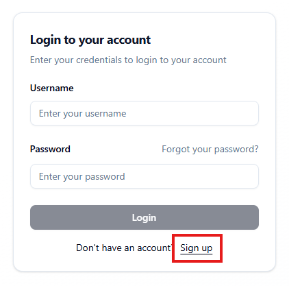

3. Fill in the registration form:

   - Username (must be globally unique)
   - Email address (must be valid - you'll receive verification code)
   - Password

   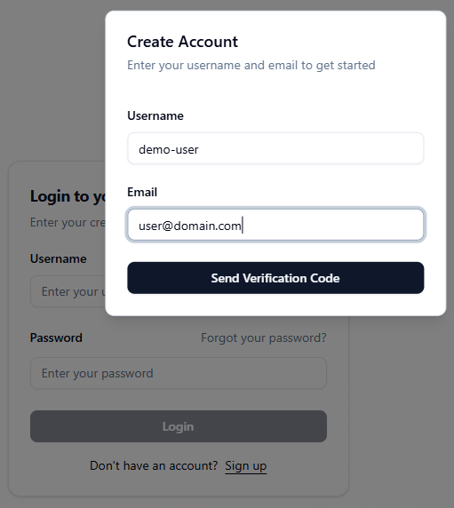

4. Click **Send Verification Code**

## Step 2: Verify Your Email

1. Check your email inbox for a verification code

   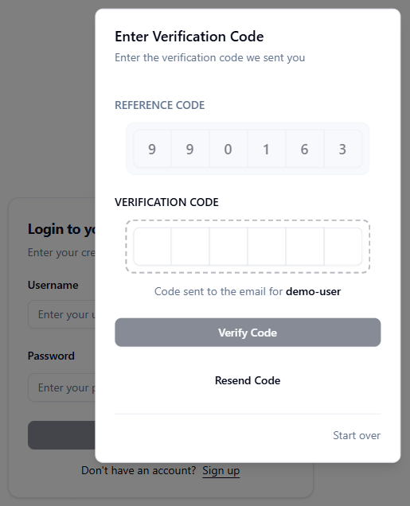

   The email will contain a verification code and a temporary password:

   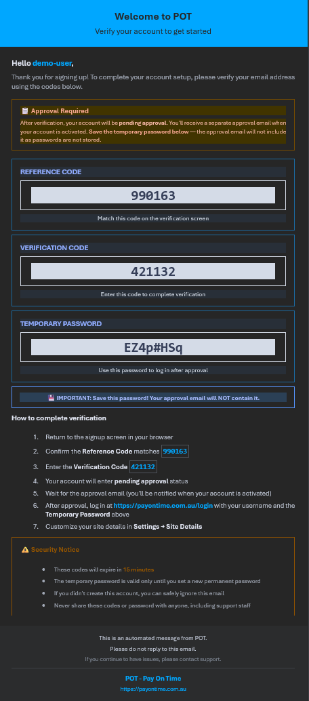

   > **Important:** Save the temporary password shown in the email - you'll need it to log in after approval. If you lose it, you'll need to use the "Forgot your password?" flow to reset it.

2. Enter the 6-digit code in the verification screen

   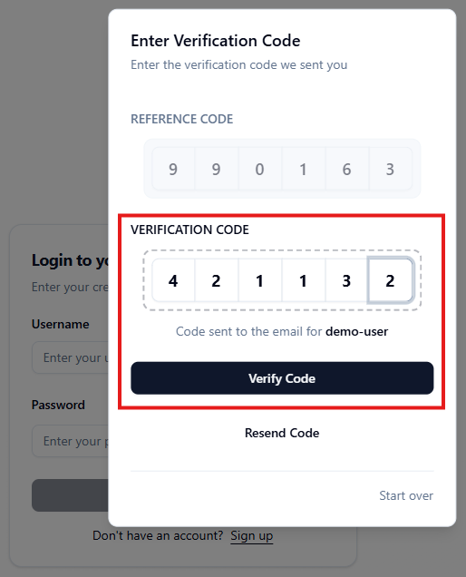

3. Click **Verify Code**

   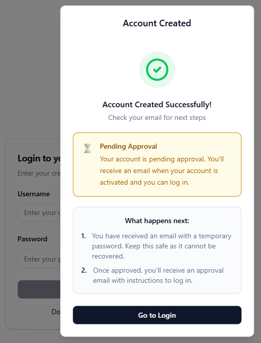

## Step 3: Wait for Platform Admin Approval

After email verification, your account status will be **PendingApproval**. You cannot log in until a platform admin approves your account.

> **For the first user:** Since there are no platform admins yet, you need to approve yourself manually. Continue to Step 4.

## Step 4: Approve Your First User (Platform Admin Setup)

### 4.1: Get Your User GUID

Connect to your PostgreSQL database and run the following query:

```sql
SELECT "RowId", "Username", "Status" FROM "User";
```

You should see a result similar to:

| RowId                                | Username  | Status   |
| ------------------------------------ | --------- | -------- |
| 7e9a1695-b6ad-45fe-811a-de61d8c68ef9 | demo-user | Approval |

Copy the GUID from the `RowId` column (e.g., `7e9a1695-b6ad-45fe-811a-de61d8c68ef9`).

> **Note:** Since this is the first user, there will only be one row in the result.

### 4.2: Add Yourself as Platform Admin

Add your GUID to the platform admin configuration:

**If using Docker:**

Open `Source/Docker/.env.development` and add your GUID to the `PLATFORM_ADMIN_USERIDS` setting:

```bash
# Platform Admin Configuration
PLATFORM_ADMIN_USERIDS=7e9a1695-b6ad-45fe-811a-de61d8c68ef9
```

**If running locally (Visual Studio):**

Open `Source/Server/Pot.AspNetCore/appsettings.Development.json` and add your GUID to the `PlatformAdmin:UserIds` setting:

```json
"PlatformAdmin": {
  "UserIds": "7e9a1695-b6ad-45fe-811a-de61d8c68ef9"
}
```

> **Note:** Replace the example GUID with your actual GUID from Step 4.1.

### 4.3: Restart the API Server

**If using Docker:**

```bash
docker restart pot-aspnet
```

**If running locally (Visual Studio):**

Stop and restart the API application in Visual Studio (or restart `dotnet run` if using the command line).

### 4.4: Approve Your Account

Connect to your PostgreSQL database and approve your account by updating the status:

```sql
UPDATE "User" SET "Status" = 'Enabled' WHERE "RowId" = '7e9a1695-b6ad-45fe-811a-de61d8c68ef9';
```

> **Note:** Replace the GUID with your actual GUID from Step 4.1.

Verify the update by running:

```sql
SELECT "RowId", "Username", "Status" FROM "User";
```

You should see the status changed to `Enabled`:

| RowId                                | Username  | Status  |
| ------------------------------------ | --------- | ------- |
| 7e9a1695-b6ad-45fe-811a-de61d8c68ef9 | demo-user | Enabled |

## Step 5: Log In and Change Password

1. Return to http://localhost:5175
2. Click **Log In**
3. Enter your username and the temporary password from the email
4. You should now have access to the POT application with platform admin permissions

   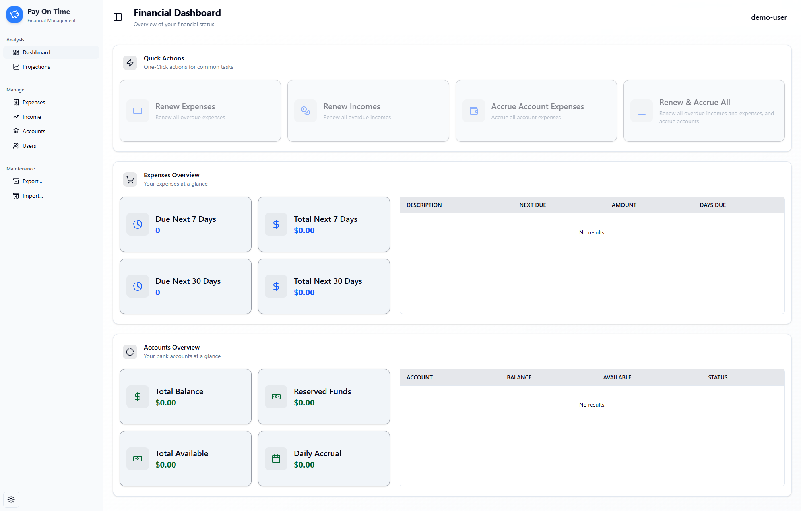

5. **Change your password immediately** for security:

   - Click on your username in the top-right corner

     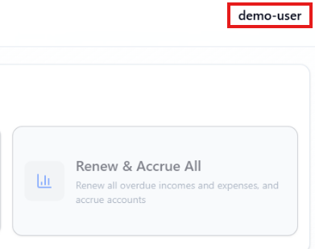

   - Select **Settings** from the dropdown menu

     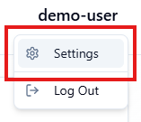

   - (Optional) Update your **Display Name** in the User Details section if desired, then click **Update User Details**

     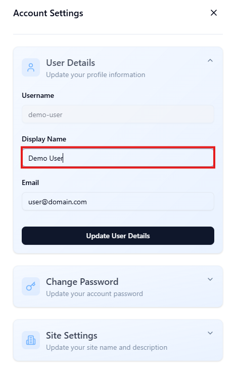

   - Expand the **Change Password** section
   - Enter your temporary password in **Current Password**
   - Enter and confirm your new secure password
   - Click **Change Password**

     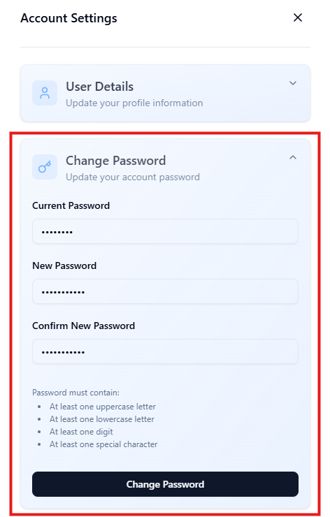

   - A success notification will appear confirming the password change

     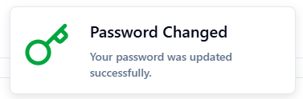

6. **Verify platform admin access:**

   - Navigate to **Users** in the left sidebar (only visible to platform admins)
   - You should see your account listed with "Admin" role and "Enabled" status

     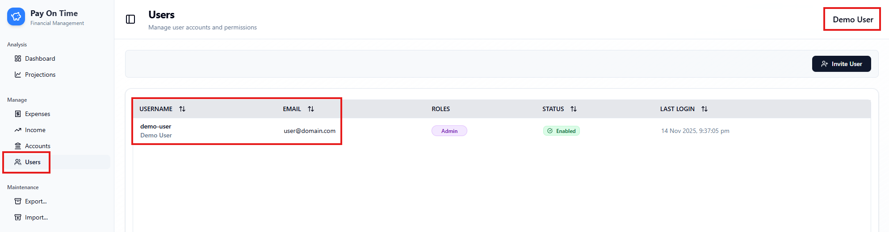

---

**Congratulations!** 🎉 POT is now fully configured and ready to use.

---

**Return to:** [Getting Started](GETTING-STARTED.md)
