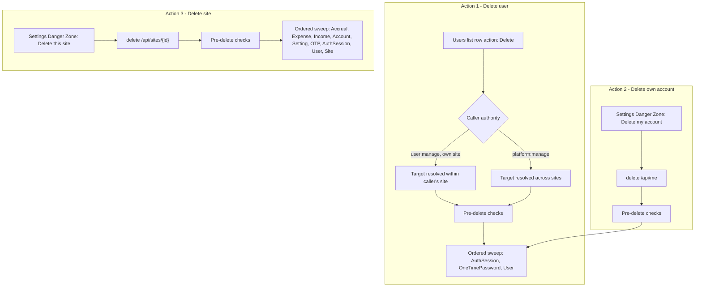

# User and Site Deletion PRD

**Status:** Proposed (discovery draft)
**Priority:** Medium
**Last Updated:** 2026-09-25
**Feature ID:** 022
**Scope:** Three deletion capabilities end to end. (1) A site admin removing another user from their site through a new row-level Delete action on the Users list, backed by `DELETE /api/users/{id}`. (2) A signed-in user permanently deleting their own account, backed by `DELETE /api/me`. (3) Deleting a whole site — every user, session and financial record — from a Danger Zone at the bottom of the POT Settings sheet, backed by `DELETE /api/sites/{id}`. Covers the server guards that keep a site and the platform administrable, the ordered transactional sweeps the schema's `Restrict` foreign keys force, the confirmation surfaces, the local-only session teardown and return to the login page, and the 422 presentation. Bulk user deletion is explicitly excluded.
**Audience:** Future implementation agent(s), reviewers, and maintainers.

## Purpose

Give each actor a supported way to remove a user or retire a tenant, without hand-written SQL and without leaving POT in a state that nobody can administer.

Three different actors and three different blast radii drive this document, and keeping them apart is the core of it:

| Action              | Actor                                                     | Blast radius                                      | Reversible |
| ------------------- | --------------------------------------------------------- | ------------------------------------------------- | ---------- |
| Delete a user       | Site admin (`user:manage`) for their site, or a platform admin (`platform:manage`) for any site | One `User` row plus their sessions and OTP rows   | No         |
| Delete own account  | The user themselves                                       | The same as above, for the caller only            | No         |
| Delete a site       | Site admin (`site:manage`) for their own site, or a platform admin for any site | Every user, session, account, expense, income, accrual and setting of the tenant | No         |

Deleting a **user** removes the person and their ability to sign in. It is not a data-deletion feature: accounts, expenses, incomes, accruals and settings belong to the **site**, not to the user, so they stay behind and remain visible to the site's other users. Deciding that deliberately — and saying it plainly in the confirmation — is the core of Action 1.

Deleting a **site** removes all of it, for everyone.

## Problem Statement

There is no way to remove a user, and no way to retire a site, through the product.

The server has no delete route for users at all: `Pot.AspNetCore/Features/Users/UsersEndpoints.cs` declares `GetAll`, `Update`, `UpdateRoles`, `UpdateStatus`, `Invite` and `ResendInvite`, and nothing else. The client even carries an orphan hook for it — `useApiDeleteUser` in `src/api/hooks/useUser.ts` targets `DELETE /users/{id}`, is exported, is imported nowhere, and has no server route to reach. The E2E suite records the same gap in writing (`e2e/tests/approvals/approvals.test.ts`: *"KNOWN GAP … there is no delete-user API"*).

The only route today is a hand-run `DELETE FROM "User" WHERE "Id" = …`, and even that fails against a live account: `DbContextBase.DisableCascadeDelete` forces `DeleteBehavior.Restrict` onto every foreign key on an `EntityBase`-derived entity, so any user who has ever signed in is protected by `AuthSession.UserId`, and any user with a pending reset or verification is protected by `OneTimePassword.UserId`. An operator must delete the session rows, then the OTP rows, then the user, then reason about what else pointed at it. Deleting a whole site multiplies that problem across six more tables.

Meanwhile sites accumulate by design. `VerifySignupService` mints a site per approved signup:

```csharp
var site = new SiteEntity
{
    Name = GetDefaultSiteNameForUser(mostRecentOtp.Username),
};
```

so every self-service signup leaves behind a tenant, and after this feature's user deletion it can leave behind a tenant with no users at all — a site row, its settings and its financial history, with nobody able to sign into it.

Three refusals make both operations safe to expose:

1. **The only configured platform admin cannot be removed.** Platform administration is not a database role — it is a list of user `RowId`s in `PlatformAdminOptions.UserIds` — so there is no in-app way to appoint a successor if the last entry is deleted.
2. **The last enabled site admin cannot be removed.** The site's own `Admin` role holder is the only person who can manage accounts, users and site settings for that tenant, so removing them leaves the tenant unadministrable.
3. **A site that contains a configured platform admin cannot be deleted.** Deleting it silently shrinks the administrator set, and because malformed entries in `PLATFORM_ADMIN_USERIDS` are ignored without error, the failure mode is a platform with no way back in short of editing deployment configuration.

Everything else about the feature is presentation: where each action lives, how hard it is to trigger by accident, and what the actor sees afterwards.

## Current Behaviour

### Identity, roles and administration

| Concept                     | Where it lives                                                                  | Notes                                                                                          |
| --------------------------- | ------------------------------------------------------------------------------- | ---------------------------------------------------------------------------------------------- |
| User                        | `Pot.Data/Entities/UserEntity.cs`                                                | Belongs to exactly one `Site`; `Username` is globally unique (`citext`); `Email` is not unique |
| Site                        | `Pot.Data/Entities/SiteEntity.cs`                                                | Owns `Users`, `Accounts`, `Settings`; `Name` is globally unique (`citext`)                      |
| Site role                   | `Pot.Shared/Enumerations/Role.cs`                                                | `Admin`, `Viewer` — stored in the `UserRole` join table                                        |
| Permission                  | `Pot.Shared/Enumerations/Permission.cs`                                          | `site:manage`, `user:manage`, `account:manage`, … — attached to roles                           |
| User status                 | `Pot.Shared/Enumerations/UserStatus.cs`                                          | `Enabled`, `Disabled`, `Pending`, `Approval`                                                   |
| Platform admin              | `Pot.AspNetCore/Concerns/Auth/Configuration/PlatformAdminOptions.cs`             | Comma-separated `RowId`s from `PLATFORM_ADMIN_USERIDS`; `PermissionService` adds `platform:manage` at runtime on top of the user's database permissions |
| Platform-admin-only surface | `src/components/nav/AppSidebarMenus.tsx` → Platform → Approvals (`platform:manage`) | The only place a platform admin acts in the UI today                                         |

`PlatformAdminOptions.GetUserRowIds()` silently drops entries that are not parseable GUIDs, so a stale or malformed configuration entry is invisible: it neither grants access nor reports a problem.

There is no site list, no site switcher, and no site create/edit/delete beyond `PUT /api/sites/{id}` for the **current** site's name and description (`ISiteRepository.GetCurrentSite()`). The only cross-tenant surface in the product is Approvals.

### What the database permits

`DbContextBase.DisableCascadeDelete` forces `DeleteBehavior.Restrict` onto every foreign key on an `EntityBase`-derived entity. The auto-generated join tables are the only exception.

| Dependent row          | FK              | On delete                                       |
| ---------------------- | --------------- | ----------------------------------------------- |
| `AuthSession`          | `UserId`        | **Restricted** — must be deleted first          |
| `OneTimePassword`      | `UserId` (nullable) | **Restricted** — delete or null first       |
| `UserRole` (join)      | `UsersId`       | Cascades                                        |
| `Account`              | `SiteId`        | **Restricted**                                  |
| `Setting`              | `SiteId`        | **Restricted**                                  |
| `AccountAccrual`       | `AccountId`     | **Restricted**                                  |
| `Expense`              | `AccountId`     | **Restricted**                                  |
| `Income`               | `AccountId`     | **Restricted**                                  |

Any delete of a live user or a live site is therefore an ordered, transactional write, not a single statement.

### Site scoping and cross-tenant reads

`PotDbContext` applies site-scoped global query filters to `Account`, `AccountAccrual`, `Expense`, `Income` and `Setting` (`account.Site.Id == GetCurrentUserSiteId()`, etc.). `User` is **not** globally filtered; `GetAllForCurrentSiteAsync` filters explicitly, and `GetByUsernameOrDefaultAsync` is global. Cross-tenant reads are already done with `IgnoreQueryFilters()` in `Pot.App/Features/Approvals/{Pending,UpdateStatus}`, which is the precedent any platform-admin path over another site's data must follow.

### Authentication already reacts to a missing user

`JwtBearerEventsSetup.OnTokenValidated` resolves the user by `RowId` on every request and calls `context.Fail("User not found")` when the row is gone. `User.TokenVersion` exists for global revocation, but a hard delete does not need it: there is no user row left for a token to be validated against. Deleting the row is itself the global revoke.

Only `UserStatus.Enabled` users can authenticate (`OnTokenValidated` rejects the others), so only enabled users can reach any authenticated endpoint.

### Existing precedents this design follows

- **Delete-shaped feature layout.** `Pot.App/Features/Accounts/Delete` is the shape: an `IDeleteAccountService`, and a chain-of-responsibility `PreDeleteChecker : ChainOfResponsibilityAsyncComposer<InputState, ApiDetailError?>` over `EntityChecks/IPreDeleteChecker`, with one `Checks/Check… : PreDeleteCheckBase` handler per rule, each returning an `ApiDetailError` or falling through to the base handler.
- **Endpoint shape.** `Pot.AspNetCore/Features/Accounts/Delete/Handler.cs` returns `Results<Ok, ProblemHttpResult>`, mapping `EnrichedResult` success to `TypedResults.Ok()` and failure to `error.ToProblemDetails()`.
- **422 contract.** `ApiDetailErrorFactory.CreateUnprocessableEntityError(message)` and `CreateEntityConstraintError(...)` both surface as HTTP 422 (`EnrichedErrorExtensions.ToProblemDetails`).
- **Cookie clearing.** `RefreshTokenHelper.ClearCookie(httpContext, authOptions)` is the established way to drop the refresh-token cookie.
- **Route authorisation.** Routes use `.RequireAuthorization("<permission>")` (for example `user:manage` on `PUT /api/users/{id}/status`, `platform:manage` on Approvals). Multiple policies passed to one call are **AND**-ed, not OR-ed — an important constraint for the mixed-authority endpoints below.
- **Client row-action convention.** Row deletes live last in the action menu, after a `DropdownMenuSeparator`, with `Trash2` and `text-destructive-high-contrast` (`AccountActions.tsx`, `ExpenseActions.tsx`, `IncomeActions.tsx`); the confirmation is `ConfirmationDialog` (`src/components/dialog/confirmationDialog.tsx`) over `ui/alert-dialog`.
- **Client error surface.** `useErrorContext().setError({ title, description })` renders the global `ErrorSheet`, which splits `description` on `\n` — so line-per-point consequence and refusal copy is idiomatic here.
- **Client permission surfaces.** `<WithPermission>` renders children **disabled** with an explanatory wrapper; `<PermissionGuard>` renders **nothing**. `usePermissions()` exposes `hasPermission` / `hasAnyPermission` / `hasAllPermissions`.
- **Settings sheet structure.** `POTSettingsSheet` is a sticky header + one `overflow-y-auto` scroll region holding an `Accordion` (Site Details, User Details, Change Password, Budget Reminders), and **no footer**. The accordion drives `isActiveSectionDirty`, `handleSectionChange`, `getSectionFormHandle` and the unsaved-changes dialog, which is rendered as a sibling at `z-[70]` with `showCloseButton={false}` and `onInteractOutside` prevented.
- **Cache invalidation.** `useCacheInvalidation(queryClient)` + `invalidateCache(keys)` with a closed `CacheKey` union — `accounts | expenses | incomes | me | pending-approvals | projections | users`. There is **no** `sites` key.

### What the client does today

- `AuthContext.logout()` awaits `POST /auth/logout` **before** clearing local state. That call needs a live token and a live user, so it cannot be reused after any of the three deletions.
- The `Toaster` is mounted in `App.tsx` **above** `AppRoutes`, so a toast survives a route change to `/login`.
- The 422 branch of the axios interceptor produces a `ValidationError` whose `code` is the fixed string `Validation Error` and whose `description` is the server's `errors[].errorMessage` (joined with `\n`) or `detail`. The error sheet therefore already reports a 422 — with a generic title and the server's own wording as the body.
- The Users list **already has** a per-row action menu: `UserActions.tsx` (desktop table) and `UserMobileCard.tsx` (mobile card) both currently offer Change Role, Disable/Enable User, and Resend Invitation, gated by `user:manage` and hidden entirely for the current user (`if (!canManageUsers || isCurrentUser) return null;`). What is missing is Delete.

  > **Source reconciliation.** The brief describes the Users list as having "no row level actions, like accounts, incomes, expenses". In the current client it does have a row action menu; only the Delete entry is absent. This PRD is written on the basis that the requirement is to **add Delete to the existing menu**, not to build the menu. If a wider rework of user row actions is intended, that is a scope change this document does not cover.

- `UsersTable.tsx` passes only `columns`, `data` and `getRowId` to `DataTable` — there is no `enableRowSelection` and no `bulkActions`, unlike `AccountsTable.tsx` and `ExpensesTable.tsx`. Bulk user deletion is therefore impossible by construction today, and the requirement is to keep it that way.

## Proposed Solution

Everything below is a candidate requirement; nothing is implemented. Decision IDs (`OD-nn`) refer to the Open Decisions Backlog.

The three actions share one authorisation question, one sweep design and one dialog problem, so the requirements are grouped by action and the shared concerns are stated once.



### Action 1 — A site admin deletes another user

#### Server contract

- **R1 — `DELETE /api/users/{id:guid}`.** A new route constant (`Delete = "/{id:guid}"`) on the existing Users group, mapped in `Features/Users/Extensions/RouteGroupBuilderExtensions.cs`, declaring 200, 401, 403, 404, 422 and 500. The target id is always explicit.
- **R2 — Authority: site admin for their own site, platform admin for any site.** Both actors were confirmed. Authorisation is therefore *`user:manage` scoped to the target's site* **OR** *`platform:manage`*. Because `.RequireAuthorization("user:manage", "platform:manage")` AND-s its arguments (and `platform:manage` is a runtime-added permission that a platform admin may hold without `user:manage`), this needs a dedicated OR policy or an explicit in-handler authorisation check — see OD-01.
- **R3 — Target resolution is site-scoped for a site admin.** A site admin resolves the target through the site filter, so an id belonging to another tenant is simply not found and returns **404**, never a 403 that would confirm the row exists. A platform admin resolves across tenants, using the `IgnoreQueryFilters()` precedent from `Approvals`.
- **R4 — Self-target is refused.** The caller cannot delete themselves through this endpoint; self-removal is Action 2 and has its own contract. Refuse with 422 (before any write).
- **R5 — Ordered removal, in one transaction.** Resolve the tracked target (with a `WithTracking()` scope so `Add`/`Delete` classification is correct), then delete **all** of the target's `AuthSession` rows (revoked included), delete or detach the target's `OneTimePassword` rows (OD-05), and delete the `User` row. `UserRole` rows cascade. `IPersistableAuthSessionRepository` and the OTP repository need read methods that return **all** sessions / OTPs for the user — `GetUnrevokedByUserIdAsync` is not sufficient for a delete.
- **R6 — Response.** Success returns 200 with an empty body. There is no cookie to clear for the target: the target's refresh cookie lives in the target's own browser, and it dies with their session rows.
- **R7 — Logging.** Log the caller's `RowId`, the target's `RowId`, the site `RowId`, and the counts of removed sessions and OTP rows (whether the target's username is logged is OD-06).

#### Pre-delete refusal rules (422)

Each is a `Check… : PreDeleteCheckBase` handler in `Pot.App/Features/Users/Delete/EntityChecks/Checks`, following the `Accounts/Delete` chain.

- **R8 — `CheckTargetIsNotLastEnabledSiteAdmin`.** Refuse when the target is the site's only **enabled** user holding the `Admin` role. The exact population counted is OD-04.
- **R9 — `CheckTargetIsNotPlatformAdmin`.** Refuse when the target's `RowId` is in `PlatformAdminOptions.GetUserRowIds()`. A site admin must not be able to silently remove a platform administrator from a deployment configuration list that never reports stale entries.

Both rules apply to a platform-admin caller as well: authority to act on any site does not remove a safety invariant.

#### Refusal messages are user-facing copy

The client's 422 `code` is a fixed generic string, so the only place to write actionable copy is the message passed to `ApiDetailErrorFactory` — and it must not promise a self-service remedy that does not exist.

- Platform admin: state that the account cannot be deleted because it is a platform administrator, and that platform admin access is granted by deployment configuration rather than a role, so it cannot be changed from inside the app.
- Last enabled site admin: state that the account cannot be deleted because it is the site's only administrator, and that another user must be invited and given the `Admin` role first. Unlike the platform-admin rule, this remedy is reachable in-app.
- Self: state that a user cannot delete their own account from the user list, and point at the Settings Danger Zone.

If the target matches both of the first two rules, the platform-admin rule is evaluated first (OD-04 records whether a combined message is preferable).

#### Client surface and interaction

- **R10 — Add Delete to both existing user action menus.** Last item, after a `DropdownMenuSeparator` (which `UserActions.tsx` and `UserMobileCard.tsx` do not import today), labelled `Delete User…` to match the repo's "opens a further step" ellipsis convention, with `Trash2` and `text-destructive-high-contrast`.
- **R11 — Keep the existing gating and self-protection exactly as they are.** The menu stays behind `user:manage` / `WithPermission`, and stays hidden for the current user on both desktop and mobile (`isCurrentUser`). A site admin cannot remove themselves from this surface.
- **R12 — Disambiguate Delete from Disable explicitly.** These are adjacent, both user-lifecycle actions, and only one is reversible. The dialog copy must say so: for example, that disabling blocks sign-in and keeps the account, while deleting removes the account permanently — and that deletion does **not** delete the site's accounts, expenses or incomes, which remain visible to the site's other users.
- **R13 — A destructive confirmation dedicated to this action.** Requires a typed confirmation of the target's **username**, compared trimmed and case-insensitively, with `autoCapitalize="none"`, `autoCorrect="off"` and `spellCheck={false}` on the input. Cancel is first and default-focused; the destructive action is last, labelled `Delete User`, disabled until the typed value matches, and shows a busy state while the request is in flight. The dialog must be scroll-capped (`max-h-[85dvh] overflow-y-auto` via the `className` passthrough) because `AlertDialogContent` has no max-height and a phone in landscape is roughly 390 px tall. Whether this is built on an extended shared `ConfirmationDialog` or as a feature-local destructive dialog is OD-03.
- **R14 — Success and failure.** On success: a toast (matching the status/role/invite flows, all of which toast) plus `invalidateCache(['users'])`. On failure: the dialog stays open and the failure is reported with `setError({ title: error.code, description: error.description })`, as the account and user flows already do.
- **R15 — No bulk deletion.** `UsersTable` stays free of `enableRowSelection` and `bulkActions`, and a unit test asserts that absence so it cannot creep in.
- **R16 — Decide the fate of the orphan `useApiDeleteUser`.** It is dead code with no server route. Either delete it and add a feature-local `useDeleteUser` mirroring `useDeleteAccount`, or re-point it. Leaving both would be two half-truths (OD-13).

### Action 2 — A user deletes their own account

- **R17 — `DELETE /api/me`.** A new route on the existing `Me` group (`Pot.AspNetCore/Features/Me/MeEndpoints.cs`), `RequireAuthorization("AuthenticatedUser")`, declaring 200, 401, 422 and 500. The caller is identified from the token; no target id is accepted, so the endpoint cannot be pointed at another user.
- **R18 — Refusal rules (422), evaluated before any write.** Both mirror the `Accounts/Delete` checker chain:
  - `CheckNotOnlyPlatformAdmin` — refuse when the caller's `RowId` is in `PlatformAdminOptions.GetUserRowIds()` and that list resolves to exactly one id (evaluated first).
  - `CheckIsNotLastSiteAdmin` — refuse when the caller is the site's only **enabled** user holding the `Admin` role.

  The exact population each rule counts is OD-04.
- **R19 — Removal.** The same ordered sweep as R5, for the caller.
- **R20 — Response and cookie.** Success returns 200 with an empty body and clears the refresh cookie via `RefreshTokenHelper.ClearCookie`, mirroring the logout handler. The client must not be left holding a cookie for a session that no longer exists.
- **R21 — Placement: a Danger Zone inside `POTSettingsSheet`.** A distinct block after `</Accordion>` **inside** the existing scroll region, separated by a `Separator`, with a destructive-styled trigger. It sits **outside** the accordion, so it never participates in `isActiveSectionDirty`, the unsaved-changes dialog, or per-section Save/Discard — the accordion's `handleSectionChange` intercepts every value change and `getSectionFormHandle` has no member for a danger zone, so an accordion item would be actively wrong.
- **R22 — Not permission-gated.** Every user, including a `Viewer`, must be able to close their own account, so this block must not be behind `site:manage` or `user:manage`.
- **R23 — Confirmation.** A dedicated destructive dialog (not the shared `ConfirmationDialog` as it stands, for the reasons in R26) with:
  - a consequence summary as multi-line copy (the `ErrorSheet` splits its description on `\n`, so line-per-point copy is idiomatic), stating: the account is permanently deleted and cannot be undone; sessions are ended and the user cannot sign in again; **the site's accounts, expenses and incomes are not deleted and remain visible to the site's other users**;
  - a typed confirmation of the user's own **username**, compared trimmed and case-insensitively, with helper text explaining why the button is disabled;
  - Cancel first and default-focused; the destructive action last, labelled `Delete My Account`, disabled until the typed value matches, with a busy state;
  - scroll-capped for short viewports, `z-[70]` and `showCloseButton={false}` with `onInteractOutside` prevented, mirroring the unsaved-changes dialog so a backdrop mis-tap cannot dismiss a destructive confirmation.
- **R24 — Success transition: toast, then login.** Close the dialog and the sheet, run a **local-only** session teardown, then `navigate('/login', { replace: true })`. The teardown mirrors `logout()` without the network call: clear the access token, stop the access-token refresh timer, clear the user store, clear the React Query cache. `replace` prevents the Back button re-entering an authenticated shell that no longer exists.
- **R25 — 422 presentation through the existing error sheet.** The dialog stays open and the failure is reported with `setError({ title: error.code, description: error.description })`. Each refusal rule must be written as copy a user can act on, including the remedy.

### Action 3 — Delete the whole site

Why this is a different problem from Action 1: it destroys other people's accounts and a tenant's entire financial history, on the authority of someone acting on data that is not only theirs. The authority, the surface, the server work and the blast radius are all different, and the loss is unrecoverable.

- **R26 — `DELETE /api/sites/{id:guid}`.** The Sites group currently only declares `Update` (`PUT /{id:guid}`), so this is a new route and a new handler. Declares 200, 401, 403, 404, 422 and 500.
- **R27 — Authority: `site:manage` for the caller's own site, or `platform:manage` for any site.** Both actors were confirmed. As with R2 this is an OR over two policies and needs a dedicated policy or an explicit in-handler check (OD-01). `site:manage` is deliberately included — it is the tenant owner's action — while the platform guard in R29 protects the platform from the consequence.
- **R28 — Target resolution.** A site admin may only target their own site; any other id returns **404** rather than 403. A platform admin may target any site and must use `IgnoreQueryFilters()` for the site-scoped entities.
- **R29 — Refusal rules (422), evaluated before any write:**
  - `CheckSiteHasNoPlatformAdmin` — refuse when the target site contains **any** configured platform admin. This is a superset of "the caller's own site" for a platform-admin caller, because silently removing a platform admin from a config list that never reports stale entries is how a platform ends up with no administrator. It also makes the canonical E2E seed sites undeletable, which is a useful safety property for the test suite.
  - `CheckSiteIsNotProtected` — refuse when the target site is protected by configuration, if a protected-site list is introduced in the same spirit as `PlatformAdminOptions` (OD-07).
- **R30 — Deletion is an ordered, transactional sweep:** `AccountAccrual` → `Expense` → `Income` → `Account` → `Setting` → `OneTimePassword` (resolved via the site's users; the table has no site FK) → `AuthSession` → `UserRole` (cascades from `User`) → `User` → `Site`, all inside one transaction, with a clean 404 on a second attempt.
- **R31 — The Danger Zone is gated by `site:manage` and hidden when denied.** Use `PermissionGuard` (renders nothing) rather than `WithPermission` (renders a disabled destructive trigger): a disabled destructive control is a worse experience than no control, and permissions are already resolved from the user store so there is no render flicker.
- **R32 — Visual treatment.** The destructive twin of the accordion tile, keeping identical geometry so it reads as the same design system: `border border-destructive/40 rounded-lg shadow-sm bg-gradient-to-br from-destructive/5 to-destructive/10`, an icon wrapper of `bg-destructive/10 text-destructive`, and a `<Button variant="destructive">` trigger. The tokens already exist (`--destructive` / `--color-destructive` in `src/index.css`, `Button variant="destructive"` in `ui/button.tsx`, `.text-destructive-high-contrast`); the string "Danger Zone" does not exist anywhere in the client today.
- **R33 — Confirmation is a dedicated destructive dialog**, not the shared `ConfirmationDialog`, and it must include:
  - a target summary — site name, and counts of users by status, sessions, accounts, expenses and incomes — because a cross-tenant destructive action should show what is about to be destroyed (the read model behind the counts is OD-09);
  - a consequence summary as line-per-point copy: every user of the site is removed and signed out permanently; all accounts, expenses, incomes and accruals are deleted; the action cannot be undone;
  - typed confirmation of **both the site name and the acting user's username**, compared trimmed and case-insensitively, with the destructive action disabled until both match (confirmed requirement);
  - Cancel first and default-focused; the destructive action last, labelled `Delete Site`, with a busy state while the request is in flight;
  - `z-[70]`, `showCloseButton={false}`, `onInteractOutside` prevented, and `max-h-[85dvh] overflow-y-auto` for short viewports.
- **R34 — Optional data-copy acknowledgement (OD-08).** If the maintenance export is offered before deletion, the copy **must** say that the export contains accounts, incomes and expenses only — no users, roles, settings or site row — so a restore yields a tenant nobody can sign into, and that the real recovery path is an operations database dump. It must never be presented as a backup.
- **R35 — Post-deletion behaviour.** Every user of the site loses access at their next request; existing tabs fall back to the login page through the normal 401 path. The caller runs the same local-only teardown as R24 and returns to `/login` with `replace: true`, ending in a full cache teardown rather than an invalidation, because there is no `sites` cache key. Post-deletion notification emails to remaining `Enabled` users are proposed but depend on PRD-019 (OD-10); login must keep returning the generic invalid-credentials response, because saying "that site was deleted" would confirm usernames to an unauthenticated caller.
- **R36 — E2E safety.** The harness seed defines two sites with a platform admin in seed site 1, so any test of this feature must create a throwaway site through the signup API and delete only that. R29 conveniently makes the canonical seed sites undeletable.

### Shared concerns

- **R37 — One platform-administrability invariant, not two.** If the last-enabled-site-admin rule here and the last-platform-admin rule are written independently, a combination of the two can still reach a platform with no administrator. The two guards must read as one invariant and be evaluated in a defined order (OD-04).
- **R38 — The confirmation strategy is decided once.** Three destructive flows are being added to a client whose only confirmation primitive renders `[Delete] [Cancel]` with no destructive variant, no busy state, no typed confirmation, and (because the destructive action is first in the DOM) likely takes initial focus on open. Extending `src/components/dialog/confirmationDialog.tsx` — which, unlike `src/components/ui/*`, is editable — to support `variant`, `isPending`, `confirmDisabled` and a node `description`, and flipping its footer to safe-first, fixes this for these flows and for accounts/expenses/incomes retroactively. The alternative is a feature-local destructive dialog composed from `ui/alert-dialog` primitives. Both are viable; OD-03 decides.
- **R39 — Do not edit `src/components/ui/*`.** Those are shadcn-registry-owned. Everything above is achievable through wrappers, composition, and `className` passthrough on Radix content components.

## Out of Scope

- **Bulk user deletion.** Explicitly excluded. No multi-select delete, no "delete all disabled users".
- **Soft delete, anonymisation or a "disabled forever" state.** The user row is removed. There is no tombstone and no in-app audit record, because no audit infrastructure exists.
- **Deleting another tenant's user as a site admin.** Only a platform admin acts across tenants.
- **A site list, site switcher or site create/edit.** R27 grants a platform admin authority over any site; whether this PRD also ships a cross-tenant surface to exercise it is OD-02.
- **Data export or portability as part of deletion.** The maintenance export covers accounts, incomes and expenses for the current site; it is not a per-user export and, even acknowledged, is not a restorable tenant backup.
- **Email or notification on user deletion.** No notification is sent to the departing user or to anyone else.
- **Account closure by an unauthenticated caller.** A user who cannot sign in (disabled, pending, or already deleted) cannot reach any of these endpoints, and no request-based alternative is introduced.
- **Password re-entry / step-up re-authentication.** See OD-11.
- **`TokenVersion` semantics.** No change; a hard delete supersedes the need for global revocation.
- **Refresh-token cookie handling for a deleted user's own devices.** Nothing can be done server-side beyond deleting the session rows; the stale cookie dies on its first use.

## Tests

Planned coverage, following the existing unit/integration split.

- **Application — user deletion.** `Pot.App.Tests/Features/Users/Delete/DeleteUserServiceFixture.cs`: the happy path deletes the user and returns success; each refusal rule returns its 422 error and performs no write; a caller targeting themselves is refused; a site admin targeting another tenant's user gets 404; a platform admin targeting another tenant's user succeeds.
- **Application — self deletion.** `Pot.App.Tests/Features/Me/Delete/DeleteAccountServiceFixture.cs`: happy path; both refusals; both rules matching returns the platform-admin error first.
- **Application — site deletion.** `Pot.App.Tests/Features/Sites/Delete/DeleteSiteServiceFixture.cs`: happy path returns a completion payload; a site containing a configured platform admin is refused; a site admin targeting a foreign site gets 404.
- **Entity checks.** `…/Checks/CheckTargetIsNotLastEnabledSiteAdminFixture.cs`, `CheckTargetIsNotPlatformAdminFixture.cs`, `CheckSiteHasNoPlatformAdminFixture.cs`, `CheckNotOnlyPlatformAdminFixture.cs`, `CheckIsNotLastSiteAdminFixture.cs`: single platform admin refuses; two platform admins allow; empty and malformed `PlatformAdminOptions.UserIds` allow; last enabled `Admin`-role user refuses; a second enabled `Admin` allows; a `Viewer`, or an `Admin` of a different site, allows; disabled/pending `Admin`-role users are counted per OD-04.
- **Data.** Repository coverage for the new read methods (all sessions for a user including revoked; a user's OTP rows; the users/accounts/expenses/incomes of a site for the summary counts) and fixtures that prove the ordered deletes succeed for a user holding sessions *and* OTP rows, and for a site holding every dependent table — the two cases the current `Restrict` foreign keys reject today.
- **Integration.** `Pot.AspNetCore.Integration.Tests/Features/Users/DeleteUserFixture.cs`, `Features/Me/DeleteAccountFixture.cs`, `Features/Sites/DeleteSiteFixture.cs`, in the style of the existing `Features/Auth/*Fixture.cs`: 401 unauthenticated; 403/404 for the wrong authority; 200 for a deletable target, after which the target's access token is rejected (and for self-deletion the refresh cookie is cleared); 422 with the expected problem-details body for each refusal rule and no rows removed.
- **Client unit.** A `useDeleteUser` hook test; `UsersPage.test.tsx`, `UserActions.test.tsx` and `UserMobileCard.test.tsx` extended to assert Delete renders, is last, is destructive-styled, is absent for the current user, and is absent for a non-manager; a `UsersTable` test asserting no row selection (R15); dialog tests asserting the destructive action stays disabled until the typed value matches, that the copy names the site-data caveat, and that Cancel is the default action; `POTSettingsSheet.test.tsx` extended to assert the Danger Zone renders for a `Viewer` (self-delete) and for an `Admin` (site delete), and that it is absent for a `Viewer` (site delete); an `AuthContext` teardown test proving no `POST /auth/logout` is issued while the token, user store and query cache are cleared.
- **E2E.** Extend `e2e/tests/settings/userSettings.test.ts` for the Danger Zone, and `e2e/tests/approvals/approvals.test.ts` — which already documents the missing delete-user API — for the new row action. The 422 paths can be driven safely as the seeded `e2e_admin`; every 200 path must use a throwaway account created through signup, or a throwaway site created through the signup API, since the seeded users and sites are depended on by every other spec. Assert the return to `/login`, any confirmation message, that a subsequent sign-in attempt with the deleted credentials fails, and that a second delete returns 404. Short-landscape dialog coverage is new (existing short-viewport coverage is lists only).

## Open Decisions Backlog

| ID    | Decision                                                                  | Candidate Options                                                                                                        | Status  |
| ----- | ------------------------------------------------------------------------- | ------------------------------------------------------------------------------------------------------------------------ | ------- |
| OD-01 | How the mixed-authority endpoints express `site:manage`/`user:manage` **OR** `platform:manage` | A dedicated OR authorisation policy · `AuthenticatedUser` plus an explicit in-handler authority check returning 403       | Pending |
| OD-02 | How a platform admin exercises authority over a site they are not signed into | Add a platform-admin `Sites` list under the existing Platform menu group · API-only for now, UI deferred                  | Pending |
| OD-03 | Confirmation strategy for the three new destructive flows                  | Extend the shared `ConfirmationDialog` (variant, busy, disabled, node description, safe-first footer) · Feature-local destructive dialog composed from `ui/alert-dialog` | Pending |
| OD-04 | Exact population behind each last-admin rule, and their evaluation order    | Enabled only · Enabled only, plus configured platform admins treated as covered · Include `Pending`/`Approval`/`Disabled` `Admin`-role users | Pending |
| OD-05 | Whether the user's `OneTimePassword` rows are deleted or detached          | Delete rows for the user · Null their `UserId` so they expire naturally                                                   | Pending |
| OD-06 | What the deletion log line records                                         | `RowId`s and counts only · Also the username (PII, but traceable in logs)                                                 | Pending |
| OD-07 | Whether a protected-site configuration is introduced                       | Yes — mirror `PlatformAdminOptions` · No — rely on the platform-admin rule alone                                          | Pending |
| OD-08 | Whether site deletion offers the maintenance export as a pre-step           | Yes, with explicit "not a backup" copy · No, direct to confirmation                                                       | Pending |
| OD-09 | How the site-delete dialog obtains its target summary counts                | A new read endpoint (`GET /api/sites/{id}/summary`) · Extend an existing site response · Ship without counts              | Pending |
| OD-10 | Whether remaining `Enabled` users are emailed after a site is deleted      | Yes, sent after deletion only (depends on PRD-019) · No                                                                   | Pending |
| OD-11 | Whether password re-entry is required before self-deletion                  | Not required · Required as step-up re-authentication                                                                      | Pending |
| OD-12 | Whether the Danger Zone is always visible or behind a disclosure row        | Always visible at the bottom of the scroll region · Collapsed behind a disclosure                                         | Pending |
| OD-13 | Fate of the unused `useApiDeleteUser` hook                                   | Delete it and add a feature-local `useDeleteUser` · Re-point it as the basis of the new hook                               | Pending |
| OD-14 | Whether a site admin may delete another `Admin` (guard is last-admin only)   | Yes — only the last enabled admin is protected · No — only a platform admin may remove an `Admin`                          | Pending |
| OD-15 | Landing experience after self-deletion                                       | Toast only · Toast plus an informational notice on the login page                                                          | Pending |
| OD-16 | Whether a cooling-off / confirmation-link step exists for site deletion      | None — immediate and transactional · An emailed one-time confirmation link to the requesting admin                        | Pending |

## Outstanding Questions Register

1. Is a user allowed to sign up again immediately with the same username after their account (or site) is deleted? `Username` is globally unique and the row — with it the uniqueness constraint — is gone, so re-signup succeeds and mints a new site. Nothing in the current design prevents it; is that the intended outcome, or should the username be reserved for a period?
2. Should anything be sent on deletion — to the departing user, or to the platform operator as a record that an account or tenant was closed? No notification path exists today (PRD-019 is the durable-dispatch prerequisite).
3. Is the "only platform admin" rule enough on its own, or does the deployment's `PLATFORM_ADMIN_USERIDS` need validation (non-GUID entries are silently ignored) so a platform cannot be left with zero working administrators?
4. Does the refusal for the last enabled site admin need to account for a site whose other users are all non-enabled, and if so is the message still actionable?
5. A platform admin is granted authority over any site (R27), but the only site-scoped surface today is the current site's Settings sheet. How is that authority exercised before OD-02 is decided — is an API-only capability acceptable in the interim?
6. Should the user-delete endpoint accept an id for a user on another site when the caller is a site admin (returning 404 per R3), or should it be structurally incapable of expressing a cross-site target?
7. When a site is deleted while its users have live sessions, is the 401-driven fallback to the login page enough, or do those tabs need explicit copy?
8. Should the site Danger Zone warn when the caller is themselves the last admin and would be deleted as part of the site — or is R29's refusal only about platform admins?
9. Signup OTP rows are keyed by username and may have no `UserId` (the row is created before the user exists). What happens to a pending signup's OTP rows when the target user is deleted, or when a site is deleted?
10. When a user deletes their account, does anything need to happen to already-delivered budget-reminder state or scheduled reminders for that site? They are site-scoped, but the departing user may be the recipient.
11. Should the self-delete Danger Zone offer the maintenance export before deletion, so the departing user has a physical copy even though the data survives in place?
12. Should the Danger Zone reachable by a `Viewer` (self-delete) visually match the `site:manage`-gated one (site delete) when only one of the two blocks is visible to them, or should each be styled for its own audience?

## Assumptions and Constraints Register

| ID    | Assumption / Constraint                                                                                                             | Confidence |
| ----- | ----------------------------------------------------------------------------------------------------------------------------------- | ---------- |
| AC-01 | Financial and configuration data belongs to the `Site`, so deleting a user leaves it intact and visible to the site's other users.   | High       |
| AC-02 | `AuthSession.UserId` and `OneTimePassword.UserId` are `Restrict`; `UserRole` cascades; `Account`/`Setting` restrict on `SiteId` and `AccountAccrual`/`Expense`/`Income` restrict on `AccountId`. Every delete is an ordered write. | High |
| AC-03 | Only `UserStatus.Enabled` users authenticate, so only they can reach any of these endpoints.                                          | High       |
| AC-04 | A hard delete is its own global revoke: a live access token dies at the next request on the per-request user lookup.                  | High       |
| AC-05 | Site-scoped global query filters cover `Account`, `AccountAccrual`, `Expense`, `Income` and `Setting` only; `User` is unfiltered, and cross-tenant platform-admin paths use `IgnoreQueryFilters()`. | High       |
| AC-06 | The client's 422 `code` is a fixed generic string, so user-visible rejection wording must be authored server-side.                    | High       |
| AC-07 | `AuthContext.logout()` cannot be reused after deletion, because it calls `POST /auth/logout` first.                                   | High       |
| AC-08 | A toast survives the navigation to `/login` because `Toaster` is mounted above `AppRoutes`.                                            | High       |
| AC-09 | There is no audit, tombstone, or soft-delete infrastructure, so deletion is immediate and unrecorded beyond application logs.         | High       |
| AC-10 | Platform admin membership is deployment configuration, so there is no in-app remedy for the platform-admin refusals.                  | High       |
| AC-11 | Approved signup creates a site per user, so abandoned sites accumulate and are the main motivation for Action 3.                      | High       |
| AC-12 | The maintenance export is not a tenant backup: it carries no users, roles, settings, or site row.                                     | High       |
| AC-13 | The client's `CacheKey` union has no `sites` key, so site deletion must end in a full cache teardown rather than an invalidation.      | High       |
| AC-14 | `src/components/ui/*` is shadcn-registry-owned and must not be hand-edited; `src/components/dialog/confirmationDialog.tsx` is editable. | High       |
| AC-15 | The Users list already has a per-row action menu (Change Role, Disable/Enable, Resend Invitation); only Delete is missing.             | High       |
| AC-16 | `UsersTable` has no row selection or bulk actions, so bulk deletion is impossible by construction today.                              | High       |
| AC-17 | `.RequireAuthorization("a", "b")` requires **both** policies; it is not an OR.                                                        | High       |
| AC-18 | The three delete services slot into the existing feature folders (`Pot.App/Features/{Users,Me,Sites}/Delete`, `Pot.AspNetCore/Features/{Users,Me,Sites}/Delete`) following the `Accounts/Delete` shape. | Medium |

## Discovery Exit Criteria

Before this PRD moves from Proposed to Planning:

1. OD-01 is decided, because it determines the shape of two endpoint authorisation contracts.
2. OD-02 is decided, because "platform admin can act on any site" is unexercisable in the UI until it is.
3. OD-04 is decided, because the refusal rules are the safety mechanism and their population must be exact before implementation.
4. OD-03 is decided, so the shared-component work (or the decision not to do it) is scoped.
5. The ordered-sweep designs (R5 and R30) are validated against a real database, since that is the only part of this feature the current schema actively rejects.
6. The E2E approach (throwaway site for Action 3, throwaway account for Action 1) is accepted, so the seeded users and sites are not consumed by this feature's tests.

## Design Notes (Rationale and Rejected Alternatives)

Reference notes for future maintainers.

- **Two actions, not one, and no third "site disposal" flow.** Deleting a user is a row that belongs to the person who asked; deleting a site destroys other people's accounts and a tenant's whole financial history. They share guards and dialog machinery, which is why they share a document, but they must not share an entry point or an authority model.
- **Action 3 lives in Settings rather than in a platform-only console, but keeps a platform guard.** The tenant owner is the natural actor for retiring their own tenant, and `site:manage` is exactly that authority. The `CheckSiteHasNoPlatformAdmin` rule is what stops the same button from silently reducing the platform's administrator set. Rejected: requiring `platform:manage` for all site deletion (removes the tenant owner's ability to retire their own data); rejected: automatic site disposal when the last user leaves, which would turn "delete my account" into a covert tenant-destruction button acting on data the user does not own.
- **Row-level Delete, not a destructive bulk action.** Bulk deletion has no place in a users list where a single mis-selection can remove several people at once, and the Users table has no selection model to build on anyway. Keeping the table selection-free is cheaper and safer than adding then restricting one.
- **Delete is last in the menu, after a separator, in red.** This is the existing convention for every other row delete in the app; making users the exception would be the only place a destructive action sits adjacent to a benign one.
- **Delete and Disable must be told apart in words, not just colour.** They are adjacent lifecycle actions and only one is reversible. The confirmation therefore carries the distinction, and the copy states what deletion does *not* do to the site's data.
- **The self row keeps no menu.** The current `UserActions` guard hides the whole menu for the current user to prevent self-lockout, on both desktop and mobile. Self-deletion is deliberately reached through Settings instead, where it can be designed as an account-closure flow with its own confirmation, rather than through a row action that looks like administering somebody else.
- **The Danger Zone sits outside the accordion, and outside the dirty-state machinery.** `handleSectionChange` intercepts every accordion value change, `isActiveSectionDirty` drives the unsaved-changes prompt, and `getSectionFormHandle` returns `null` for anything without a form. Authoring the danger zone as an accordion item would drag a destructive action into all three, and into a `Save`/`Discard` contract it does not have. Plain JSX after `</Accordion>` inside the scroll region cannot affect any of that.
- **A disabled destructive trigger is worse than no trigger.** For the `site:manage` block, hiding is the better failure mode; for the self-delete block, gating would exclude the very users who most need the capability, so it is not gated at all.
- **A purpose-built dialog rather than the shared `ConfirmationDialog` as it stands.** The shared component renders `[Delete] [Cancel]`, has no destructive variant, no busy state and no typed confirmation, and puts the destructive action first in the DOM — so Radix's first-tabbable focus rule lands on it. It is also the outlier: every other destructive footer in the app puts the safe action first (`ExportModal` `[Cancel][Export Data]`, the unsaved-changes dialog `[Keep Editing][Discard Changes][Save Changes]`). Fixing the shared component or forking a local one is OD-03; silently reusing it is not an option for an unrecoverable action.
- **Typing the site name and the username, not a fixed phrase.** A fixed word adds friction without information. The site name forces awareness of *which* tenant dies; the acting username forces a deliberate, personally-attributable act. Both are compared trimmed and case-insensitively, because strict matching strands keyboard users on a technically-correct entry, and the input disables autocapitalisation so lowercase names like `e2e_approval_…` are not silently mangled.
- **No password re-entry.** The session is already a proof of possession, and POT has no step-up re-authentication pattern to build on; adding one introduces a credential-collection surface with its own validation and rate-limit interactions. Typed confirmation already prevents reflexive confirmation.
- **A local-only teardown instead of `logout()`.** `logout()` awaits `POST /auth/logout` before clearing state. After a deletion that request cannot succeed, and a 401 from it can trip the global 401 handling that itself calls `logoutManager.logout()`, risking a double navigation or a loop. The teardown therefore mirrors `logout()` minus the network call, and the refresh timer must be torn down promptly for the same reason. `logoutManager.logout()` is not the right tool either, because it routes through the same networked path.
- **`navigate(..., { replace: true })`.** Without `replace`, Back would re-enter the authenticated shell with no session.
- **A toast rather than a login-page banner.** The `Toaster` is mounted above `AppRoutes`, so the message survives the transition to `/login` and no new login-page state contract is needed. The trade-off — a toast is transient while deletion deserves a durable acknowledgement — is why OD-15 leaves a persistent notice on the table.
- **Hard delete, not anonymisation or soft delete.** Retaining the row keeps the username and email, keeps the person's presence in the users list, and leaves the account recoverable — the opposite of what was asked. There is also no audit infrastructure for a tombstone to serve, and `Restrict` foreign keys mean any retained row still has to be reasoned about. A hard delete also makes the authentication path correct for free: the per-request user lookup fails, so no `TokenVersion` bump is needed.
- **`OneTimePassword` rows are part of the delete, not an afterthought.** Rows created for an existing user carry a `UserId`, and that FK is `Restrict`, so ignoring them means the feature fails for exactly the users who have recently reset a password.
- **The platform-admin guard exists because the configuration is silent.** `GetUserRowIds()` drops malformed entries without a word, so a configuration that looks healthy can hold nothing usable. A guard that refuses to delete the last (or any) configured platform admin is cheaper than a configuration validator, and it is the only thing standing between a routine delete and an unrecoverable lockout.
- **404, not 403, for a cross-tenant target.** A 403 confirms that the row exists, which leaks tenant membership to a caller who should not know it.
- **One invariant, written twice, is not an invariant.** The last-site-admin rule and the last-platform-admin rule interact: deleting a platform admin who is also a site's last admin, or deleting the site that holds the last platform admin, must be considered together or the platform can still end up unadministrable.
- **The export is acknowledged, never offered as a backup.** The maintenance export writes accounts, incomes, expenses and metadata only — no users, roles, settings or site row — so a restore yields a tenant nobody can sign into. Presenting it as safety would be worse than offering nothing.
- **Cooling-off is rejected as a schema feature.** A "pending deletion" tenant would have to be understood by every site-scoped query, by auth, and by the reminder worker. If cooling-off is wanted, the cheap substitute is an emailed one-time confirmation link to the requesting admin (OD-16).
- **Two dialog hazards are already known.** Radix content components have no max-height and would clip their own footer on a phone in landscape, so the dialog must be scroll-capped; and the Settings sheet and any Radix dialog both portal to `document.body` at the same z-index, which is why the unsaved-changes dialog already uses `z-[70]`.
- **`src/components/ui/*` is off limits.** It is registry-owned; the repo has already completed a shadcn v4 migration there. A dialog wrapper, composition, and `className` passthrough get everything this feature needs without touching it.

## Related Documents

- Future index: [Docs/Future/README.md](README.md)
- Precedent for the delete feature layout: `Source/Server/Pot.App/Features/Accounts/Delete`, `Source/Server/Pot.AspNetCore/Features/Accounts/Delete`
- Session and logout architecture: [Server Login/Logout Session Architecture](PRD-002-server-login-logout-session-architecture.md)
- AuthSession retention (context for what a session represents): [AuthSession Retention and Background Cleanup Policy](PRD-010-auth-session-retention-and-cleanup-policy.md)
- Durable email dispatch, which any post-deletion notification would depend on: [Email Outbox and Durable Dispatch](PRD-019-email-outbox-durable-dispatch.md)
- Per-site locale, which a cross-tenant site list would present: [Site Locale and Time Zone Settings](PRD-018-site-locale-settings.md)
- Client dialog and destructive-action surface: `Source/Client/pot-react/src/components/dialog/confirmationDialog.tsx`, `Source/Client/pot-react/src/components/ui/alert-dialog.tsx`
