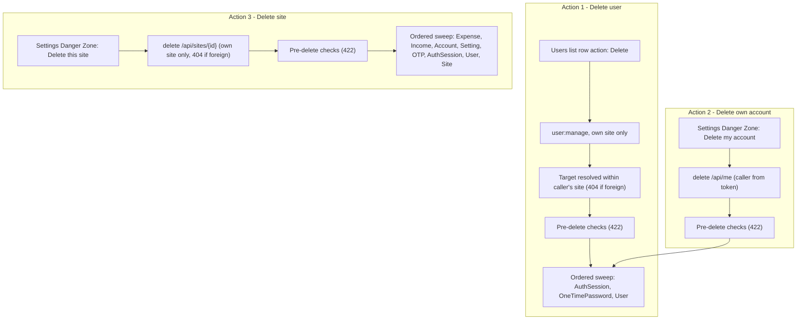

# User and Site Deletion PRD

**Status:** Blocked — waiting on PRD-026; this document needs review once PRD-026 is delivered
**Priority:** Medium
**Last Updated:** 2026-10-05
**Feature ID:** 022
**Scope:** Three deletion capabilities end to end, all confined to the caller's own site and identity. (1) A site admin removing another user from their site through a new row-level Delete action on the Users list, backed by `DELETE /api/users/{id}` and gated by `user:manage`. (2) A signed-in user permanently deleting their own account, backed by `DELETE /api/me`. (3) A site admin deleting a whole site — every user, session and financial record — from a Danger Zone at the bottom of the POT Settings sheet, backed by `DELETE /api/sites/{id}` and gated by `site:manage`. Covers the server guards that keep a site and the platform administrable, the ordered transactional sweeps the schema's `Restrict` foreign keys force, the confirmation surfaces, the local-only session teardown and return to the login page, and the 422 presentation. `platform:manage` grants no authority anywhere in this document: every platform-administrator cross-tenant operation — cross-site user deletion, cross-site site deletion and admin recovery in a foreign site — belongs to PRD-027. Bulk user deletion is explicitly excluded.

## Purpose

Give a site admin and a signed-in user a supported way to remove a user or retire a tenant, without hand-written SQL and without leaving POT in a state that nobody can administer.

Three different actors and three different blast radii drive this document, and keeping them apart is the core of it. Every action below is confined to the caller's own site and identity — no action here crosses a tenant boundary:

| Action             | Actor                                                                  | Blast radius                                                               | Reversible |
| ------------------ | ---------------------------------------------------------------------- | -------------------------------------------------------------------------- | ---------- |
| Delete a user      | Site admin (`user:manage`) acting on their own site                    | One `User` row plus their sessions and OTP rows                            | No         |
| Delete own account | The user themselves (any authenticated user, including a `Viewer`)     | The same as above, for the caller only                                     | No         |
| Delete a site      | Non-platform-admin site admin (`site:manage`) acting on their own site | Every user, session, account, expense, income and setting of the tenant    | No         |

Deleting a **user** removes the person and their ability to sign in. It is not a data-deletion feature: accounts, expenses, incomes and settings belong to the **site**, not to the user, so they stay behind and remain visible to the site's other users. Deciding that deliberately — and saying it plainly in the confirmation — is the core of Action 1.

Deleting a **site** removes all of it, for everyone.

Three refusals make both operations safe to expose:

1. **A configured platform admin can never be removed.** Platform administration is not a database role — it is a list of user `RowId`s in `PlatformAdminOptions` (`Source/Server/Pot.AspNetCore/Concerns/Auth/Configuration/PlatformAdminOptions.cs`), and `PermissionService` adds `platform:manage` at runtime on top of the user's database permissions. This rule is absolute: a configured platform admin can never be deleted by anyone, including themselves, and can never be removed by deleting the site they belong to. Removal is out-of-band: update `PLATFORM_ADMIN_USERIDS` to add a successor, restart the server, and the user then becomes deletable through the app. There is no config hot-reload, and monitoring configuration changes is not a requirement.
2. **The last enabled site admin cannot be removed.** The site's own `Admin` role holder is the only person who can manage accounts, users and site settings for that tenant, so removing them leaves the tenant unadministrable. The remedy — invite or promote another user to `Admin` first (or re-enable a disabled one) — is reachable in-app; when the caller is the site's only user, the remedy is to delete the whole site instead (Action 3). A tenant whose only administrator is unreachable is recovered by a platform administrator under PRD-027.
3. **A site that contains a configured platform admin cannot be deleted.** Deleting it would remove a user who can never be deleted, and a platform admin who is no longer in the configuration list is the only way back in, so the platform could be left with no working administrator.

Everything else about the feature is presentation: where each action lives, how hard it is to trigger by accident, and what the actor sees afterwards.

## Delivery Order and Dependencies

Delivery order is **PRD-026 → PRD-022 → PRD-027**.

- **PRD-026 (prerequisite).** Closes the cross-tenant authorization gaps so a delete target is resolved inside the caller's site (404 for a foreign id), and carries the invariants that a configured platform admin can never be disabled and a site's last enabled `Admin` can never be disabled or have `Admin` removed — without which the refusals here are bypassed through `PUT /api/users/{id}/status` and `/roles`.
- **PRD-027 (follows).** Reuses the ordered sweeps and refusal rules built here for the platform administrator's cross-tenant operations.

## Problem Statement

There is no way to remove a user, and no way to retire a site, through the product.

The server has no delete route for users at all: `Pot.AspNetCore/Features/Users/UsersEndpoints.cs` declares `GetAll`, `Update`, `UpdateRoles`, `UpdateStatus`, `Invite` and `ResendInvite`, and nothing else. The client even carries an orphan hook for it — `useApiDeleteUser` in `src/api/hooks/useUser.ts` targets `DELETE /users/{id}`, is exported, is imported nowhere, and has no server route to reach. The E2E suite records the same gap in writing (`e2e/tests/approvals/approvals.test.ts`: _"KNOWN GAP … there is no delete-user API"_).

The only route today is a hand-run `DELETE FROM "User" WHERE "Id" = …`, and even that fails against a live account: `DbContextBase.DisableCascadeDelete` forces `DeleteBehavior.Restrict` onto every foreign key on an `EntityBase`-derived entity, so any user who has ever signed in is protected by `AuthSession.UserId`, and any user with a pending reset or verification is protected by `OneTimePassword.UserId`. An operator must delete the session rows, then the OTP rows, then the user, then reason about what else pointed at it. Deleting a whole site multiplies that problem across more tables.

Meanwhile sites accumulate by design. `VerifySignupService` mints a site per approved signup:

```csharp
var site = new SiteEntity
{
    Name = GetDefaultSiteNameForUser(mostRecentOtp.Username),
};
```

so every self-service signup leaves behind a tenant, and after this feature's user deletion it can leave behind a tenant with no users at all — a site row, its settings and its financial history, with nobody able to sign into it.

## Current Behaviour

### Identity, roles and administration

| Concept                     | Where it lives                                                                      | Notes                                                                                                                                                   |
| --------------------------- | ----------------------------------------------------------------------------------- | ------------------------------------------------------------------------------------------------------------------------------------------------------- |
| User                        | `Pot.Data/Entities/UserEntity.cs`                                                   | Belongs to exactly one `Site`; `Username` is globally unique (`citext`); `Email` is not unique                                                          |
| Site                        | `Pot.Data/Entities/SiteEntity.cs`                                                   | Owns `Users`, `Accounts`, `Settings`; `Name` is globally unique (`citext`)                                                                              |
| Site role                   | `Pot.Shared/Enumerations/Role.cs`                                                   | `Admin`, `Viewer` — stored in the `UserRole` join table                                                                                                 |
| Permission                  | `Pot.Shared/Enumerations/Permission.cs`                                             | `site:manage`, `user:manage`, `account:manage`, … — attached to roles                                                                                   |
| User status                 | `Pot.Shared/Enumerations/UserStatus.cs`                                             | `Enabled`, `Disabled`, `Pending`, `Approval`                                                                                                            |
| Platform admin              | `Pot.AspNetCore/Concerns/Auth/Configuration/PlatformAdminOptions.cs`                | Comma-separated `RowId`s from `PLATFORM_ADMIN_USERIDS`; `PermissionService` adds `platform:manage` at runtime on top of the user's database permissions |
| Platform-admin-only surface | `src/components/nav/AppSidebarMenus.tsx` → Platform → Approvals (`platform:manage`) | The only place a platform admin acts in the UI today                                                                                                    |

`PlatformAdminOptionsSetup.Validate` fails startup when `PLATFORM_ADMIN_USERIDS` contains an entry that is not a GUID, so malformed configuration is caught at boot. A well-formed GUID that no longer maps to a live user still validates and resolves to nothing; this document does not change that.

There is no site list, no site switcher, and no site create/edit/delete beyond `PUT /api/sites/{id}` for the **current** site's name and description (`ISiteRepository.GetCurrentSite()`). The only cross-tenant surface in the product is Approvals.

### What the database permits

`DbContextBase.DisableCascadeDelete` forces `DeleteBehavior.Restrict` onto every foreign key on an `EntityBase`-derived entity. The auto-generated join tables are the only exception.

| Dependent row     | FK                  | On delete                              |
| ----------------- | ------------------- | -------------------------------------- |
| `AuthSession`     | `UserId`            | **Restricted** — must be deleted first |
| `OneTimePassword` | `UserId` (nullable) | **Restricted** — delete first          |
| `UserRole` (join) | `UsersId`           | Cascades                               |
| `Account`         | `SiteId`            | **Restricted**                         |
| `Setting`         | `SiteId`            | **Restricted**                         |
| `Expense`         | `AccountId`         | **Restricted**                         |
| `Income`          | `AccountId`         | **Restricted**                         |

Any delete of a live user or a live site is therefore an ordered, transactional write, not a single statement. There is no accrual table: derived accrual values are calculated, not stored.

### Site scoping and target binding

`PotDbContext` applies site-scoped global query filters to `Account`, `Expense`, `Income` and `Setting` (`account.Site.Id == GetCurrentUserSiteId()`, etc.). `User` and `Site` are **not** globally filtered: `GetAllForCurrentSiteAsync` filters users explicitly, and `GetByUsernameOrDefaultAsync` is global because it serves sign-in. A site-scoped delete of a `User` or a `Site` therefore cannot rely on a query filter to hide a foreign row — the target must be bound explicitly, which is what PRD-026 specifies and why it is a prerequisite.

### Authentication already reacts to a missing user

`JwtBearerEventsSetup.OnTokenValidated` resolves the user by `RowId` on every request and calls `context.Fail("User not found")` when the row is gone. `User.TokenVersion` exists for global revocation, but a hard delete does not need it: there is no user row left for a token to be validated against. Deleting the row is itself the global revoke.

Only `UserStatus.Enabled` users can authenticate (`OnTokenValidated` rejects the others), so only enabled users can reach any authenticated endpoint.

### Existing precedents this design follows

- **Delete-shaped feature layout.** `Pot.App/Features/Accounts/Delete` is the shape: an `IDeleteAccountService`, and a chain-of-responsibility `PreDeleteChecker : ChainOfResponsibilityAsyncComposer<InputState, ApiDetailError?>` over `EntityChecks/IPreDeleteChecker`, with one `Checks/Check… : PreDeleteCheckBase` handler per rule, each returning an `ApiDetailError` or falling through to the base handler.
- **Endpoint shape.** `Pot.AspNetCore/Features/Accounts/Delete/Handler.cs` returns `Results<Ok, ProblemHttpResult>`, mapping `EnrichedResult` success to `TypedResults.Ok()` and failure to `error.ToProblemDetails()`.
- **422 contract.** `ApiDetailErrorFactory.CreateUnprocessableEntityError(message)` and `CreateEntityConstraintError(...)` both surface as HTTP 422 (`EnrichedErrorExtensions.ToProblemDetails`).
- **Cookie clearing.** `RefreshTokenHelper.ClearCookie(httpContext, authOptions)` is the established way to drop the refresh-token cookie.
- **Route authorisation.** Routes use a single `.RequireAuthorization("<permission>")` policy (for example `user:manage` on `PUT /api/users/{id}/status` and `PUT /api/users/{id}/roles`, `site:manage` on `PUT /api/sites/{id}`). Every endpoint in this PRD uses exactly one site-scoped permission policy; none combines policies, because `platform:manage` is not part of any contract here.
- **Client row-action convention.** Row deletes live last in the action menu, after a `DropdownMenuSeparator`, with `Trash2` and `text-destructive-high-contrast` (`ExpenseActions.tsx`, `IncomeActions.tsx`); the confirmation is `ConfirmationDialog` (`src/components/dialog/confirmationDialog.tsx`) over `ui/alert-dialog`.
- **Client error surface.** `useErrorContext().setError({ title, description })` renders the global `ErrorSheet`, which splits `description` on `\n` — so line-per-point consequence and refusal copy is idiomatic here.
- **Client permission surfaces.** `<WithPermission>` renders children **disabled** with an explanatory wrapper; `<PermissionGuard>` renders **nothing**. `usePermissions()` exposes `hasPermission` / `hasAnyPermission` / `hasAllPermissions`.
- **Settings sheet structure.** `POTSettingsSheet` is a sticky header + one `overflow-y-auto` scroll region holding an `Accordion` (Site Details, User Details, Change Password, Budget Reminders), and **no footer**. The accordion drives `isActiveSectionDirty`, `handleSectionChange`, `getSectionFormHandle` and the unsaved-changes dialog, which is rendered as a sibling at `z-[70]` with `showCloseButton={false}` and `onInteractOutside` prevented.
- **Cache invalidation.** `useCacheInvalidation(queryClient)` + `invalidateCache(keys)` with a closed `CacheKey` union — `accounts | expenses | incomes | me | pending-approvals | projections | users`. There is **no** `sites` key.

### What the client does today

- `AuthContext.logout()` awaits `POST /auth/logout` **before** clearing local state. That call needs a live token and a live user, so it cannot be reused after any of the three deletions.
- The `Toaster` is mounted in `App.tsx` **above** `AppRoutes`, so a toast survives a route change to `/login`.
- The 422 branch of the axios interceptor produces a `ValidationError` whose `code` is the fixed string `Validation Error` (`src/api/errors/apiErrors.ts`) and whose `description` is the server's `errors[].errorMessage` (joined with `\n`) or `detail`. The error sheet therefore already reports a 422 — with a generic title and the server's own wording as the body.
- The Users list **already has** a per-row action menu: `UserActions.tsx` (desktop table) and `UserMobileCard.tsx` (mobile card) both currently offer Change Role, Disable/Enable User, and Resend Invitation, gated by `user:manage` and hidden entirely for the current user (`if (!canManageUsers || isCurrentUser) return null;` in `UserActions.tsx`; `!isCurrentUser` plus `WithPermission permissions={['user:manage']} mode="all"` in `UserMobileCard.tsx`). What is missing is Delete.

  > **Source reconciliation.** The brief describes the Users list as having "no row level actions, like accounts, incomes, expenses". In the current client it does have a row action menu; only the Delete entry is absent. This PRD is written on the basis that the requirement is to **add Delete to the existing menu**, not to build the menu. If a wider rework of user row actions is intended, that is a scope change this document does not cover.

- `UsersTable.tsx` passes only `columns`, `data` and `getRowId` to `DataTable` — there is no `enableRowSelection` and no `bulkActions`, unlike `AccountsTable.tsx` and `ExpensesTable.tsx`. Bulk user deletion is therefore impossible by construction today, and the requirement is to keep it that way.

## Proposed Solution

Decisions are recorded in the Decisions table; requirements reference them as `D-nn`.

The three actions share one sweep design and one dialog problem, so the requirements are grouped by action and the shared concerns are stated once. Every action is site-scoped, and platform-administrator cross-tenant operations are not represented here at all.


```mermaid
flowchart TD
    subgraph A1["Action 1 - Delete user"]
        U1["Users list row action: Delete"] --> U2["user:manage, own site only"]
        U2 --> U3["Target resolved within caller's site (404 if foreign)"]
        U3 --> U5["Pre-delete checks (422)"]
        U5 --> U6["Ordered sweep: AuthSession, OneTimePassword, User"]
    end
    subgraph A2["Action 2 - Delete own account"]
        M1["Settings Danger Zone: Delete my account"] --> M2["delete /api/me (caller from token)"]
        M2 --> M3["Pre-delete checks (422)"]
        M3 --> U6
    end
    subgraph A3["Action 3 - Delete site"]
        S1["Settings Danger Zone: Delete this site"] --> S2["delete /api/sites/{id} (own site only, 404 if foreign)"]
        S2 --> S3["Pre-delete checks (422)"]
        S3 --> S4["Ordered sweep: Expense, Income, Account, Setting, OTP, AuthSession, User, Site"]
    end
```

### Action 1 — A site admin deletes another user

#### Server contract

- **R1 — `DELETE /api/users/{id:guid}`.** A new route constant (`Delete = "/{id:guid}"`) on the existing Users group, mapped in `Features/Users/Extensions/RouteGroupBuilderExtensions.cs`, declaring 200, 401, 403, 404, 422 and 500. The target id is always explicit.
- **R2 — Authority: `user:manage`, scoped to the caller's own site.** A single permission policy on the route. `platform:manage` is not part of this contract and grants no authority here; a platform admin who is also a site admin of the target's site is authorised only through their site role, exactly like any other site admin.
- **R3 — Target resolution is site-scoped.** The target is resolved within the caller's site, so an id belonging to another tenant is simply not found and returns **404**, never a 403 that would confirm the row exists. This uses the site-scoped user lookup delivered by PRD-026.
- **R4 — Self-target is refused.** The caller cannot delete themselves through this endpoint; self-removal is Action 2 and has its own contract. Refuse with 422 (before any write) via `CheckTargetIsNotSelf`.
- **R5 — Ordered removal, in one transaction.** Resolve the tracked target (with a `WithTracking()` scope so `Add`/`Delete` classification is correct), then delete **all** of the target's `AuthSession` rows (revoked included), delete the target's `OneTimePassword` rows — those carrying the target's `UserId` **and** those carrying the target's `Username` (signup rows are created before a user exists and have no `UserId`; `Username` is globally unique so they can only belong to the same person) — and delete the `User` row. `UserRole` rows cascade. `IPersistableAuthSessionRepository` and the OTP repository need read methods that return **all** sessions / OTPs for the user — `GetUnrevokedByUserIdAsync` is not sufficient for a delete. See the Open Questions for where the shared sweep lives.
- **R6 — Response.** Success returns 200 with an empty body. There is no cookie to clear for the target: the target's refresh cookie lives in the target's own browser, and it dies with their session rows.
- **R7 — Logging.** Log the caller's `RowId`, the target's `RowId`, the site `RowId`, and the counts of removed sessions and OTP rows. Usernames are not logged (D-06).

#### Pre-delete refusal rules (422)

Each is a `Check… : PreDeleteCheckBase` handler in `Pot.App/Features/Users/Delete/EntityChecks/Checks`, following the `Accounts/Delete` chain. Evaluation order: not-self → platform admin → last enabled site admin; the first failing rule is returned (D-04).

- **R8 — `CheckTargetIsNotLastEnabledSiteAdmin`.** Refuse when the target is the site's only **enabled** user holding the `Admin` role. Users in `Disabled`, `Pending` or `Approval` status are not counted, because none of them can administer the site (D-04).
- **R9 — `CheckTargetIsNotPlatformAdmin`.** Refuse when the target's `RowId` is in `PlatformAdminOptions.GetUserRowIds()`. A configured platform admin can never be deleted, so no caller — site admin or otherwise — may remove one through the app.

Both rules are absolute safety invariants: authority to act on the target's site does not remove them.

#### Refusal messages are user-facing copy

The client's 422 `code` is a fixed generic string, so the only place to write actionable copy is the message passed to `ApiDetailErrorFactory` — and it must not promise a self-service remedy that does not exist.

- Platform admin: state that the account cannot be deleted because it is a platform administrator, that platform admin membership is deployment configuration rather than a role, and that it can only be changed out-of-band — update `PLATFORM_ADMIN_USERIDS` (adding a successor if appropriate) and restart the server, after which the account becomes deletable.
- Last enabled site admin: state that the account cannot be deleted because it is the site's only enabled administrator, and that another user must be invited and given the `Admin` role (or a disabled administrator re-enabled) first. Unlike the platform-admin rule, this remedy is reachable in-app.
- Self: state that a user cannot delete their own account from the user list, and point at the Settings Danger Zone.

#### Client surface and interaction

- **R10 — Add Delete to both existing user action menus.** Last item, after a `DropdownMenuSeparator` (which `UserActions.tsx` and `UserMobileCard.tsx` do not import today), labelled `Delete User…` to match the repo's "opens a further step" ellipsis convention, with `Trash2` and `text-destructive-high-contrast`.
- **R11 — Keep the existing gating and self-protection exactly as they are.** The menu stays behind `user:manage` / `WithPermission`, and stays hidden for the current user on both desktop and mobile (`isCurrentUser`). A site admin cannot remove themselves from this surface.
- **R12 — Disambiguate Delete from Disable explicitly.** These are adjacent, both user-lifecycle actions, and only one is reversible. The dialog copy must say so: for example, that disabling blocks sign-in and keeps the account, while deleting removes the account permanently — and that deletion does **not** delete the site's accounts, expenses or incomes, which remain visible to the site's other users.
- **R13 — A destructive confirmation dedicated to this action.** Built on the feature-local destructive dialog (D-03). Requires a typed confirmation of the target's **username**, compared trimmed and case-insensitively, with `autoCapitalize="none"`, `autoCorrect="off"` and `spellCheck={false}` on the input. Cancel is first and default-focused; the destructive action is last, labelled `Delete User`, disabled until the typed value matches, and shows a busy state while the request is in flight. The dialog must be scroll-capped (`max-h-[85dvh] overflow-y-auto` via the `className` passthrough) because `AlertDialogContent` has no max-height and a phone in landscape is roughly 390 px tall.
- **R14 — Success and failure.** On success: a toast (matching the status/role/invite flows, all of which toast) plus `invalidateCache(['users'])`. On failure: the dialog stays open and the failure is reported with `setError({ title: error.code, description: error.description })`, as the account and user flows already do.
- **R15 — No bulk deletion.** `UsersTable` stays free of `enableRowSelection` and `bulkActions`, and a unit test asserts that absence so it cannot creep in.
- **R16 — Replace the orphan `useApiDeleteUser`.** Delete it from `useUser.ts` and add a feature-local `useDeleteUser` mirroring `useDeleteAccount` (D-13).

### Action 2 — A user deletes their own account

- **R17 — `DELETE /api/me`.** A new route on the existing `Me` group (`Pot.AspNetCore/Features/Me/MeEndpoints.cs`), `RequireAuthorization("AuthenticatedUser")`, declaring 200, 401, 422 and 500. The caller is identified from the token; no target id is accepted, so the endpoint cannot be pointed at another user.
- **R18 — Refusal rules (422), evaluated before any write.** Both mirror the `Accounts/Delete` checker chain:
  - `CheckIsNotPlatformAdmin` — refuse when the caller's `RowId` is in `PlatformAdminOptions.GetUserRowIds()` (evaluated first). A configured platform admin can never be deleted, not even by themselves.
  - `CheckIsNotLastSiteAdmin` — refuse when the caller is the site's only **enabled** user holding the `Admin` role (same population as R8). The remedy is to promote another user to `Admin` first; when the caller is the site's **only user**, the stated remedy is to delete the whole site instead (Action 3).
- **R19 — Removal.** The same ordered sweep as R5, for the caller.
- **R20 — Response and cookie.** Success returns 200 with an empty body and clears the refresh cookie via `RefreshTokenHelper.ClearCookie`, mirroring the logout handler. The client must not be left holding a cookie for a session that no longer exists.
- **R21 — Placement: a Danger Zone inside `POTSettingsSheet`.** A distinct block after `</Accordion>` **inside** the existing scroll region, separated by a `Separator`, with a destructive-styled trigger, always visible (D-12). It sits **outside** the accordion, so it never participates in `isActiveSectionDirty`, the unsaved-changes dialog, or per-section Save/Discard — the accordion's `handleSectionChange` intercepts every value change and `getSectionFormHandle` has no member for a danger zone, so an accordion item would be actively wrong.
- **R22 — Not permission-gated.** Every user, including a `Viewer`, must be able to close their own account, so this block must not be behind `site:manage` or `user:manage`.
- **R23 — Confirmation.** The feature-local destructive dialog (D-03) with:
  - a consequence summary as multi-line copy (the `ErrorSheet` splits its description on `\n`, so line-per-point copy is idiomatic), stating: the account is permanently deleted and cannot be undone; sessions are ended and the user cannot sign in again; **the site's accounts, expenses and incomes are not deleted and remain visible to the site's other users**;
  - a typed confirmation of the user's own **username**, compared trimmed and case-insensitively, with helper text explaining why the button is disabled;
  - Cancel first and default-focused; the destructive action last, labelled `Delete My Account`, disabled until the typed value matches, with a busy state;
  - scroll-capped for short viewports, `z-[70]` and `showCloseButton={false}` with `onInteractOutside` prevented, mirroring the unsaved-changes dialog so a backdrop mis-tap cannot dismiss a destructive confirmation.
- **R24 — Success transition: toast, then login.** Close the dialog and the sheet, run a **local-only** session teardown, then `navigate('/login', { replace: true })`. The teardown mirrors `logout()` without the network call: clear the access token, stop the access-token refresh timer, clear the user store, clear the React Query cache. `replace` prevents the Back button re-entering an authenticated shell that no longer exists. The landing experience is the toast only (D-15).
- **R25 — 422 presentation through the existing error sheet.** The dialog stays open and the failure is reported with `setError({ title: error.code, description: error.description })`. Each refusal rule must be written as copy a user can act on, including the remedy.

### Action 3 — Delete the whole site

Why this is a different problem from Action 1: it destroys other people's accounts and a tenant's entire financial history. The authority, the surface, the server work and the blast radius are all different, and the loss is unrecoverable.

- **R26 — `DELETE /api/sites/{id:guid}`.** The Sites group currently only declares `Update` (`PUT /{id:guid}`), so this is a new route and a new handler. Declares 200, 401, 403, 404, 422 and 500.
- **R27 — Authority: `site:manage` on the caller's own site, and the caller must not be a configured platform admin.** `site:manage` is deliberately included — it is the tenant owner's action — while platform-admin operations across sites are PRD-027's concern, not this route's. Because the route only permits the caller's own site, a platform-admin caller is necessarily a member of the target site, so `CheckSiteHasNoPlatformAdmin` (R29) refuses the call.
- **R28 — Target resolution.** The caller may only target their own site; any other id returns **404** rather than 403. This uses the current-site binding delivered by PRD-026.
- **R29 — Refusal rule (422), evaluated before any write:** `CheckSiteHasNoPlatformAdmin` — refuse when the target site contains **any** configured platform admin. Deleting the site would remove a user who can never be deleted, and it also makes the canonical E2E seed sites undeletable, which is a useful safety property for the test suite. No protected-site configuration is introduced (D-07).
- **R30 — Deletion is an ordered, transactional sweep:** `Expense` → `Income` → `Account` → `Setting` → `OneTimePassword` (rows whose `UserId` belongs to one of the site's users, or whose `Username` matches one of them; the table has no site FK) → `AuthSession` → `UserRole` (cascades from `User`) → `User` → `Site`, all inside one transaction, with a clean 404 on a second attempt. The per-user refusal rules (R8) are **not** evaluated during a site sweep: the whole tenant, including its last admin, is being removed by design.
- **R31 — The Danger Zone is gated by `site:manage` and hidden when denied.** Use `PermissionGuard` (renders nothing) rather than `WithPermission` (renders a disabled destructive trigger): a disabled destructive control is a worse experience than no control, and permissions are already resolved from the user store so there is no render flicker. A user who holds both audiences' permissions (an `Admin`) sees both blocks, each styled identically as a destructive tile.
- **R32 — Visual treatment.** The destructive twin of the accordion tile, keeping identical geometry so it reads as the same design system: `border border-destructive/40 rounded-lg shadow-sm bg-gradient-to-br from-destructive/5 to-destructive/10`, an icon wrapper of `bg-destructive/10 text-destructive`, and a `<Button variant="destructive">` trigger. The tokens already exist (`--destructive` / `--color-destructive` in `src/index.css`, `Button variant="destructive"` in `ui/button.tsx`, `.text-destructive-high-contrast`); the string "Danger Zone" does not exist anywhere in the client today.
- **R33 — Confirmation is the feature-local destructive dialog (D-03)**, and it must include:
  - a consequence summary as line-per-point copy: every user of the site is removed and signed out permanently — **including you**; all accounts, expenses and incomes are deleted; no backup is taken and the action cannot be undone. No target counts are shown (D-09);
  - typed confirmation of **both the site name and the acting user's username**, compared trimmed and case-insensitively, with the destructive action disabled until both match (confirmed requirement);
  - Cancel first and default-focused; the destructive action last, labelled `Delete Site`, with a busy state while the request is in flight;
  - `z-[70]`, `showCloseButton={false}`, `onInteractOutside` prevented, and `max-h-[85dvh] overflow-y-auto` for short viewports.
- **R34 — No export pre-step.** The maintenance export covers accounts, incomes and expenses only — no users, roles, settings or site row — so offering it here would imply a backup that does not exist (D-08). The dialog copy says plainly that no backup is taken.
- **R35 — Post-deletion behaviour.** Every user of the site loses access at their next request; existing tabs fall back to the login page through the normal 401 path, which is sufficient (no extra copy). The caller runs the same local-only teardown as R24 and returns to `/login` with `replace: true`, ending in a full cache teardown rather than an invalidation, because there is no `sites` cache key. No notification email is sent (D-10). Login must keep returning the generic invalid-credentials response, because saying "that site was deleted" would confirm usernames to an unauthenticated caller.
- **R36 — E2E safety.** The harness seed defines two sites with a platform admin in seed site 1, so any test of this feature must create a throwaway site through the signup API and delete only that. R29 conveniently makes the canonical seed sites undeletable.

### Shared concerns

- **R37 — The platform-administrability invariant is absolute, not a counting rule.** A configured platform admin can never be deleted, so there is no "last platform admin" population to count and no interaction to reconcile with the last-site-admin rule. The two remaining guards are independent: R8 / R18 protect a site's administrability, and R9 / R18 / R29 protect the platform's immutable administrator set. The mirrored invariants carried by PRD-026 are that a configured platform admin can never be **disabled** (status is frozen; site roles are not, because `platform:manage` is granted from configuration independently of roles), and that a site's last enabled `Admin` can never be disabled or have `Admin` removed — so neither refusal can be bypassed through `PUT /api/users/{id}/status` or `PUT /api/users/{id}/roles`.
- **R38 — One feature-local destructive dialog, decided once.** Three destructive flows are being added to a client whose only confirmation primitive renders `[Delete] [Cancel]` with no destructive variant, no busy state, no typed confirmation, and (because the destructive action is first in the DOM) likely takes initial focus on open. A new reusable destructive dialog composed from `ui/alert-dialog` primitives (typed-confirmation input(s), busy state, safe-first footer, scroll cap, node description) serves all three flows and is reused by PRD-027. The shared `ConfirmationDialog` is left untouched so existing account/expense/income confirmations carry no regression risk (D-03). Where the component lives is for the stage that creates it to confirm with the developer, per the shared-helper rule.
- **R39 — Do not edit `src/components/ui/*`.** Those are shadcn-registry-owned. Everything above is achievable through wrappers, composition, and `className` passthrough on Radix content components.

## Out of Scope

- **All platform-administrator, cross-tenant operations.** Cross-site user deletion, cross-site site deletion, and admin recovery (promoting or assigning `Admin` in a foreign site) are owned by PRD-027. `platform:manage` grants no authority in this document, and there is no mixed-authority (`site:manage` / `user:manage` **OR** `platform:manage`) endpoint here.
- **Bulk user deletion.** Explicitly excluded. No multi-select delete, no "delete all disabled users".
- **Soft delete, anonymisation or a "disabled forever" state.** The user row is removed. There is no tombstone and no in-app audit record, because no audit infrastructure exists.
- **Deleting another tenant's user as a site admin.** This is a platform-admin operation owned by PRD-027; a site admin targeting a foreign id gets 404.
- **A site list, site switcher or site create/edit.** Out of scope; the only site surface is the current site's Settings sheet.
- **Data export, portability or target counts as part of deletion.** The maintenance export is not a tenant backup, and neither an export pre-step nor a summary endpoint is offered (D-08, D-09).
- **Email or notification on deletion.** No notification is sent to the departing user, to remaining users, or to the platform operator (D-10).
- **Account closure by an unauthenticated caller.** A user who cannot sign in (disabled, pending, or already deleted) cannot reach any of these endpoints, and no request-based alternative is introduced.
- **Password re-entry / step-up re-authentication** (D-11) and **a cooling-off or confirmation-link step** (D-16).
- **A protected-site configuration list** (D-07).
- **`TokenVersion` semantics.** No change; a hard delete supersedes the need for global revocation.
- **Refresh-token cookie handling for a deleted user's own devices.** Nothing can be done server-side beyond deleting the session rows; the stale cookie dies on its first use.
- **Validating that every `PLATFORM_ADMIN_USERIDS` entry maps to a live user.** Startup already rejects non-GUID entries; a well-formed GUID that maps to nobody is a deployment-configuration concern.

## Tests

Planned coverage, following the existing unit/integration split.

- **Application — user deletion.** `Pot.App.Tests/Features/Users/Delete/DeleteUserServiceFixture.cs`: the happy path deletes the user and returns success; each refusal rule returns its 422 error and performs no write; a caller targeting themselves is refused; a site admin targeting another tenant's user gets 404.
- **Application — self deletion.** `Pot.App.Tests/Features/Me/Delete/DeleteAccountServiceFixture.cs`: happy path; both refusals; when both rules match, the platform-admin error is returned first.
- **Application — site deletion.** `Pot.App.Tests/Features/Sites/Delete/DeleteSiteServiceFixture.cs`: happy path; a site containing a configured platform admin is refused; a site admin targeting a foreign site gets 404; a platform-admin caller acting on their own site is refused.
- **Entity checks.** `…/Checks/CheckTargetIsNotLastEnabledSiteAdminFixture.cs`, `CheckTargetIsNotPlatformAdminFixture.cs`, `CheckTargetIsNotSelfFixture.cs`, `CheckSiteHasNoPlatformAdminFixture.cs`, `CheckIsNotPlatformAdminFixture.cs`, `CheckIsNotLastSiteAdminFixture.cs`: any configured platform admin refuses (and a platform admin cannot self-delete); empty `PlatformAdminOptions.UserIds` allows; the last enabled `Admin`-role user refuses; a second enabled `Admin` allows; an `Admin` who is the only `Admin` but alongside a `Disabled`/`Pending` `Admin` still refuses (disabled and pending are not counted); a `Viewer`, or an `Admin` of a different site, allows.
- **Data.** Repository coverage for the new read methods (all sessions for a user including revoked; a user's OTP rows by `UserId` and by `Username`; the OTP rows of a site's users) and fixtures against a real Postgres database (`Pot.AspNetCore.Integration.Tests` is the only project that boots one, via Testcontainers) proving the ordered deletes succeed for a user holding sessions _and_ OTP rows, and for a site holding every dependent table — the two cases the current `Restrict` foreign keys reject today — and that a login racing the delete cannot leave an orphaned session (the `Restrict` FK makes one side fail rather than orphan a row).
- **Integration.** `Pot.AspNetCore.Integration.Tests/Features/Users/DeleteUserFixture.cs`, `Features/Me/DeleteAccountFixture.cs`, `Features/Sites/DeleteSiteFixture.cs`, in the style of the existing `Features/Auth/*Fixture.cs`: 401 unauthenticated; 403 for a caller without the required permission; 404 for a foreign-site target on both `DELETE /api/users/{id}` and `DELETE /api/sites/{id}`; 200 for a deletable target, after which the target's access token is rejected (and for self-deletion the refresh cookie is cleared); 422 with the expected problem-details body for each refusal rule and no rows removed; a second delete returns 404.
- **Client unit.** A `useDeleteUser` hook test; `UsersPage.test.tsx`, `UserActions.test.tsx` and `UserMobileCard.test.tsx` extended to assert Delete renders, is last, is destructive-styled, is absent for the current user, and is absent for a non-manager; a `UsersTable` test asserting no row selection (R15); destructive-dialog tests asserting the destructive action stays disabled until every typed value matches (trimmed, case-insensitive), that the copy names the site-data caveat, and that Cancel is the default action; `POTSettingsSheet.test.tsx` extended to assert the Danger Zone renders for a `Viewer` (self-delete) and for an `Admin` (self-delete and site delete), and that the site-delete block is absent for a `Viewer`; an `AuthContext` teardown test proving no `POST /auth/logout` is issued while the token, user store and query cache are cleared.
- **E2E.** Extend `e2e/tests/settings/userSettings.test.ts` for the Danger Zone, and `e2e/tests/approvals/approvals.test.ts` — which already documents the missing delete-user API — for the new row action. The 422 paths can be driven safely as the seeded `e2e_admin`; every 200 path must use a throwaway account created through signup, or a throwaway site created through the signup API, since the seeded users and sites are depended on by every other spec (and the seed sites are undeletable because they contain a configured platform admin). Assert the return to `/login`, that a subsequent sign-in attempt with the deleted credentials fails, and that a second delete returns 404. Short-landscape dialog coverage is new (existing short-viewport coverage is lists only).

## Decisions

| ID   | Decision                                                                | Resolution                                                                                                                                                                                                                                                                                        |
| ---- | ----------------------------------------------------------------------- | ------------------------------------------------------------------------------------------------------------------------------------------------------------------------------------------------------------------------------------------------------------------------------------------------- |
| D-03 | Confirmation strategy for the destructive flows                         | One feature-local destructive dialog composed from `ui/alert-dialog`; the shared `ConfirmationDialog` is not changed. Zero regression risk for existing confirmations; the dialog is reused by PRD-027.                                                                                            |
| D-04 | Population behind the last-site-admin rules, and evaluation order       | **Enabled only.** A non-enabled `Admin` cannot administer the site or re-enable anyone, so counting one would permit leaving a tenant with no usable administrator. Order: not-self → platform admin → last enabled admin; first failure wins, no combined message.                              |
| D-05 | `OneTimePassword` rows on user deletion                                 | **Delete** the rows (by `UserId` and by `Username`) rather than detach them. Detached rows would linger until expiry and signup rows keyed only by `Username` would survive the person they belong to.                                                                                            |
| D-06 | What the deletion log line records                                      | `RowId`s and counts only; no username.                                                                                                                                                                                                                                                            |
| D-07 | Protected-site configuration                                            | **No.** The platform-admin rule already protects the sites that matter.                                                                                                                                                                                                                           |
| D-08 | Maintenance export as a pre-step to site deletion                       | **No.** It is not a backup and offering it implies one.                                                                                                                                                                                                                                           |
| D-09 | Target summary counts in the site-delete dialog                         | **No** counts and no summary endpoint. Typed confirmation of site name and username plus consequence copy is the bar; keeps the feature to the three delete routes.                                                                                                                               |
| D-10 | Emailing remaining users after deletion                                 | **No.** No notification path exists (PRD-019 is unbuilt) and none is required.                                                                                                                                                                                                                    |
| D-11 | Password re-entry before self-deletion                                  | **Not required.** Typed confirmation of the username is the bar; no step-up pattern exists to build on.                                                                                                                                                                                           |
| D-12 | Danger Zone visibility                                                  | **Always visible** at the bottom of the scroll region; no disclosure row.                                                                                                                                                                                                                         |
| D-13 | Fate of the unused `useApiDeleteUser`                                   | **Delete** it and add a feature-local `useDeleteUser` mirroring `useDeleteAccount`.                                                                                                                                                                                                               |
| D-14 | May a site admin delete another `Admin`                                 | **Yes.** Only the last enabled `Admin` is protected; an `Admin` is an equal peer within their own site.                                                                                                                                                                                           |
| D-15 | Landing experience after self-deletion                                  | **Toast only**, no login-page notice.                                                                                                                                                                                                                                                             |
| D-16 | Cooling-off / emailed confirmation link for site deletion               | **None.** Deletion is immediate and transactional.                                                                                                                                                                                                                                                |

## Resolved Questions

1. **Can a user sign up again with the same username after deletion?** Yes. The row, and with it the uniqueness constraint, is gone, so re-signup succeeds and mints a new site. The username is not reserved.
2. **Should anything be sent on deletion?** No (D-10).
3. **Does `PLATFORM_ADMIN_USERIDS` need validation?** Non-GUID entries are already rejected at startup by `PlatformAdminOptionsSetup.Validate`. The never-delete rule does not depend on the list being usable; a GUID that maps to nobody is a deployment concern (Out of Scope).
4. **Last-admin rule when the site's other users are all non-enabled?** The rule counts enabled admins only (D-04), so deletion is refused and the message names both remedies: invite or promote an administrator, or re-enable a disabled one.
5. **Is the 401 fall-through enough for other users' open tabs after a site delete?** Yes (R35).
6. **Should the site Danger Zone warn that the caller is deleted too?** Yes — the consequence copy says "including you" (R33). R29's refusal is only about platform admins.
7. **Signup OTP rows with no `UserId`?** Deleted by `Username` match for user deletion, and by the site's users' usernames for site deletion (R5, R30, D-05).
8. **Budget-reminder state for a deleted recipient?** Nothing to do. The reminder worker enumerates enabled admins on each run, so a deleted user is simply no longer enumerated.
9. **Offer the export before self-deletion?** No (D-08).
10. **Should the self-delete and site-delete blocks be styled differently?** No. Both use the same destructive tile (R32); an `Admin` sees both, a `Viewer` only the self-delete block (R31).
11. **A login racing a delete?** Because every FK is `Restrict`, a session inserted for a user being deleted either blocks the delete until it commits (then the delete fails its FK check) or fails its own FK check; no orphan row can be written. The losing request fails and a retry succeeds. No explicit lock is added; a data-layer fixture proves the behaviour against a real database.

## Open Questions

1. **Where does the shared ordered-delete sweep live?** The user sweep (R5) and site sweep (R30) are consumed by this PRD and by PRD-027, and the ordering is forced by the foreign keys. Proposal: repository methods in `Pot.Data` (for example on `IPersistableUserRepository` / `IPersistableSiteRepository`), called from the application delete services. This is a shared-code placement and needs the developer's confirmation before the stage that creates it.

2. **How does the application layer learn the configured platform-admin `RowId`s?** `PlatformAdminOptions` lives in `Pot.AspNetCore`, which `Pot.App` cannot reference. The existing precedent is the signup flow: the handler reads the options and passes the values to the application service through its `Input` model (`VerifySignupService` / `Signup/Complete/Models/Input.cs`). Proposal: follow that precedent, so each delete handler passes the platform-admin ids in its `Input`. Confirm, since the alternative is a new abstraction in `Pot.App` implemented in `Pot.AspNetCore`.

## Assumptions and Constraints Register

| ID    | Assumption / Constraint                                                                                                                                                                                                                                                                                                           | Confidence |
| ----- | --------------------------------------------------------------------------------------------------------------------------------------------------------------------------------------------------------------------------------------------------------------------------------------------------------------------------------- | ---------- |
| AC-01 | Financial and configuration data belongs to the `Site`, so deleting a user leaves it intact and visible to the site's other users.                                                                                                                                                                                                | High       |
| AC-02 | `AuthSession.UserId` and `OneTimePassword.UserId` are `Restrict`; `UserRole` cascades; `Account`/`Setting` restrict on `SiteId` and `Expense`/`Income` restrict on `AccountId`. Every delete is an ordered write.                                                                                                                 | High       |
| AC-03 | Only `UserStatus.Enabled` users authenticate, so only they can reach any of these endpoints.                                                                                                                                                                                                                                      | High       |
| AC-04 | A hard delete is its own global revoke: a live access token dies at the next request on the per-request user lookup.                                                                                                                                                                                                              | High       |
| AC-05 | Site-scoped global query filters cover `Account`, `Expense`, `Income` and `Setting` only; `User` and `Site` are unfiltered, so a site-scoped delete must bind its target explicitly (PRD-026).                                                                                                                                    | High       |
| AC-06 | The client's 422 `code` is a fixed generic string, so user-visible rejection wording must be authored server-side.                                                                                                                                                                                                                | High       |
| AC-07 | `AuthContext.logout()` cannot be reused after deletion, because it calls `POST /auth/logout` first.                                                                                                                                                                                                                               | High       |
| AC-08 | A toast survives the navigation to `/login` because `Toaster` is mounted above `AppRoutes`.                                                                                                                                                                                                                                       | High       |
| AC-09 | There is no audit, tombstone, or soft-delete infrastructure, so deletion is immediate and unrecorded beyond application logs.                                                                                                                                                                                                     | High       |
| AC-10 | Platform admin membership is deployment configuration (`PLATFORM_ADMIN_USERIDS`). A configured platform admin can never be deleted through the app — not by a site admin, not by themselves, and not by deleting their site — so there is no in-app remedy; removal requires editing the configuration and restarting the server. | High       |
| AC-11 | Approved signup creates a site per user, so abandoned sites accumulate and are the main motivation for Action 3.                                                                                                                                                                                                                  | High       |
| AC-12 | The maintenance export is not a tenant backup: it carries no users, roles, settings, or site row.                                                                                                                                                                                                                                 | High       |
| AC-13 | The client's `CacheKey` union has no `sites` key, so site deletion must end in a full cache teardown rather than an invalidation.                                                                                                                                                                                                 | High       |
| AC-14 | `src/components/ui/*` is shadcn-registry-owned and must not be hand-edited; `src/components/dialog/confirmationDialog.tsx` is left unchanged by this feature.                                                                                                                                                                    | High       |
| AC-15 | The Users list already has a per-row action menu (Change Role, Disable/Enable, Resend Invitation); only Delete is missing.                                                                                                                                                                                                        | High       |
| AC-16 | `UsersTable` has no row selection or bulk actions, so bulk deletion is impossible by construction today.                                                                                                                                                                                                                          | High       |
| AC-17 | Every endpoint in this PRD uses exactly one site-scoped permission policy; no endpoint in this document requires more than one policy.                                                                                                                                                                                            | High       |
| AC-18 | The three delete services slot into the existing feature folders (`Pot.App/Features/{Users,Me,Sites}/Delete`, `Pot.AspNetCore/Features/{Users,Me,Sites}/Delete`) following the `Accounts/Delete` shape.                                                                                                                           | Medium     |
| AC-19 | PRD-026 is delivered first: it binds a site-scoped target for `User`/`Site` routes and freezes a configured platform admin's status and a site's last enabled `Admin` against the status and role routes.                                                                                                                       | High       |
| AC-20 | No accrual table exists; the accrual values are calculated, so no accrual rows are part of any sweep.                                                                                                                                                                                                                             | High       |

## Readiness Criteria

Before this PRD moves from Planning to Planned:

1. The developer has reviewed and approved the Decisions table.
2. The two Open Questions (shared sweep placement, how the application layer gets the platform-admin ids) are answered.
3. PRD-026 is Planned (or delivered), because the 404-for-a-foreign-target contract in R3 and R28 and the status/role invariants in R37 are provided by it.
4. The E2E approach (throwaway site for Action 3, throwaway account for Action 1) is accepted, so the seeded users and sites are not consumed by this feature's tests.

The ordered sweeps (R5, R30) are validated against a real database by the data-layer fixtures in their stage, not as a precondition.

## Design Notes (Rationale and Rejected Alternatives)

Reference notes for future maintainers.

- **Two actions, not one, and no third "site disposal" flow.** Deleting a user is a row that belongs to the person who asked; deleting a site destroys other people's accounts and a tenant's whole financial history. They share guards and dialog machinery, which is why they share a document, but they must not share an entry point or an authority model.
- **No platform-admin authority in this document.** Every action here is confined to the caller's site and identity, so `platform:manage` never participates and there is no mixed-authority endpoint. Cross-site user deletion, cross-site site deletion and admin recovery are owned by PRD-027; this PRD only points at it.
- **Action 3 lives in Settings and keeps a platform guard, but not a platform authority.** The tenant owner is the natural actor for retiring their own tenant, and `site:manage` is exactly that authority. The `CheckSiteHasNoPlatformAdmin` rule is what stops the same button from removing a user who can never be deleted. Rejected: requiring `platform:manage` for all site deletion (that is PRD-027's territory and would remove the tenant owner's ability to retire their own data); rejected: automatic site disposal when the last user leaves, which would turn "delete my account" into a covert tenant-destruction button acting on data the user does not own.
- **The platform-admin rule is absolute, so "last platform admin" is deleted as a concept.** Because a configured platform admin can never be deleted by anyone, including themselves, no deletion can reduce the platform admin set. Removal is out-of-band: update `PLATFORM_ADMIN_USERIDS` to add a successor, restart the server, then delete. The refusal copy must say this and point at the deployment configuration and restart.
- **The mirrored invariants are PRD-026's.** A user-deletion guard here is only meaningful if the same user cannot be disabled or stripped of `Admin` through `PUT /api/users/{id}/status` or `/roles`. PRD-026 carries those invariants; this PRD depends on them.
- **Row-level Delete, not a destructive bulk action.** Bulk deletion has no place in a users list where a single mis-selection can remove several people at once, and the Users table has no selection model to build on anyway.
- **Delete is last in the menu, after a separator, in red.** This is the existing convention for every other row delete in the app; making users the exception would be the only place a destructive action sits adjacent to a benign one.
- **Delete and Disable must be told apart in words, not just colour.** They are adjacent lifecycle actions and only one is reversible. The confirmation therefore carries the distinction, and the copy states what deletion does _not_ do to the site's data.
- **The self row keeps no menu.** The current `UserActions` guard hides the whole menu for the current user to prevent self-lockout, on both desktop and mobile. Self-deletion is deliberately reached through Settings instead, where it can be designed as an account-closure flow with its own confirmation.
- **The Danger Zone sits outside the accordion, and outside the dirty-state machinery.** `handleSectionChange` intercepts every accordion value change, `isActiveSectionDirty` drives the unsaved-changes prompt, and `getSectionFormHandle` returns `null` for anything without a form. Plain JSX after `</Accordion>` inside the scroll region cannot affect any of that.
- **A disabled destructive trigger is worse than no trigger.** For the `site:manage` block, hiding is the better failure mode; for the self-delete block, gating would exclude the very users who most need the capability, so it is not gated at all.
- **A purpose-built dialog rather than the shared `ConfirmationDialog`.** The shared component renders `[Delete] [Cancel]`, has no destructive variant, no busy state and no typed confirmation, and puts the destructive action first in the DOM — so Radix's first-tabbable focus rule lands on it. Rather than change a component that every existing delete relies on, a new dialog is added alongside it; migrating the existing confirmations is a separate, optional follow-up.
- **Typing the site name and the username, not a fixed phrase.** A fixed word adds friction without information. The site name forces awareness of _which_ tenant dies; the acting username forces a deliberate, personally-attributable act. Both are compared trimmed and case-insensitively, because strict matching strands keyboard users on a technically-correct entry, and the input disables autocapitalisation so lowercase names like `e2e_approval_…` are not silently mangled.
- **No password re-entry.** The session is already a proof of possession, and POT has no step-up re-authentication pattern to build on. Typed confirmation already prevents reflexive confirmation.
- **A local-only teardown instead of `logout()`.** `logout()` awaits `POST /auth/logout` before clearing state. After a deletion that request cannot succeed, and a 401 from it can trip the global 401 handling that itself calls `logoutManager.logout()`, risking a double navigation or a loop. The teardown therefore mirrors `logout()` minus the network call, and the refresh timer must be torn down promptly for the same reason.
- **`navigate(..., { replace: true })`.** Without `replace`, Back would re-enter the authenticated shell with no session.
- **A toast rather than a login-page banner.** The `Toaster` is mounted above `AppRoutes`, so the message survives the transition to `/login` and no new login-page state contract is needed.
- **Hard delete, not anonymisation or soft delete.** Retaining the row keeps the username and email, keeps the person's presence in the users list, and leaves the account recoverable — the opposite of what was asked. A hard delete also makes the authentication path correct for free: the per-request user lookup fails, so no `TokenVersion` bump is needed.
- **`OneTimePassword` rows are part of the delete, not an afterthought.** Rows created for an existing user carry a `UserId`, and that FK is `Restrict`, so ignoring them means the feature fails for exactly the users who have recently reset a password. Signup rows carry only a `Username`, so they are matched on it.
- **The platform-admin guard exists because the configuration is unrevocable in-app.** Refusing to delete any configured platform admin — rather than counting to "last" — is the simplest rule that cannot be reasoned into an unrecoverable lockout.
- **404, not 403, for a foreign target.** A 403 confirms that the row exists, which leaks tenant membership to a caller who should not know it.
- **No export, no counts.** The maintenance export writes accounts, incomes, expenses and metadata only, so a restore yields a tenant nobody can sign into; presenting it as safety would be worse than offering nothing. Target counts would need a new read endpoint for information the typed confirmation already makes unnecessary.
- **Cooling-off is rejected as a schema feature.** A "pending deletion" tenant would have to be understood by every site-scoped query, by auth, and by the reminder worker.
- **Two dialog hazards are already known.** Radix content components have no max-height and would clip their own footer on a phone in landscape, so the dialog must be scroll-capped; and the Settings sheet and any Radix dialog both portal to `document.body` at the same z-index, which is why the unsaved-changes dialog already uses `z-[70]`.
- **`src/components/ui/*` is off limits.** It is registry-owned; a dialog wrapper, composition, and `className` passthrough get everything this feature needs without touching it.

## Related Documents

- Future index: [Docs/Future/README.md](README.md)
- **Prerequisite:** [Cross-Tenant Authorization Hardening](PRD-026-cross-tenant-authorization-hardening.md) — closes the cross-tenant target-binding gaps so a site-scoped delete resolves its target inside the caller's site, and carries the invariants that a configured platform admin can never be disabled and that a site's last enabled `Admin` can never be disabled or have `Admin` removed.
- **Owner of platform-admin operations:** [Platform Administration](PRD-027-platform-administration.md) (cross-site user deletion, cross-site site deletion, and admin recovery in a foreign site), which reuses this PRD's sweeps, refusal rules and destructive dialog.
- Precedent for the delete feature layout: `Source/Server/Pot.App/Features/Accounts/Delete`, `Source/Server/Pot.AspNetCore/Features/Accounts/Delete`
- Session and logout architecture: [Server Login/Logout Session Architecture](PRD-002-server-login-logout-session-architecture.md)
- AuthSession retention (context for what a session represents): [AuthSession Retention and Background Cleanup Policy](PRD-010-auth-session-retention-and-cleanup-policy.md)
- Per-site locale (context for the site's Settings surface): [Site Locale and Time Zone Settings](PRD-018-site-locale-settings.md)
- Client dialog and destructive-action surface: `Source/Client/pot-react/src/components/dialog/confirmationDialog.tsx`, `Source/Client/pot-react/src/components/ui/alert-dialog.tsx`
