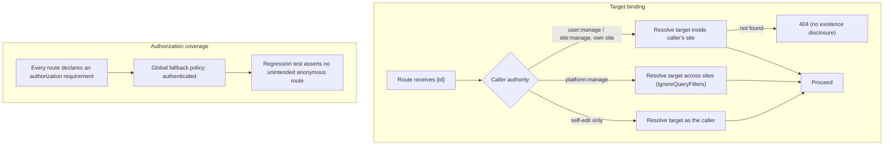

# Cross-Tenant Authorization Hardening PRD

**Status:** Proposed (discovery draft)
**Priority:** High
**Last Updated:** 2026-10-03
**Feature ID:** 026
**Scope:** Close the cross-tenant authorization gaps in POT's user- and site-scoped API endpoints, where the target row is resolved by the id supplied by the caller without binding it to the caller's site or to the caller's own identity. The gaps are on the Users group (`PUT /api/users/{id}`, `PUT /api/users/{id}/roles`, `PUT /api/users/{id}/status`, `POST /api/users/{id}/resend-invite`) and one site route (`PUT /api/sites/{id}`), and they exist because `UserEntity` and `SiteEntity` carry no site-scoped global query filter while the routes' permission requirements (`user:manage` / `site:manage`) are not tenant-scoped. This PRD records the verified current behaviour, proposes candidate requirements (target binding, authorization coverage, repository-level tenant scoping), and enumerates the open decisions that must be resolved before implementation. Closing these gaps is a prerequisite for the user/site deletion feature, which assumes site-scoped target resolution. It also records the identity invariants those routes must not be able to bypass: a configured platform administrator can never be disabled, and a site's last enabled `Admin` can never be disabled or have `Admin` removed, so the deletion feature's refusals cannot be side-stepped through a status or role change.

## Purpose

Make every id-taking endpoint resolve its target inside a boundary the caller is authorised to act on, so a signed-in user of one site cannot read or write another site's users or settings by supplying a `Guid` `RowId`.

POT is multi-tenant: a `Site` owns `Users`, `Accounts`, `Settings`, and (through `Account`) `Expenses` and `Incomes`. Tenant isolation is currently enforced in two places only:

1. **Global query filters** on `Account`, `Expense`, `Income` and `Setting`, applied by `PotDbContext.SetupQueryFilters` (`Source/Server/Pot.Data/PotDbContext.cs`).
2. **Permission policies** such as `user:manage` and `site:manage`, checked by `RequireAuthorization(...)` at each route.

Neither mechanism binds a caller to the target row. The query filters do not cover `User` or `Site`, and a permission like `user:manage` says what a caller may do, not which site's rows they may do it to. Where a service looks a target up by `RowId` from the raw `DbSet`, an id from another tenant is reachable.

This document is a discovery draft. Every claim below is grounded in a file that was read; where a behaviour could not be confirmed it is recorded in the Outstanding Questions Register rather than asserted.

## Problem Statement

A site admin in site A can act on a user in site B, and a site admin in site A can rename site B, because the target `RowId` is not bound to the caller.

The root cause is the combination of two verified facts:

- `PotDbContext.SetupQueryFilters` (`Source/Server/Pot.Data/PotDbContext.cs`) applies site-scoped filters to `AccountEntity`, `ExpenseEntity`, `IncomeEntity` and `SettingEntity` only. `UserEntity` and `SiteEntity` are unfiltered, so `Set<UserEntity>()` and `Set<SiteEntity>()` return rows from every site. `UserRepository.Users` is `Set<UserEntity>()` and `SiteRepository.Sites` is `Set<SiteEntity>()` (`Source/Server/Pot.Data/Repositories/Users/UserRepository.cs`, `Source/Server/Pot.Data/Repositories/Sites/SiteRepository.cs`).
- The permission requirements are not tenant-scoped. `PermissionAuthorizationPolicyProvider` builds a policy that carries a single `PermissionRequirement(policyName)` for whatever string is passed to `RequireAuthorization` (`Source/Server/Pot.AspNetCore/Concerns/Auth/PermissionAuthorizationPolicyProvider.cs`), and the permission set itself comes from the caller's roles plus the runtime-added `platform:manage` (`Source/Server/Pot.AspNetCore/Concerns/Auth/Services/PermissionService.cs`). A `user:manage` holder in site A satisfies `RequireAuthorization("user:manage")` for a target in site B.

The affected services all share the same shape: resolve the tracked target with `_userRepository.Users.SingleOrDefaultAsync(user => user.RowId == input.RowId)` and then mutate it, with the only pre-write guard being an etag equality check.

The severity varies by endpoint. `PUT /api/users/{id}` is not protected by any authorization requirement at all, so the caller is not even required to be authenticated. `POST /api/users/{id}/resend-invite` resets the target's `PasswordHash`. `PUT /api/users/{id}/roles` can change another tenant's role assignments, including granting `Admin`. `PUT /api/sites/{id}` can rename another tenant.

The gaps must be closed before the user/site deletion feature is implemented. That feature is specified to resolve a site admin's target **within the caller's site**, returning 404 for a foreign id, and to use `platform:manage` as the only cross-tenant authority. If the existing user-targeting services remain cross-tenant, the delete endpoint built alongside them would inherit the same defect, and a site admin could delete another tenant's user by `RowId`.

## Current Behaviour

### Tenant isolation primitives

| Mechanism                        | Where                                                                                                                                                                                                      | Tenant-bound?       | Notes                                                                                                                             |
| -------------------------------- | ---------------------------------------------------------------------------------------------------------------------------------------------------------------------------------------------------------- | ------------------- | --------------------------------------------------------------------------------------------------------------------------------- |
| Site-scoped global query filters | `PotDbContext.SetupQueryFilters` (`Source/Server/Pot.Data/PotDbContext.cs`)                                                                                                                                | Yes, but partial    | Applies to `Account`, `Expense` (via `Account.Site.Id`), `Income` (via `Account.Site.Id`) and `Setting`. Not to `User` or `Site`. |
| Permission policies              | `RequireAuthorization("<permission>")` per route                                                                                                                                                           | **No**              | Checks only that the caller holds the permission; it carries no site condition.                                                   |
| Current-site resolution          | `SiteRepository.GetCurrentSite()` → `UserRepository.GetCurrentUser(true)` (`Source/Server/Pot.Data/Repositories/Sites/SiteRepository.cs`, `.../Users/UserRepository.cs`)                                   | Yes                 | Used by `InviteUserService` to attach a new user to the caller's site; not used to bind an id-taking target.                      |
| Runtime platform admin           | `PermissionService.GetPermissionsAsync` + `PlatformAdminOptions.GetUserRowIds()` (`Source/Server/Pot.AspNetCore/Concerns/Auth/Services/PermissionService.cs`, `.../Configuration/PlatformAdminOptions.cs`) | Deliberately global | Adds `platform:manage` on top of the caller's database permissions when their `RowId` is in `PLATFORM_ADMIN_USERIDS`.             |
| Current-caller context           | `UserContextMiddleware` sets `ICurrentUserContext.UserRowId` from the JWT `sub` (`Source/Server/Pot.AspNetCore/Concerns/Middleware/UserContextMiddleware.cs`)                                              | Yes                 | Available to application services but not consulted by the affected user/site services.                                           |

There is **no global fallback authorization policy**. `AddPotAuth` registers only the `AuthenticatedUser` policy (`Source/Server/Pot.AspNetCore/Extensions/WebApplicationBuilderExtensions.cs`), and the pipeline calls `UseAuthentication()` / `UseAuthorization()` without a default requirement (`Source/Server/Pot.AspNetCore/Program.cs`). An endpoint that omits `RequireAuthorization(...)` therefore has no authorization requirement at all.

### The affected endpoints

| Route                                                                | Required permission                                                                                                     | Target lookup                                                                                                           | Caller == target binding | Site-scoped target resolution |
| -------------------------------------------------------------------- | ----------------------------------------------------------------------------------------------------------------------- | ----------------------------------------------------------------------------------------------------------------------- | ------------------------ | ----------------------------- |
| `PUT /api/users/{id}` (`UsersEndpoints.Update`)                      | **None** — the `.RequireAuthorization("user:manage")` call is commented out in `RouteGroupBuilderExtensions.UpdateUser` | `Users.SingleOrDefaultAsync(user => user.RowId == input.RowId)` in `UpdateUserService`                                  | No                       | No                            |
| `PUT /api/users/{id}/roles` (`UsersEndpoints.UpdateRoles`)           | `user:manage`                                                                                                           | `Users.Include(user => user.Roles).SingleOrDefaultAsync(user => user.RowId == input.RowId)` in `UpdateUserRolesService` | No                       | No                            |
| `PUT /api/users/{id}/status` (`UsersEndpoints.UpdateStatus`)         | `user:manage`                                                                                                           | `Users.SingleOrDefaultAsync(user => user.RowId == input.RowId)` in `UpdateUserStatusService`                            | No                       | No                            |
| `POST /api/users/{id}/resend-invite` (`UsersEndpoints.ResendInvite`) | `user:manage`                                                                                                           | `Users.SingleOrDefaultAsync(user => user.RowId == userRowId)` in `ResendInviteService`                                  | No                       | No                            |
| `PUT /api/sites/{id}` (`SitesEndpoints.Update`)                      | `site:manage`                                                                                                           | `Sites.SingleOrDefaultAsync(site => site.RowId == input.RowId)` in `UpdateSiteService`                                  | No                       | No                            |

Route registration: `Source/Server/Pot.AspNetCore/Features/Users/Extensions/RouteGroupBuilderExtensions.cs` and `Source/Server/Pot.AspNetCore/Features/Sites/Extensions/RouteGroupBuilderExtensions.cs`. Endpoint constants: `Source/Server/Pot.AspNetCore/Features/Users/UsersEndpoints.cs`, `.../Sites/SitesEndpoints.cs`.

The only pre-write guard on these routes is an etag equality check (for example `Source/Server/Pot.App/Features/Users/Update/EntityChecks/Checks/CheckHasSameEtag.cs`, and the equivalents under `UpdateStatus/EntityChecks/Checks` and `UpdateRoles/EntityChecks/Checks`; `UpdateRoles` adds `CheckValidRoles`). An etag is a concurrency token, not an authorization control: it proves the caller has seen the row, not that they are entitled to change it.

### Finding detail

**F1 — `PUT /api/users/{id}` has no authorization requirement and no identity binding.**

- `RouteGroupBuilderExtensions.UpdateUser` carries the comment _"There's no RequireAuthorization here since the user needs to be able to change their own display / email details"_ and the `.RequireAuthorization("user:manage")` line is commented out.
- `UpdateUserService.UpdateUserAsync` resolves the target solely by `input.RowId` and updates `DisplayName` and `Email`. It never compares `input.RowId` with `ICurrentUserContext.UserRowId`.
- Because there is no fallback policy, the route is not behind any authorization requirement, so an unauthenticated caller is not rejected by the framework, and no service code rejects them either (neither `UpdateUserService` nor any dependency it calls reads `ICurrentUserContext` on this path).
- Impact: any caller who can supply a target `RowId` (and a matching `Etag`) can change that user's `DisplayName` and `Email`, across tenants. A wrong etag yields a 409 and a missing row yields a 404, so the endpoint also discloses whether a given `RowId` exists. The etag check is the only friction.

**F2 — `PUT /api/users/{id}/roles` is cross-tenant.**

- `UpdateUserRolesService.UpdateUserRolesAsync` resolves the target with `_userRepository.Users.Include(user => user.Roles).SingleOrDefaultAsync(user => user.RowId == input.RowId)` and assigns `userToUpdate.Roles = roles` from `input.RoleIds`.
- `UserEntity` has no query filter, so the id may belong to any site.
- Impact: a `user:manage` holder in site A can replace the roles of a user in site B, including granting or removing `Admin`. Site roles are `Admin` / `Viewer` (`Pot.Shared/Enumerations/Role.cs`), so this is a privilege-escalation vector inside another tenant.

**F3 — `PUT /api/users/{id}/status` is cross-tenant.**

- `UpdateUserStatusService.UpdateUserStatusAsync` resolves the target by `RowId` and sets `userToUpdate.Status = input.Status`.
- Impact: a `user:manage` holder in site A can enable or disable a user in site B. Disabling another tenant's users is a denial-of-service against that tenant.

**F4 — `POST /api/users/{id}/resend-invite` is cross-tenant.**

- `ResendInviteService.ResendInviteAsync` resolves `_userRepository.Users.SingleOrDefaultAsync(user => user.RowId == userRowId)`, generates a new temporary password, overwrites `user.PasswordHash`, and calls `SendInvitationEmail` to the target's stored `Email`.
- Impact: a `user:manage` holder in site A can force a credential reset on a user in site B and trigger an unexpected invitation email. The plaintext temporary password is delivered to the target's own mailbox, so this is credential tampering rather than direct impersonation, but it is still an unauthorised cross-tenant write to another user's account.

**F5 — `PUT /api/sites/{id}` is cross-tenant.**

- `UpdateSiteService.UpdateSiteAsync` resolves `_siteRepository.Sites.SingleOrDefaultAsync(site => site.RowId == input.RowId)` and updates `Name` and `Description`. `SiteRepository.Sites` is `Set<SiteEntity>()` and `SiteEntity` has no query filter, so the id may be any site.
- The lambda parameter is named `user` in the source (`SingleOrDefaultAsync(user => user.RowId == input.RowId)`), but the query is against `Sites` — this is a **site** lookup with a misleading parameter name, not a user lookup. The defect is that the target is not bound to the caller's current site, even though the route is conceptually "update the current site" and `ISiteRepository.GetCurrentSite()` already exists for that purpose.
- Impact: a `site:manage` holder in site A can rename or re-describe any site in the deployment by `RowId`.

### Invariants reachable through the affected routes

The affected routes do not only cross site boundaries; they also reach identities the deletion feature treats as immutable.

- `PUT /api/users/{id}/status` (F3) can set a configured platform admin's status to `Disabled`, and can disable a site's last enabled `Admin`. The deletion feature refuses both outcomes through deletion (PRD-022 R8/R9/R18); no equivalent refusal exists on the status route.
- `PUT /api/users/{id}/roles` (F2) can remove the `Admin` role from a site's last enabled admin, and can change a configured platform admin's roles.

`PermissionService` adds `platform:manage` at runtime from `PlatformAdminOptions.GetUserRowIds()` independently of the user's database roles, so removing a platform admin's `Admin` role does not remove `platform:manage`. Disabling the account does prevent sign-in, because `JwtBearerEventsSetup.OnTokenValidated` rejects a non-`Enabled` user — the status route is therefore the lock-out vector, and the role route is the tenant-administrability vector.

### Investigated and found NOT to be gaps

- **`GET /api/users`.** The handler calls `IGetAllUsersService.GetAllForCurrentSiteAsync` (`Source/Server/Pot.AspNetCore/Features/Users/GetAll/Handler.cs`), which calls `UserRepository.GetAllForCurrentSiteAsync` — an explicit `Users.Where(user => user.Site.Id == currentUser.Site.Id)` (`Source/Server/Pot.Data/Repositories/Users/UserRepository.cs`). Site-scoped by construction.
- **`GetAllEnabledAdminsAsync`.** `GetAllUsersService.GetAllEnabledAdminsAsync` is built on `UserRepository.GetEnabledUsersAsync`, which returns every enabled user across all sites. It is **not exposed by any route**; its only production caller is `BudgetReminderEmailWorker` (`Source/Server/Pot.AspNetCore/Features/Workers/BudgetReminderEmailWorker.cs`), which enumerates the enabled admins and then opens a _per-user scope_ that sets `ICurrentUserContext.SetUserRowId(user.RowId)` so the downstream site filters resolve that user's site. This is an intentional platform-wide worker enumeration, not a request-reachable gap.
- **`GET /api/me` and `PUT /api/me/change-password`.** Both derive the caller from the token's `JwtRegisteredClaimNames.Sub` claim through `IHttpUserService.GetMeInfoAsync` → `UserService.GetUserInfoAsync(Guid)` (`Source/Server/Pot.AspNetCore/Features/Me/Services/HttpUserService.cs`, `Source/Server/Pot.AspNetCore/Features/Me/Get/Handler.cs`, `.../ChangePassword/Handler.cs`). No user id is accepted from the request, so the endpoint cannot be pointed at another user.
- **`PUT /api/approvals/{id}/status` and `GET /api/approvals/pending`.** Both require `platform:manage` and deliberately read/write across sites using `IgnoreQueryFilters()` (`Source/Server/Pot.App/Features/Approvals/UpdateStatus/UpdateApprovalService.cs`, `.../Pending/GetPendingApprovalsService.cs`). This is the intended cross-tenant platform-admin surface, not a gap, and it is the precedent any future platform-admin path should follow.
- **`POST /api/auth/logout`.** Has no `.RequireAuthorization(...)`, but derives the user from the token and ignores a missing user (`Source/Server/Pot.AspNetCore/Features/Auth/Logout/Handler.cs`); it cannot be pointed at another user.
- **`Accounts`, `Expenses`, `Incomes`, `Settings`, `Projections`, `Maintenance`.** These resolve targets by `RowId`, but their entities are site-filtered (`Account`, `Expense`, `Income`, `Setting`), so an id from another site is not returned by the filtered `DbSet`. The routes also require the matching `resource:action` permission. Not cross-tenant.
- **`GET /api/roles`.** Requires `user:view`; roles are platform-level (`Pot.Data/Entities/RoleEntity.cs`), not tenant data.

## Proposed Solution

Everything below is a candidate requirement; nothing is implemented. Decision IDs (`OD-nn`) refer to the Open Decisions Backlog.

The findings share two concerns — **target binding** and **authorization coverage** — so the requirements are grouped by concern rather than by endpoint.

### Target binding

- **R1 — Bind the user target to the caller's site for the `user:manage` routes.** `PUT /api/users/{id}/roles`, `PUT /api/users/{id}/status` and `POST /api/users/{id}/resend-invite` must resolve the target within the caller's site. A shared, site-scoped lookup (for example a `GetForCurrentSiteAsync(Guid)` on `IPersistableUserRepository` / `IUserRepository`) is preferred over repeating the predicate, so a future user-targeting endpoint cannot forget it. The existing `GetAllForCurrentSiteAsync` is the shape to follow.
- **R2 — Bind `PUT /api/users/{id}` to the caller.** The route exists so a user can edit their own details. Two candidate shapes:
  - **(a)** Self-only unless `user:manage`: a caller without `user:manage` may target only their own `RowId`; a `user:manage` caller may target users in their own site; `platform:manage` may target any site. Reject a non-matching target with 404 (or 403 — see OD-05).
  - **(b)** Split the route: `PUT /api/me` for self-edit and `PUT /api/users/{id}` requiring `user:manage` for admin edit. This keeps the public self-edit contract but changes the API shape.
    OD-01 decides.
- **R3 — Bind `PUT /api/sites/{id}` to the caller's current site.** Resolve the target as `ISiteRepository.GetCurrentSite()` and treat any other id as not-found, or remove the `{id}` parameter in favour of the current site. A `platform:manage` caller taking the delete/update path over another site is the explicit exception and must use `IgnoreQueryFilters()`. OD-06 decides whether the id parameter stays.
- **R4 — Deny cross-tenant targets as not-found, not forbidden.** For a caller whose authority is site-scoped, an id from another site must return 404 (or the existing not-found shape), matching the reasoning in the deletion feature: a 403 confirms the row exists and leaks tenant membership. See OD-05.
- **R5 — Keep `platform:manage` as the only cross-tenant authority for request-reachable endpoints.** Any endpoint that must act across tenants follows the `Approvals` precedent (`IgnoreQueryFilters()` behind `platform:manage`) and is named and documented as deliberate (`Source/Server/Pot.App/Features/Approvals/*`).

### Authorization coverage

- **R6 — No request-reachable route may be left without an authorization requirement.** Restore an explicit requirement on `PUT /api/users/{id}` (shape per R2) and add a global fallback policy (`RequireAuthenticatedUser`) so a future forgotten `.RequireAuthorization(...)` fails closed rather than becoming anonymous. The intentionally anonymous auth endpoints (`login`, `refresh`, `signup`, `password-reset`) must be identified and excluded explicitly. See OD-02.
- **R7 — Add an authorization regression test.** A test that enumerates the mapped endpoints and asserts every endpoint declares an authorization requirement except an explicit allow-list of anonymous auth routes. This converts "someone forgets to annotate a route" from a shipped vulnerability into a failing test. See OD-10.

### Tenant-scoping of permissions

- **R8 — Decide and document whether `resource:action` permissions are tenant-scoped.** Today `user:manage` and `site:manage` are global grants with no site condition (verified in `PermissionAuthorizationPolicyProvider` and `PermissionService`). If the intended model is "a permission applies to the caller's site only, except `platform:manage`", then either every id-taking endpoint binds its target to the caller's site (R1–R3) or the authorization layer learns about site scope. The former is smaller; the latter is more durable. See OD-03.

### Repository and query-filter safety

- **R9 — Evaluate giving `UserEntity` and `SiteEntity` global query filters.** A site-scoped filter on `User` and `Site` would make the safe behaviour the default and would surface every cross-tenant read as a compile-time-visible `IgnoreQueryFilters()` opt-out. It is also the largest change in this document: it touches authentication (`UserRepository.GetByUsernameOrDefaultAsync` is deliberately cross-tenant for sign-in), the budget-reminder worker, the Approvals services, and permission resolution (`RoleRepository.GetRolesForUserAsync`, which currently looks a user up without a site filter while resolving the _current_ user's permissions). See OD-04.
- **R10 — Name and comment deliberately cross-tenant repository methods.** `GetEnabledUsersAsync` and `GetByUsernameOrDefaultAsync` return rows across sites by design. They should read as cross-tenant at the call site (naming and/or an XML comment) so a future caller does not treat them as site-scoped.

### Prerequisite

- **R11 — Do not implement the user/site deletion feature until these gaps are closed.** That feature is specified to resolve a site admin's target within the caller's site and to use `platform:manage` as the only cross-tenant authority. Implementing it on top of the current services would reproduce F1–F5 in a far more destructive form.

### Observability

- **R12 — Log cross-tenant rejections.** When a site-scoped caller supplies an id from another site, record the caller `RowId`, the caller's site, and the requested id at warning level, so probing is visible. Follow the existing `LogApiError` / `LogCall` conventions.

### Protected identities (invariant enforcement)

- **R13 — A configured platform administrator can never be disabled.** `PUT /api/users/{id}/status` must refuse with 422 any change that would set a configured platform admin's status to anything other than `Enabled`. The deletion feature declares a configured platform admin undeletable (PRD-022 R9); disabling one achieves the same lock-out through another door, and because `platform:manage` is granted from deployment configuration and is unrevocable in-app, there is no in-app remedy. See OD-11.
- **R14 — A site's last enabled `Admin` can never be disabled or stripped of `Admin`.** `PUT /api/users/{id}/status` must refuse a change that would leave a site with no enabled user holding the `Admin` role, and `PUT /api/users/{id}/roles` must refuse a role change that removes `Admin` from that last enabled admin. This is the same invariant the deletion feature refuses to break by deletion (PRD-022 R8/R18); it must not be reachable through a status or role change instead. The population counted is OD-12, and should match the deletion feature's OD-04.

## Out of Scope

- **The user/site deletion feature itself.** This document is the prerequisite, not the feature. Its refusal _invariants_ — a configured platform admin is undeletable, and a site's last enabled `Admin` cannot be removed — are enforced here on the status and role routes so they cannot be bypassed, but the delete endpoints themselves belong to feature 022.
- **Authentication, session and refresh-token architecture.** No change to login, logout, refresh or `TokenVersion` semantics.
- **The `Approvals` cross-tenant surface.** It is intentional and unchanged; it is documented here only as the precedent.
- **The budget-reminder worker.** `GetAllEnabledAdminsAsync` is deliberately platform-wide and out of request scope; this document only notes it as a verified non-gap.
- **Client changes.** Whether the client ever sends a foreign id is out of scope; the fix is server-side. Any client adjustment found necessary (for example if R3 removes the site id) is a follow-up.
- **Rate limiting and abuse protection.** Separate tracks.
- **A tenant list, site switcher or cross-tenant admin console.** PRD-022 records the platform-admin surface gap separately.
- **New EF Core migrations.** Whether R9 needs a migration is decided only if that requirement is accepted.
- **Audit logging infrastructure.** No audit store exists; R12 is application logging only.

## Tests

Planned coverage, following the existing unit/integration split.

- **Application — user target binding.** Extend `Pot.App.Tests/Features/Users/{Update,UpdateRoles,UpdateStatus,ResendInvite}/*Fixture.cs`: a site-A caller targeting a site-B user gets the not-found error and performs no write; a same-site target succeeds; a `platform:manage` caller acting across sites succeeds.
- **Application — `PUT /api/users/{id}` identity binding.** A caller without `user:manage` targeting their own `RowId` succeeds; targeting another user's `RowId` is refused; a `user:manage` caller targeting a user in their own site succeeds; targeting another site is refused.
- **Application — site binding.** `Pot.App.Tests/Features/Sites/Update/UpdateSiteServiceFixture.cs`: a `site:manage` caller targeting their own site succeeds; targeting another site is refused; the current-site path is used.
- **Entity checks.** Fixtures for any new binding check (caller-site vs target-site; self vs other; `platform:manage` bypass).
- **Data.** Repository fixture for the new site-scoped user lookup: a same-site id returns the user, a foreign-site id returns null. If R9 is accepted, fixtures proving the `User`/`Site` query filters and each `IgnoreQueryFilters()` opt-out (auth by username, Approvals, reminder worker).
- **Integration.** `Pot.AspNetCore.Integration.Tests/Features/Users/*` and `.../Sites/*`: 401 unauthenticated on `PUT /api/users/{id}` once R6 lands; 404 for a cross-tenant target; 200 for an authorised same-site target; no rows changed on the refusal paths.
- **Authorization regression.** `Pot.AspNetCore.Integration.Tests` (or a unit test over the route data source) asserting every mapped endpoint requires authorization except the anonymous allow-list (R7).
- **Regression for the existing permission behaviour.** Assert that `platform:manage` still reaches the Approvals endpoints and that a `user:manage` caller without `platform:manage` does not.
- **Entity checks — protected identities.** Fixtures proving `PUT /api/users/{id}/status` refuses to disable a configured platform admin and refuses to disable a site's last enabled `Admin`; `PUT /api/users/{id}/roles` refuses to remove `Admin` from the last enabled admin; a second enabled `Admin` allows the change; a `Viewer` is unaffected.

## Open Decisions Backlog

| ID    | Decision                                                                                          | Candidate Options                                                                                                                                        | Status  |
| ----- | ------------------------------------------------------------------------------------------------- | -------------------------------------------------------------------------------------------------------------------------------------------------------- | ------- |
| OD-01 | How `PUT /api/users/{id}` keeps self-edit while binding the target                                | Self-only unless `user:manage`, with site-scoped admin targeting · Split into `PUT /api/me` (self) and `PUT /api/users/{id}` requiring `user:manage`     | Pending |
| OD-02 | Whether to add a global fallback authorization policy                                             | Yes — `RequireAuthenticatedUser` fallback plus an explicit anonymous allow-list · No — annotation stays per-route                                        | Pending |
| OD-03 | Whether permissions become tenant-scoped, or every endpoint binds its target to the caller's site | Bind the target at every id-taking endpoint (smaller) · Introduce a site-aware authorization requirement (more durable)                                  | Pending |
| OD-04 | Whether `UserEntity` and `SiteEntity` get global query filters                                    | Yes — filter both and opt out explicitly for auth/worker/Approvals · No — keep them unfiltered and rely on explicit predicates in each repository method | Pending |
| OD-05 | Response for a cross-tenant target                                                                | 404 not-found (no existence disclosure) · 403 forbidden                                                                                                  | Pending |
| OD-06 | Whether `PUT /api/sites/{id}` keeps its `{id}` parameter                                          | Keep the parameter, reject a foreign id · Drop the parameter and always update the current site                                                          | Pending |
| OD-07 | Whether the shared site-scoped lookup lives on the repository or in a new application helper      | Repository method (follows `GetAllForCurrentSiteAsync`) · Application-layer helper that reads `ICurrentUserContext`                                      | Pending |
| OD-08 | How a `platform:manage` caller chooses a target site on a user route                              | Existing route with the target's own `RowId` resolved via `IgnoreQueryFilters()` · A separate platform-admin endpoint                                    | Pending |
| OD-09 | Priority order for fixing F1–F5                                                                   | F1 first (no authorization at all) · F2–F4 (`user:manage` group) first · All together                                                                    | Pending |
| OD-10 | Whether the endpoint-authorization regression lives in integration tests or route-data unit tests | Integration tests over the real host · A unit test over `EndpointDataSource`                                                                             | Pending |
| OD-11 | Whether a configured platform admin's site roles are also frozen, or only their status            | Freeze status only — roles remain changeable · Freeze status and roles · Freeze neither, log only                                                        | Pending |
| OD-12 | The population counted by the last-enabled-admin status/role guard, and its evaluation order      | Enabled only · Include `Pending`/`Approval`/`Disabled` `Admin`-role users · Share the definition with the deletion feature's OD-04                       | Pending |

## Outstanding Questions Register

1. **Is `PUT /api/users/{id}` genuinely reachable without authentication at runtime?** The code shows no `.RequireAuthorization(...)` on the route, no global fallback policy, and no `ICurrentUserContext` access on that path, which implies it is. This was not confirmed by executing a request; an integration test should prove the observed status for an anonymous call before the fix is scoped.
2. Does any current client flow rely on `PUT /api/sites/{id}` targeting a site other than the caller's current site? `POTSettingsSheet` appears to send the current site's `RowId`, but this was not traced end-to-end.
3. Are `Etag` values for foreign users obtainable by a cross-tenant caller? If they are not, F1's practical exploitability is limited by the concurrency check rather than by authorization — but the missing authorization remains the defect. This affects severity ranking only.
4. Should `ResendInviteService` (F4) be restricted to users in a `Pending` status, in addition to site-scoping? An enabled user's credentials being force-reset by a site admin is a separate question from cross-tenancy.
5. Should a `user:manage` caller be able to change another `Admin`'s roles or status within their own site? This is a same-tenant privilege question surfaced by F2/F3 and is not answered by site binding alone.
6. Does `RoleRepository.GetRolesForUserAsync` need a site guard? It looks a user up by `RowId` without a site filter while resolving the _current_ user's permissions, so it is only safe because every caller passes the authenticated `RowId`. Is that invariant documented anywhere?
7. If OD-04 is accepted (query filters on `User` and `Site`), how is the authentication lookup by username (`UserRepository.GetByUsernameOrDefaultAsync`) kept working, and does the reminder worker's per-user scope still resolve the correct site?
8. Is there a documented rule that every id-taking endpoint must bind its target to the caller's site? `DEVELOPER.md` states "Site-based query filters automatically isolate tenant data" and "Requires explicit `IgnoreQueryFilters()` for cross-site operations", which is true only for the filtered entities, so the guidance is currently incomplete for `User` and `Site`.

## Assumptions and Constraints Register

| ID    | Assumption / Constraint                                                                                                                                                                                                                             | Confidence |
| ----- | --------------------------------------------------------------------------------------------------------------------------------------------------------------------------------------------------------------------------------------------------- | ---------- |
| AC-01 | `PotDbContext.SetupQueryFilters` applies site-scoped filters to `Account`, `Expense`, `Income` and `Setting` only.                                                                                                                                  | High       |
| AC-02 | `UserEntity` and `SiteEntity` have no global query filter, so `Set<UserEntity>()` / `Set<SiteEntity>()` return all sites.                                                                                                                           | High       |
| AC-03 | `RequireAuthorization("<permission>")` checks permission possession only; it carries no tenant condition.                                                                                                                                           | High       |
| AC-04 | `PermissionAuthorizationPolicyProvider` dynamically builds a policy for any unknown policy string, so `RequireAuthorization` never fails for an unrecognised permission name — it just denies.                                                      | High       |
| AC-05 | `platform:manage` is added at runtime by `PermissionService` for `RowId`s listed in `PlatformAdminOptions`, on top of database permissions.                                                                                                         | High       |
| AC-06 | No global fallback authorization policy is configured; `AuthenticatedUser` is the only registered named policy besides the dynamic permission policies.                                                                                             | High       |
| AC-07 | The affected services resolve their target by the request id and never compare it with `ICurrentUserContext.UserRowId` or the caller's site.                                                                                                        | High       |
| AC-08 | The only pre-write guard on the affected routes is an etag equality check (plus `CheckValidRoles` on `UpdateRoles`), which is a concurrency control, not authorization.                                                                             | High       |
| AC-09 | The `Approvals` endpoints are intentionally cross-tenant behind `platform:manage` and use `IgnoreQueryFilters()`.                                                                                                                                   | High       |
| AC-10 | `GetAllEnabledAdminsAsync` is reachable only from `BudgetReminderEmailWorker`, which sets a per-user `ICurrentUserContext` scope; it is not exposed by a route.                                                                                     | High       |
| AC-11 | `GET /api/me` and `PUT /api/me/change-password` resolve the caller from the token `sub` and accept no target id.                                                                                                                                    | High       |
| AC-12 | `UserRepository.GetByUsernameOrDefaultAsync` is intentionally cross-tenant because it serves authentication.                                                                                                                                        | High       |
| AC-13 | `UserEntity.Username` is globally unique; `SiteEntity.Name` is globally unique. Cross-tenant writes are therefore not blocked by these constraints.                                                                                                 | High       |
| AC-14 | The user/site deletion feature assumes site-scoped target resolution for a site admin and is not safe to implement before these gaps are closed.                                                                                                    | High       |
| AC-15 | The `DEVELOPER.md` multi-tenancy guidance is written as though query filters cover all tenant entities; it does not currently mention the `User`/`Site` exception.                                                                                  | Medium     |
| AC-16 | `UserContextMiddleware` sets `ICurrentUserContext.UserRowId` only when a valid `sub` claim is present, so it is available to bind a target on authenticated routes.                                                                                 | High       |
| AC-17 | A configured platform admin can be disabled through `PUT /api/users/{id}/status` today, and a site's last enabled `Admin` can be disabled or have `Admin` removed; the deletion feature's refusal rules do not cover these routes.                  | High       |
| AC-18 | Removing a platform admin's site roles does not remove `platform:manage` (it is added at runtime from configuration), but disabling the account does prevent sign-in, because `JwtBearerEventsSetup.OnTokenValidated` rejects a non-`Enabled` user. | High       |

## Discovery Exit Criteria

Before this PRD moves from Proposed to Planning:

1. OD-01 is decided, because it determines whether the self-edit contract stays on `PUT /api/users/{id}` or moves to a new route.
2. OD-02 and OD-04 are decided together, because a fallback policy and entity-level query filters are the two structural defences and they interact with the anonymous auth routes and the reminder worker.
3. OD-03 is decided, because "bind the target" versus "scope the permission" is the central design choice.
4. OD-05 is decided, because it fixes the response contract every affected endpoint returns for a cross-tenant target.
5. The anonymous reachability of `PUT /api/users/{id}` (Outstanding Question 1) is confirmed by an integration test, so F1's severity is evidenced rather than inferred.
6. The full set of endpoints that take a user id or a site id is enumerated and classified (bound / intentionally cross-tenant / gap), so the fix cannot miss a route added since this review.
7. R11 is accepted: the user/site deletion feature does not start implementation before F1–F5 are closed.
8. OD-11 and OD-12 are decided, because the status and role routes are the bypass for the deletion feature's refusal rules; the invariant is not meaningful until they are closed.

## Design Notes (Rationale and Rejected Alternatives)

Reference notes for future maintainers.

- **Two defences, one root cause.** The gaps exist because isolation depends on _both_ a query filter and a permission, and neither covers `User`/`Site` targets. Fixing only the routes leaves the next id-taking endpoint exposed; fixing only the query filters leaves `PUT /api/users/{id}` anonymous. The PRD therefore proposes target binding (R1–R5), authorization coverage (R6–R7) and a repository/query-filter decision (R9–R10) together.
- **Site-scoped target resolution, not a new permission.** The smallest change that closes F2–F5 is to resolve the target through the caller's site, exactly as `GetAllForCurrentSiteAsync` already does. Introducing a `user:manage:site-a`-style permission would be a larger change to the role model and does not address the anonymous `PUT /api/users/{id}`.
- **404 over 403 for a cross-tenant target.** A 403 tells the caller the row exists in another tenant. The deletion feature already chose 404 for the same reason; consistency matters both for security and for the client's error handling.
- **A fallback policy makes the safe thing the default.** The reason `PUT /api/users/{id}` slipped through is that authorization is opt-in per route. A `RequireAuthenticatedUser` fallback inverts that default so a forgotten annotation produces a 401 rather than an anonymous endpoint. The cost is that the intentionally anonymous auth routes must be listed explicitly, which is desirable documentation in itself.
- **Why not just add `.RequireAuthorization("user:manage")` to `PUT /api/users/{id}`.** That would break self-service editing of display name and email by a `Viewer`, which the commented-out line was specifically there to allow. The requirement is to bind the caller to the target, not to require an admin permission.
- **Etag is not authorization.** The etag check defends against lost updates. Treating it as a security control would be a category error; it limits blast radius only incidentally, and only while the caller cannot read the target's etag.
- **The reminder worker is the reason `User` may need to stay unfiltered.** `BudgetReminderEmailWorker` enumerates enabled admins across all sites, then re-scopes per user. A blanket `User` query filter is attractive but has to keep that path working, which is why OD-04 is a decision rather than a requirement.
- **Authentication is the other cross-tenant user read.** `GetByUsernameOrDefaultAsync` must see users in every site, because sign-in is resolved before a site is known. Any query-filter change must preserve this, and the opt-out should be explicit and commented.
- **Fix the deletion feature's foundation first.** The deletion feature is the most destructive set of operations in the product. Building it on services that do not bind their target would put a cross-tenant delete behind a permission that is not tenant-scoped — the worst possible combination. R11 makes the ordering explicit.
- **Name the misleading parameter.** `UpdateSiteService` queries `Sites` but names the lambda parameter `user`. It is not a defect on its own, but it misled this review's initial lead and will mislead the next reader; correcting it while binding the target is free.
- **The deletion feature's refusals are only as strong as the other user-mutation routes.** Feature 022 refuses to delete a site's last enabled `Admin` or a configured platform admin. If `PUT /api/users/{id}/status` can disable either — or `PUT /api/users/{id}/roles` can strip `Admin` from the last one — the refusal is bypassed with a single call. The invariant therefore belongs to the user-mutation routes as a class, not to the delete handler alone, which is why R13/R14 live in this document.

## Related Documents

- Prerequisite for: [User and Site Deletion PRD](PRD-022-user-and-site-deletion.md), which also relies on R13/R14 so its refusals cannot be bypassed through a status or role change.
- Prerequisite for: [Platform Administration PRD](PRD-027-platform-administration.md) — the platform-administrator cross-tenant operations built on these bindings.
- Server login/logout and session architecture: [Server Login/Logout Session Architecture](PRD-002-server-login-logout-session-architecture.md)
- Authentication reference (platform admin and permissions): `Docs/AUTHENTICATION.md`
- Server conventions (multi-tenancy, query filters): `Source/Server/DEVELOPER.md`
- Future index: [Docs/Future/README.md](README.md)
