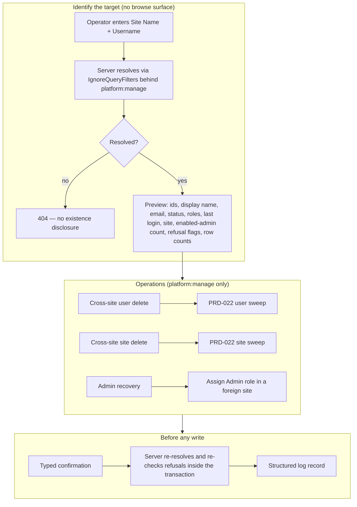

# Platform Administration PRD

**Status:** Blocked — waiting on PRD-026; this document needs review once PRD-026 is delivered
**Priority:** High
**Last Updated:** 2026-10-05
**Feature ID:** 027
**Scope:** The operations a **platform administrator** performs on a tenant they are not signed into — everything the self-service and site-scoped deletion feature (PRD-022) deliberately leaves unresolved. Three capabilities: (1) cross-site user deletion (remove a user who belongs to another site); (2) cross-site site deletion (destroy another tenant and all of its data); (3) administrator recovery (assign the `Admin` role to a user in a foreign site, so the "last enabled `Admin`" refusal can be satisfied without destroying the tenant). Also covers how the operator identifies the target without an in-app browse surface — **Site Name + Username**, both globally unique `citext`, resolved server-side to a `RowId` — the mandatory server-side resolution/preview and typed confirmation before execution, and a structured log record of each destructive operation. The heavier controls originally proposed (step-up re-authentication, two-person approval, cooling-off, rate limiting, backup gate, notifications, audit table) are deliberately **not** part of this feature; see Rejected and Deferred Controls.

## Purpose

Give a platform administrator a supported way to act on a tenant they are not signed into, without hand-written SQL and without leaving the platform, or a tenant, in a state that nobody can administer.

Approvals is the only cross-tenant surface in the product today, and it exists because a `platform:manage` caller must approve signups from every site. This document extends that authority to the three operations that the self-service/site-scoped feature does not exercise:

| Operation                     | Actor                              | Blast radius                                                            | Reversible |
| ----------------------------- | ---------------------------------- | ----------------------------------------------------------------------- | ---------- |
| Delete a user in another site | Platform admin (`platform:manage`) | One `User` row plus their sessions and OTP rows                         | No         |
| Delete another site           | Platform admin (`platform:manage`) | Every user, session, account, expense, income and setting of the tenant | No         |
| Recover a tenant's admin      | Platform admin (`platform:manage`) | One `UserRole` assignment; no row is deleted                            | Yes        |

The three share one authority (`platform:manage`), one identification problem (there is no way to enumerate another tenant's users or sites), and one thing that must never happen — a platform, or a tenant, that cannot be administered.

POT is operated by a small number of trusted administrators, so the safety bar is: name the target precisely, see exactly what will happen, type the confirmation, and leave a log record. It is not an enterprise change-management workflow.

## Delivery Order and Dependencies

Delivery order is **PRD-026 → PRD-022 → PRD-027**.

- **PRD-026** closes the target-binding gaps and freezes a configured platform admin's status and a site's last enabled `Admin` against the status and role routes. It also makes clear that `platform:manage` has no authority on the site-scoped routes, which is why this feature adds dedicated platform routes rather than re-using them.
- **PRD-022** delivers the ordered user and site sweeps, the refusal rules and the destructive dialog that this feature reuses. This document does not re-specify them.

## Problem Statement

There is no supported path for a platform administrator to act on another tenant.

**Cross-tenant deletion is expressly outside the self-service feature.** PRD-022 was narrowed to the paths a caller can exercise within their own site and identity. It grants `platform:manage` no authority at all and hands every cross-site operation to this document. What the product does not provide is _how_ a platform administrator reaches a tenant they are not signed into — there is no identification contract and no execution path.

**There is no in-app surface to enumerate another tenant.** The only platform surface is `AppSidebarMenus.tsx` → Platform → Approvals (`platform:manage`). There is no site list, no user directory, and no way for a platform admin to discover another tenant's `SiteEntity.Name` or a target `UserEntity.Username`. The operator must already know both — typically because the tenant's owner asked for the change — and the server resolves them to ids.

**The "unreachable sole administrator" trap has no non-destructive exit.** A site whose only `Admin` is unreachable (the person left, the mailbox is dead, the account is still `Enabled`) cannot have that admin deleted: PRD-022's `CheckTargetIsNotLastEnabledSiteAdmin` refuses, because a tenant must never be left with no administrator. And `platform:manage` is **not** `user:manage` — `PermissionService.GetPermissionsAsync` adds `platform:manage` at runtime _on top of_ the caller's database permissions (`Source/Server/Pot.AspNetCore/Concerns/Auth/Services/PermissionService.cs`) — so a platform admin who holds no site role cannot promote a replacement through the site-scoped role route either. The only remedy reachable today is destructive: delete the whole site. Administrator recovery is the missing non-destructive option.

**The schema forces every delete to be an ordered, transactional sweep.** `DbContextBase.DisableCascadeDelete` forces `DeleteBehavior.Restrict` onto every foreign key on an `EntityBase`-derived entity. PRD-022 specifies the user and site sweeps; this feature reuses them.

## Current Behaviour

Every claim below was verified by reading the cited file.

### Identity, roles and administration

| Concept                     | Where it lives                                                                                              | Verified note                                                                                                                                                                  |
| --------------------------- | ----------------------------------------------------------------------------------------------------------- | ------------------------------------------------------------------------------------------------------------------------------------------------------------------------------ |
| User                        | `Source/Server/Pot.Data/Entities/UserEntity.cs`                                                             | Belongs to exactly one `Site`; `Username` is globally unique (`[Index(nameof(Username), IsUnique = true)]`, `[Citext]`); `Email` is `[Index(nameof(Email), IsUnique = false)]` |
| Site                        | `Source/Server/Pot.Data/Entities/SiteEntity.cs`                                                             | Owns `Users`, `Accounts`, `Settings`; `Name` is globally unique (`[Index(nameof(Name), IsUnique = true)]`, `[Citext]`, `[SmallString]`)                                        |
| One-time password           | `Source/Server/Pot.Data/Entities/OneTimePasswordEntity.cs`                                                  | Carries its own `Username` and `Email` (both `[Citext]`); created before the user exists on signup, so `User` is nullable and there is no site FK                              |
| Auth session                | `Source/Server/Pot.Data/Entities/AuthSessionEntity.cs`                                                      | `UserId` FK to `User`; `Restrict`; one row per login, refresh rotates within the row                                                                                           |
| Site role                   | `Source/Server/Pot.Shared/Enumerations/Role.cs`                                                             | `Admin`, `Viewer`                                                                                                                                                              |
| Permission                  | `Source/Server/Pot.Shared/Enumerations/Permission.cs`                                                       | `site:manage`, `user:manage`, `account:manage`, `maintenance:export`, … — **there is no `platform:manage` member**; it is added at runtime                                     |
| User status                 | `Source/Server/Pot.Shared/Enumerations/UserStatus.cs`                                                       | `Enabled`, `Disabled`, `Pending`, `Approval`                                                                                                                                   |
| Platform admin              | `Source/Server/Pot.AspNetCore/Concerns/Auth/Configuration/PlatformAdminOptions.cs`                          | Comma-separated `RowId`s from `PLATFORM_ADMIN_USERIDS`; `PermissionService` adds `platform:manage` on top of database permissions                                              |
| Platform-admin-only surface | `Source/Client/pot-react/src/components/nav/AppSidebarMenus.tsx` → Platform → Approvals (`platform:manage`) | The only place a platform admin acts in the UI today                                                                                                                           |

`PlatformAdminOptionsSetup.Validate` fails startup if a non-empty `UserIds` contains a non-GUID. A well-formed GUID that maps to no live user still validates and resolves to nothing; this document does not change that.

### Site scoping and cross-tenant reads

`PotDbContext` applies site-scoped global query filters to `Account`, `Expense`, `Income` and `Setting` (`Source/Server/Pot.Data/PotDbContext.cs`, `SetupQueryFilters`). `User` and `Site` are **not** globally filtered. Cross-tenant reads are already done with `IgnoreQueryFilters()` behind `platform:manage` in `Pot.App/Features/Approvals/{Pending,UpdateStatus}` — `GetPendingApprovalsService.GetAllAsync` and `UpdateApprovalService.UpdateUserApprovalAsync`. This is the precedent any platform-admin path over another site's data follows.

### Reused from PRD-022

- **User sweep:** resolve the tracked target, delete all of the target's `AuthSession` rows (revoked included), delete the target's `OneTimePassword` rows (by `UserId` and by `Username`), delete the `User` row; `UserRole` cascades.
- **Site sweep:** `Expense` → `Income` → `Account` → `Setting` → `OneTimePassword` → `AuthSession` → `UserRole` → `User` → `Site`, one transaction, clean 404 on a second attempt. The per-user refusal rules are not evaluated during a site sweep.
- **Refusal rules:** the target cannot be the last **enabled** `Admin` of its site; the target cannot be a configured platform admin; a site containing any configured platform admin cannot be deleted. These are absolute safety invariants: a platform-admin caller does not escape them.
- **Destructive dialog:** the feature-local typed-confirmation dialog (safe action first, busy state, scroll-capped).

### Identity invariants established elsewhere

- A configured platform admin can **never be deleted** (PRD-022 R9).
- The **last enabled site `Admin`** cannot be deleted (PRD-022 R8/R18), nor disabled or stripped of `Admin` (PRD-026 R14).
- A configured platform admin can **never be disabled** (PRD-026 R13). Their _site roles_ are not frozen, because `platform:manage` is granted from configuration independently of roles (D-13).

### What is missing

- No way to browse another tenant — the only cross-tenant surface is Approvals.
- No cross-tenant role assignment: `PUT /api/users/{id}/roles` requires `user:manage` and, after PRD-026, resolves the target inside the caller's own site.
- No audit, tombstone or soft-delete infrastructure; the only record is application logging (`_logger.LogCall` / `LogApiError`, AllOverIt logging).

## Proposed Solution

Decisions are recorded in the Decisions table; requirements reference them as `D-nn`.

### Identification and preview

- **R1 — The target is specified as Site Name + Username and resolved server-side to a `RowId`.** Both `SiteEntity.Name` and `UserEntity.Username` are globally unique (`citext`), so the pair identifies at most one user in the deployment. For a site operation the Site Name alone identifies the site. The operator supplies the names; the server resolves the ids. No `RowId` is ever accepted from the operator (D-01).
- **R2 — Email plays no part in identification.** `UserEntity.Email` is not unique and `OneTimePasswordEntity` carries its own copy, so it cannot identify a user or site. The email is shown in the preview so the operator can sanity-check the result, nothing more.
- **R3 — There is no in-app browse surface.** The operator must already know the site name and username; a cross-tenant site list or user directory is deliberately not part of this feature (D-02).
- **R4 — A server-side resolution/preview is mandatory before any destructive execution.** The preview returns, for a user target: the resolved `UserEntity.RowId`, `DisplayName`, `Email`, `Status`, the target's roles, `LastLoggedInUtc`, the user's actual site (`SiteEntity.Name` + `RowId`), the site's current enabled-admin count, every refusal the delete would hit, and the row counts the delete will remove (sessions, OTP rows). For a site target it returns the `SiteEntity.RowId`, the counts of users by status, sessions, accounts, expenses and incomes, and any platform-admin refusal. Each preview is a dedicated `POST` endpoint under the platform route group, with the names in the body so they do not appear in URLs or access logs (D-03).
- **R5 — Execution re-resolves the target and re-evaluates the refusal rules inside the write transaction.** The execute request carries the same Site Name + Username the operator typed, never a `RowId`. A target that changed between preview and execution (renamed, deleted, newly promoted, newly added to `PLATFORM_ADMIN_USERIDS`) is refused or reported not-found rather than acted on. No concurrency token is used (see Rejected and Deferred Controls).
- **R6 — Typed confirmation.** For user deletion the operator types the target's Site Name and Username; for site deletion the Site Name and the operator's own username (D-14); for recovery the target's Username. Values are compared trimmed and case-insensitively, matching the `citext` semantics and the PRD-022 dialog convention (`autoCapitalize="none"`, `autoCorrect="off"`, `spellCheck={false}`). The destructive action stays disabled until every value matches.
- **R7 — Cross-tenant reads use `IgnoreQueryFilters()` behind `platform:manage`.** Resolution, preview and execution follow the `Approvals` precedent.

### Authority and actors

- **R8 — Every operation in this PRD requires `platform:manage` and nothing else.** The endpoints live in a new `platform` route group (`/api/platform/...`) whose only policy is `platform:manage` (D-04, D-05). A site-scoped `user:manage` / `site:manage` caller must never be able to reach a foreign target; a platform admin needs no site role to use them.
- **R9 — The acting platform admin is derived from the token.** The actor's `RowId` comes from the JWT `sub` claim (`UserContextMiddleware`), never from the request; the request may only name the _target_.
- **R10 — Identity invariants are preserved, not bypassed.** A configured platform admin can never be deleted, and a site's last enabled `Admin` can never be deleted by these operations. No operation may leave a site with zero enabled `Admin`-role users; administrator recovery (R16) exists to satisfy that invariant, not to violate it.

### Operations — cross-site user deletion

- **R11 — A cross-site user deletion endpoint that reuses PRD-022's user sweep.** Resolve the tracked target with `IgnoreQueryFilters()`, then run the user sweep. One transaction.
- **R12 — PRD-022's user refusal rules apply unchanged.** `CheckTargetIsNotLastEnabledSiteAdmin` and `CheckTargetIsNotPlatformAdmin` are evaluated for the foreign target; cross-tenant authority does not remove the invariants. Where a refusal is the last-enabled-admin rule, the message points the operator at administrator recovery (R16).
- **R13 — A repeat delete returns a clean 404.** Deleting an already-deleted target must not 500 or 409; the second attempt reports not-found.
- **R14 — A concurrent login cannot orphan a session.** Every FK is `Restrict`, so a session written for a user being deleted either blocks the delete until it commits (and the delete then fails its FK check) or fails its own FK check. No orphan row can be written, so no explicit lock is added; the losing request fails and a retry succeeds. A data-layer fixture proves this against a real database.

### Operations — cross-site site deletion

- **R15 — A cross-site site deletion endpoint that reuses PRD-022's site sweep.** `Expense` → `Income` → `Account` → `Setting` → `OneTimePassword` → `AuthSession` → `UserRole` → `User` → `Site`, one transaction, clean 404 on a second attempt. A site containing any configured platform admin is refused (PRD-022 R29), including a site that contains the acting operator. The per-user rules are not evaluated, so a site whose only administrator is unreachable can be deleted when recovery is not wanted. The dialog states plainly that no restorable backup is taken; the operator is responsible for taking a database dump first if one is wanted (D-11).

### Operations — administrator recovery

- **R16 — Assign the `Admin` role to a user in a foreign site.** This is the non-destructive remedy for the unreachable-sole-administrator trap: instead of destroying the tenant, the platform admin promotes another user in the site to `Admin`, after which PRD-022's last-enabled-admin refusal can be satisfied normally. The target must be in `Enabled` status (a non-enabled `Admin` would not satisfy the invariant); recovery does not change status.
- **R17 — Recovery changes role assignments only, and only by adding `Admin`.** It does not delete, disable or edit the target user, and it cannot revoke a role (D-15). A platform admin's own site roles are not frozen (D-13), so promoting a platform admin is allowed.
- **R18 — Recovery's preview and confirmation.** The preview (R4) already shows the target's current roles and the site's enabled-admin count; the confirmation shows the proposed change and the resulting enabled-admin count.

### Logging

- **R19 — Every execution writes one structured log record.** The record carries the acting platform admin's `RowId`, the operation, the resolved target `RowId`s (user and/or site), the removed row counts, and the result (success, refused with the rule, not found). Usernames and site names are not logged. This uses the existing logging conventions and is the only record kept; a durable audit table is deferred (D-06).

### Surface

- **R20 — A platform-administration page under the existing Platform menu group**, alongside Approvals, gated by `platform:manage` (`AppSidebarMenus.tsx` already carries the group and the permission-gating pattern). It provides the resolve → preview → confirm → execute flow for the three operations. It is **not** a browse console (R3).
- **R21 — A destructive confirmation consistent with PRD-022.** The same feature-local destructive dialog: typed confirmation (R6), the safe action first and default-focused, the destructive action last with a busy state, scroll-capped.
- **R22 — The surface never accepts a foreign `RowId` as input.** The operator types names; resolved ids are display-only (R1).

## Out of Scope

- **The self-service and site-scoped deletion paths and the PRD-026 gap fixes.** They are specified in PRD-022 and PRD-026 and are not repeated here.
- **A cross-tenant browse console (site list / user directory).** The operator supplies the target; the server resolves it (D-02).
- **Bulk deletion.** No multi-select, no "delete every user of a site except …" beyond the atomic whole-site sweep.
- **Soft delete, anonymisation or a tombstone state.** The rows are removed.
- **Any change to PRD-026's target-binding contract.**
- **`TokenVersion` semantics.** A hard delete supersedes global revocation.
- **Editing `PLATFORM_ADMIN_USERIDS` from inside the app.** The list stays deployment configuration; it is unrevocable in-app by design.
- **Revoking the `Admin` role, or any other role change, across sites** (D-15).
- **New EF Core migrations.** None are specified; there is no audit table (D-06).
- **Everything listed under Rejected and Deferred Controls.**

## Tests

Planned coverage, following the existing unit/integration split.

- **Application — resolution and preview.** An exact Site Name + Username pair resolves to the expected `RowId`; a case/whitespace variant resolves; a non-existent pair, and a username that exists in a different site than the one named, return not-found; the preview returns the refusal flags, the enabled-admin count and the row counts.
- **Application — cross-site user deletion.** The happy path deletes the foreign user; each PRD-022 refusal returns its 422 error and performs no write; a repeat delete returns not-found; a target that changed between preview and execution is re-checked.
- **Application — cross-site site deletion.** The happy path; a site containing a configured platform admin (including the operator's own site) is refused; the per-user rules are not evaluated.
- **Application — administrator recovery.** Promoting an enabled user to `Admin` in a foreign site succeeds and the enabled-admin count increases; a non-enabled target is refused; the operation cannot revoke a role.
- **Data.** Repository coverage for the cross-tenant lookups (user by site name + username with `IgnoreQueryFilters()`; site by name) and the preview counts; the ordered deletes themselves are covered by the PRD-022 fixtures; a login racing a delete (R14) is proven against a real database.
- **Logging.** An executed operation writes exactly one structured record with actor, operation, target ids, counts and result and no usernames or site names; a refused operation records the refusal.
- **Integration.** `Pot.AspNetCore.Integration.Tests`: 401 unauthenticated; 403 for a non-platform-admin (including a site `Admin` holding `user:manage` and `site:manage`); 404 for an unresolvable target and for a repeat delete; 200 for a deletable target; 422 with the expected problem-details body for each refusal; the platform routes accept no `RowId`.
- **Client unit.** The resolve/preview component (typed confirmation stays disabled until every value matches, case/whitespace-insensitive), the refusal copy, and the busy state; the surface and menu entry are absent for a non-platform-admin and present for a platform admin.
- **E2E.** Driven as the seeded platform admin against a throwaway site created through the signup API; every 200 path must not consume the canonical seed sites (PRD-022 makes the seed sites undeletable because they hold a platform admin, which the tests can also assert).

## Decisions

| ID   | Decision                                                  | Resolution                                                                                                                                                                                                                                              |
| ---- | --------------------------------------------------------- | ------------------------------------------------------------------------------------------------------------------------------------------------------------------------------------------------------------------------------------------------------- |
| D-01 | Identification key                                        | **Site Name + Username**, both globally unique; the server resolves the ids. Email is not used (non-unique).                                                                                                                                            |
| D-02 | Cross-tenant browse console                               | **No.** Resolve-only. A site list would turn "platform admin" into "can read every tenant's directory", a larger data-exposure decision than this feature needs. The operator learns the names from whoever requested the change.                       |
| D-03 | How the preview is exposed                                | **Dedicated `POST` preview endpoints** under the platform route group, names in the body. No dry-run flag, no reuse of an Approvals read.                                                                                                              |
| D-04 | Where the endpoints live                                  | A **new `platform` route group** (`/api/platform/...`). Extending `Users` / `Sites` would mix cross-tenant and site-scoped contracts in one group.                                                                                                      |
| D-05 | How `platform:manage` combines with site-scoped authority | **It does not combine.** Platform endpoints require `platform:manage` only; no site permission is needed or consulted, so there is no OR policy and no in-handler authority check.                                                                      |
| D-06 | Audit record                                              | **Structured log line only** (R19). A durable audit table is deferred; it would add a migration and a prerequisite stage for a single trusted operator.                                                                                                 |
| D-11 | Pre-deletion backup                                       | **No gate and no recorded reference.** The site-deletion dialog warns that no restorable backup is taken and that the maintenance export is not one.                                                                                                    |
| D-13 | Are a platform admin's site roles frozen                  | **No — status only** (PRD-026). `platform:manage` comes from configuration, so removing a role does not remove it; the last-enabled-admin rule already protects tenant administrability.                                                                |
| D-14 | Values typed to confirm a site deletion                   | **Site Name + the operator's own username**, matching PRD-022.                                                                                                                                                                                         |
| D-15 | May recovery also revoke `Admin`                          | **Assign only.** Revocation has no recovery use case.                                                                                                                                                                                                  |

## Rejected and Deferred Controls

The original draft proposed the controls below as candidate requirements after a security/DBA consultation. They were reviewed and removed because none of the supporting infrastructure exists and POT is run by a small number of trusted administrators. Each can become its own PRD if the operating model changes.

| Control                                            | Reason removed                                                                                                                                                                   |
| -------------------------------------------------- | -------------------------------------------------------------------------------------------------------------------------------------------------------------------------------- |
| Two-person approval                                | Impossible with a single platform administrator; would require a second operator, an approval workflow and a pending-request store.                                              |
| Cooling-off window and break-glass path            | Needs an intent store, cancellation and a second execution path for a risk that typed confirmation plus preview already addresses.                                               |
| Step-up re-authentication                          | POT has no MFA or step-up pattern; the session plus typed confirmation is the bar, consistent with PRD-022's decision on password re-entry.                                      |
| Rate limiting / per-operator quota                 | One trusted operator; login abuse protection is a separate track.                                                                                                                |
| Deletion notifications                             | Depends on the unbuilt durable email dispatch (PRD-019); PRD-022 sends none.                                                                                                     |
| Backup gate and recorded backup reference          | Reduced to a warning in the dialog (D-11); enforcement and a stored reference have no infrastructure.                                                                            |
| Email as a search hint                             | The email is not unique and adds nothing to resolution; it is display-only in the preview.                                                                                       |
| Preview concurrency token                          | Execution re-resolves and re-checks inside the write transaction (R5), which gives the same protection without a token.                                                          |
| Durable audit table                                | Deferred (D-06); structured logs are the record.                                                                                                                                 |

## Open Questions

1. **How does the platform admin recover an unreachable administrator when no other user exists to promote?** If the site has a single user the operator can only delete the site (R15); there is no "re-invite / reset credentials for an unreachable admin" operation. Is that a fourth operation worth specifying, or is deleting the site acceptable?
2. **Is there a maximum blast radius for a site deletion?** None is specified; the typed confirmation and preview counts are the guard. Confirm that no row-count ceiling is wanted.

## Assumptions and Constraints Register

| ID    | Assumption / Constraint                                                                                                                                                   | Confidence |
| ----- | ------------------------------------------------------------------------------------------------------------------------------------------------------------------------- | ---------- |
| AC-01 | `UserEntity.Username` and `SiteEntity.Name` are both globally unique `citext`; the pair identifies at most one user.                                                      | High       |
| AC-02 | `UserEntity.Email` is not unique, and `OneTimePasswordEntity` carries its own `Username` and `Email`; email cannot identify a single user or site.                         | High       |
| AC-03 | `User` and `Site` have no global query filters; cross-tenant reads require `IgnoreQueryFilters()`, as in the `Approvals` services.                                         | High       |
| AC-04 | `platform:manage` is added at runtime by `PermissionService` from the `PLATFORM_ADMIN_USERIDS` config list; it is neither a database role nor a `user:manage`/`site:manage` grant. | High       |
| AC-05 | `DbContextBase.DisableCascadeDelete` forces `Restrict` on every `EntityBase` FK; every delete is an ordered, transactional sweep, and a racing login cannot orphan a session. | High       |
| AC-06 | No audit / tombstone / soft-delete infrastructure exists; the only record is application logging.                                                                         | High       |
| AC-07 | The maintenance export is not a restorable backup — it carries no users, roles, settings or site row.                                                                     | High       |
| AC-08 | PRD-022 specifies the user and site sweeps, refusal rules and destructive dialog; this feature reuses them rather than re-specifying them.                                 | High       |
| AC-09 | PRD-026 is delivered first and closes the cross-tenant target-binding gaps.                                                                                               | High       |
| AC-10 | A configured platform admin can never be deleted (PRD-022 R9/AC-10) or disabled (PRD-026 R13).                                                                            | High       |
| AC-11 | The only platform-admin surface today is `AppSidebarMenus.tsx` → Platform → Approvals; there is no browse surface.                                                        | High       |
| AC-12 | The `Approvals` endpoints are intentionally cross-tenant behind `platform:manage` and use `IgnoreQueryFilters()` — the precedent this feature follows.                    | High       |
| AC-13 | No `platform:manage` member exists in `Permission.cs`; it is a runtime string, so it is not part of the role/permission seed data.                                        | High       |
| AC-14 | POT is operated by a single trusted administrator or a very small team; controls designed for separation of duties are not applicable.                                     | Medium     |

## Readiness Criteria

Before this PRD moves from Planning to Planned:

1. The developer has reviewed the Decisions table and the Rejected and Deferred Controls, and answered the Open Questions.
2. PRD-026 and PRD-022 are Planned or delivered, because the platform operations reuse their binding, sweeps, refusal rules and dialog.
3. The E2E approach (throwaway site, seeded platform admin) is accepted, so the canonical seed sites are not consumed.

## Design Notes (Rationale and Rejected Alternatives)

Reference notes for future maintainers.

- **Site Name + Username, not a `RowId` or an email.** Both are globally unique `citext`, so they are the only human-typeable values that identify at most one target. A `RowId` is not discoverable without a browse surface, and an email is not unique and is duplicated on the OTP table.
- **No browse console.** The smallest safe surface is resolve-only: the operator names the target, the server resolves it, and no tenant can be enumerated.
- **Administrator recovery exists to make a destructive remedy unnecessary.** The unreachable-sole-administrator trap otherwise has only one exit — destroy the tenant. Promoting a replacement is non-destructive, reversible and satisfies the same invariant.
- **The ordered sweeps are shared, not re-invented.** PRD-022 specifies the exact orders the `Restrict` foreign keys force. Re-specifying them here would create two sources of truth that will drift.
- **A dedicated platform route group rather than reusing the site-scoped routes.** The site-scoped routes bind their target to the caller's site (PRD-026), which is exactly what a platform operation must not do. A separate group keeps the two contracts, and their authorisation, from blurring.
- **`platform:manage` must not be conflated with `user:manage`/`site:manage`.** It is added at runtime on top of whatever database permissions the caller has, and a platform admin may have none. The platform group therefore needs `platform:manage` and nothing else.
- **Rejected: a full admin console with create/edit/impersonate.** Anything that lets a platform admin _become_ another tenant's user is a larger security decision with its own audit and consent questions.
- **404 on a repeat delete, not an error.** The operation is expressed as "ensure this target is gone"; a second call reporting not-found is the honest, non-disclosing answer.
- **Proportionate controls.** The review of the original control set (two-person approval, cooling-off, step-up, rate limiting, backup gate, notifications, audit table) concluded they were designed for a multi-operator organisation. They are listed in Rejected and Deferred Controls rather than deleted silently so the reasoning survives.

## Related Documents

- **Prerequisite:** [Cross-Tenant Authorization Hardening PRD](PRD-026-cross-tenant-authorization-hardening.md) — closes the target-binding gaps and the status/role invariants this feature relies on.
- **Reused work:** [User and Site Deletion PRD](PRD-022-user-and-site-deletion.md) — the ordered sweeps, the refusal rules, the destructive dialog and the platform-admin deletion invariant.
- Authentication reference (platform admin and permissions): `Docs/AUTHENTICATION.md`
- Server conventions (multi-tenancy, query filters): `Source/Server/DEVELOPER.md`
- Cross-tenant precedent in source: `Source/Server/Pot.App/Features/Approvals/Pending/GetPendingApprovalsService.cs`, `Source/Server/Pot.App/Features/Approvals/UpdateStatus/UpdateApprovalService.cs`
- Platform-admin configuration in source: `Source/Server/Pot.AspNetCore/Concerns/Auth/Configuration/PlatformAdminOptions.cs`, `.../PlatformAdminOptionsSetup.cs`, `.../Auth/Services/PermissionService.cs`
- The FK convention that forces the sweeps: `Source/Server/Pot.Data/DbContextBase.cs`, `Source/Server/Pot.Data/PotDbContext.cs`
- Platform-admin surface in the client: `Source/Client/pot-react/src/components/nav/AppSidebarMenus.tsx`
- Future index: [Docs/Future/README.md](README.md)
