# Platform Administration PRD

**Status:** Proposed (discovery draft)
**Priority:** High
**Last Updated:** 2026-10-03
**Feature ID:** 027
**Scope:** The operations a **platform administrator** performs on a tenant they are not signed into — everything the self-service and site-scoped deletion feature deliberately leaves unresolved. Three capabilities: (1) cross-site user deletion (remove a user who belongs to another site); (2) cross-site site deletion (destroy another tenant and all of its data); (3) administrator recovery (assign the `Admin` role to a user in a foreign site, so the "last enabled `Admin`" refusal can be satisfied without destroying the tenant). Also covers how the requester identifies the target without an in-app browse surface — **Site Name + Username**, both globally unique `citext`, resolved server-side to a `RowId`, with the requester's email used only as a search hint / corroboration — the mandatory server-side resolution/preview (dry-run) and typed confirmation before execution, and the security/DBA controls proposed around destructive cross-tenant operations (append-only audit, step-up re-authentication, two-person approval, cooling-off, rate limiting, pre-execution backup, notification). This is a **discovery draft**: verified current behaviour is stated precisely, requirements are candidates, and every unresolved choice is recorded as an open decision or outstanding question.

## Purpose

Give a platform administrator a supported, accountable way to act on a tenant they are not signed into, without hand-written SQL and without leaving the platform, or a tenant, in a state that nobody can administer.

Approvals is the only cross-tenant surface in the product today, and it exists because a `platform:manage` caller must approve signups from every site. This document extends that authority to the three destructive or recovery operations that the self-service/site-scoped feature (feature 022) does not exercise:

| Operation                     | Actor                              | Blast radius                                                            | Reversible |
| ----------------------------- | ---------------------------------- | ----------------------------------------------------------------------- | ---------- |
| Delete a user in another site | Platform admin (`platform:manage`) | One `User` row plus their sessions and OTP rows                         | No         |
| Delete another site           | Platform admin (`platform:manage`) | Every user, session, account, expense, income and setting of the tenant | No         |
| Recover a tenant's admin      | Platform admin (`platform:manage`) | One `UserRole` assignment; no row is deleted                            | Yes        |

The three share one authority (`platform:manage`), one identification problem (there is no way to enumerate another tenant's users or sites), one set of destructive-operation controls, and one thing that must never happen — a platform, or a tenant, that cannot be administered.

## Problem Statement

There is no supported path for a platform administrator to act on another tenant, and the paths that exist are unguarded, unrecorded and hard to aim.

**Cross-tenant deletion is expressly outside the self-service feature.** Feature 022 was narrowed to the paths a caller can exercise within their own site and identity: a site admin deletes a user in their own site, a user (including a site admin) deletes their own account, and a non-platform-admin site admin deletes their own site. It grants `platform:manage` no authority at all and hands every cross-site operation to this document. What the product does not provide is _how_ a platform administrator reaches a tenant they are not signed into — there is no identification contract, no execution path and no control set for a cross-tenant operation anywhere. This document is that counterpart.

**There is no in-app surface to enumerate another tenant.** The only platform surface is `AppSidebarMenus.tsx` → Platform → Approvals (`platform:manage`). There is no site list, no user directory, and no way for a platform admin to discover another tenant's `SiteEntity.Name` or a target `UserEntity.Username`. The requester must already know both; the server resolves them to ids.

**The "unreachable sole administrator" trap has no non-destructive exit.** A site whose only `Admin` is unreachable (the person left, the mailbox is dead, the account is still `Enabled`) cannot be deleted: `CheckTargetIsNotLastEnabledSiteAdmin` (`PRD-022` R8) refuses, because a tenant must never be left with no administrator. But `platform:manage` is **not** `user:manage` — `PermissionService.GetPermissionsAsync` adds `platform:manage` at runtime _on top of_ the caller's database permissions (`Source/Server/Pot.AspNetCore/Concerns/Auth/Services/PermissionService.cs`) — so a platform admin who holds no site role does not satisfy the `user:manage` requirement on the role- and status-changing routes, and cannot promote a replacement either. The only remedy reachable today is destructive: delete the whole site. Administrator recovery is the missing third option.

**Destructive cross-tenant operations are unrecorded.** Every other operation in POT leaves an application log line, and nothing else. Feature 022's `AC-09` records the fact plainly: "There is no audit, tombstone, or soft-delete infrastructure, so deletion is immediate and unrecorded beyond application logs." A cross-tenant tenant destruction is the single highest-consequence operation the product would expose, and there is nowhere durable to record who asked, who approved, why, or what was removed.

**There is no step-up, no second pair of eyes and no cooling-off.** Nothing re-authenticates the acting session immediately before a destructive write, nothing requires a second administrator to approve it, and nothing gives a mistaken request a window in which it can be stopped. Rate limiting and a pre-execution backup exist only as separate tracks (`PRD-008` for abuse protection; the maintenance export for data, which is not a restorable backup).

**The schema forces every delete to be an ordered, transactional sweep.** `DbContextBase.DisableCascadeDelete` forces `DeleteBehavior.Restrict` onto every foreign key on an `EntityBase`-derived entity. A user delete therefore runs `AuthSession` → `OneTimePassword` → `User` (`UserRole` cascades), and a site delete runs `Expense` → `Income` → `Account` → `Setting` → `OneTimePassword` (resolved through the site's users, the table has no site FK) → `AuthSession` → `UserRole` → `User` → `Site`, all inside one transaction. A login can race a delete: `AuthService.LoginAsync` creates an `AuthSession` and updates `LastLoggedInUtc` inside the same tracking scope and commits them with one `SaveAsync` (`Source/Server/Pot.AspNetCore/Concerns/Auth/Services/AuthService.cs`), so a delete that read the session set can have a new row written underneath it.

**The platform-admin configuration fails silently in its most dangerous mode.** `platform:manage` is not a database role — it is a comma-separated list of user `RowId`s in `PlatformAdminOptions.UserIds` (`PLATFORM_ADMIN_USERIDS`), and it is unrevocable from inside the app. `PlatformAdminOptionsSetup.Validate` rejects malformed entries at startup, but `PlatformAdminOptions.GetUserRowIds()` also drops non-parseable entries silently, and — the dangerous mode — a **well-formed GUID that no longer maps to a live user** validates and resolves to nothing, leaving a platform with no working administrator and no error.

## Current Behaviour

Every claim below was verified by reading the cited file. Where a behaviour could not be confirmed it is recorded in the Outstanding Questions Register rather than asserted.

### Identity, roles and administration

| Concept                     | Where it lives                                                                                              | Verified note                                                                                                                                                                  |
| --------------------------- | ----------------------------------------------------------------------------------------------------------- | ------------------------------------------------------------------------------------------------------------------------------------------------------------------------------ |
| User                        | `Source/Server/Pot.Data/Entities/UserEntity.cs`                                                             | Belongs to exactly one `Site`; `Username` is globally unique (`[Index(nameof(Username), IsUnique = true)]`, `[Citext]`); `Email` is `[Index(nameof(Email), IsUnique = false)]` |
| Site                        | `Source/Server/Pot.Data/Entities/SiteEntity.cs`                                                             | Owns `Users`, `Accounts`, `Settings`; `Name` is globally unique (`[Index(nameof(Name), IsUnique = true)]`, `[Citext]`, `[SmallString]`)                                        |
| One-time password           | `Source/Server/Pot.Data/Entities/OneTimePasswordEntity.cs`                                                  | Carries its own `Username` and `Email` (both `[Citext]`); created before the user exists on signup, so `User` is nullable and there is no site FK                              |
| Auth session                | `Source/Server/Pot.Data/Entities/AuthSessionEntity.cs`                                                      | `UserId` FK to `User`; `Restrict` (see below); one row per login, refresh rotates within the row                                                                               |
| Site role                   | `Source/Server/Pot.Shared/Enumerations/Role.cs`                                                             | `Admin`, `Viewer`                                                                                                                                                              |
| Permission                  | `Source/Server/Pot.Shared/Enumerations/Permission.cs`                                                       | `site:manage`, `user:manage`, `account:manage`, `maintenance:export`, … — **there is no `platform:manage` member**; it is added at runtime                                     |
| User status                 | `Source/Server/Pot.Shared/Enumerations/UserStatus.cs`                                                       | `Enabled`, `Disabled`, `Pending`, `Approval`                                                                                                                                   |
| Platform admin              | `Source/Server/Pot.AspNetCore/Concerns/Auth/Configuration/PlatformAdminOptions.cs`                          | Comma-separated `RowId`s from `PLATFORM_ADMIN_USERIDS`; `PermissionService` adds `platform:manage` on top of database permissions                                              |
| Platform-admin-only surface | `Source/Client/pot-react/src/components/nav/AppSidebarMenus.tsx` → Platform → Approvals (`platform:manage`) | The only place a platform admin acts in the UI today                                                                                                                           |

`PlatformAdminOptions.GetUserRowIds()` returns a freshly parsed `Guid[]` and silently skips any entry that is not a valid GUID; `PlatformAdminOptionsSetup.Validate` fails startup if a non-empty `UserIds` contains a non-GUID, so malformed input is caught there but a well-formed GUID that maps to no live user is not (`Source/Server/Pot.AspNetCore/Concerns/Auth/Configuration/PlatformAdminOptionsSetup.cs`).

### What the database permits

`DbContextBase.DisableCascadeDelete` (`Source/Server/Pot.Data/DbContextBase.cs`) forces `DeleteBehavior.Restrict` onto every foreign key on an `EntityBase`-derived entity; the auto-generated join tables are the only exception.

| Dependent row     | FK                | On delete                              |
| ----------------- | ----------------- | -------------------------------------- |
| `AuthSession`     | `UserId`          | **Restricted** — must be deleted first |
| `OneTimePassword` | `User` (nullable) | **Restricted** — delete or null first  |
| `UserRole` (join) | `UsersId`         | Cascades                               |
| `Account`         | `SiteId`          | **Restricted**                         |
| `Setting`         | `SiteId`          | **Restricted**                         |
| `Expense`         | `AccountId`       | **Restricted**                         |
| `Income`          | `AccountId`       | **Restricted**                         |

Any delete of a live user or a live site is therefore an ordered, transactional write, not a single statement.

### Site scoping and cross-tenant reads

`PotDbContext` applies site-scoped global query filters to `Account`, `Expense`, `Income` and `Setting` (`Source/Server/Pot.Data/PotDbContext.cs`, `SetupQueryFilters`). `User` and `Site` are **not** globally filtered. Cross-tenant reads are already done with `IgnoreQueryFilters()` behind `platform:manage` in `Pot.App/Features/Approvals/{Pending,UpdateStatus}` — `GetPendingApprovalsService.GetAllAsync` and `UpdateApprovalService.UpdateUserApprovalAsync` both call `.IgnoreQueryFilters()` (`Source/Server/Pot.App/Features/Approvals/Pending/GetPendingApprovalsService.cs`, `Source/Server/Pot.App/Features/Approvals/UpdateStatus/UpdateApprovalService.cs`). This is the precedent any platform-admin path over another site's data must follow.

### The deletion sweeps feature 022 already specifies

Feature 022 already defines the two ordered sweeps and their guards, and this feature reuses them rather than re-specifying them:

- **User sweep** (`PRD-022` R5): resolve the tracked target, delete all of the target's `AuthSession` rows (revoked included), delete or detach the target's `OneTimePassword` rows, delete the `User` row; `UserRole` cascades.
- **Site sweep** (`PRD-022` R30): `Expense` → `Income` → `Account` → `Setting` → `OneTimePassword` (via the site's users) → `AuthSession` → `UserRole` → `User` → `Site`, one transaction, clean 404 on a second attempt.
- **Refusal rules** (`PRD-022` R8/R9/R29): the target cannot be the last **enabled** `Admin` of its site; the target cannot be a configured platform admin; a site containing any configured platform admin cannot be deleted. These are absolute safety invariants: a platform-admin caller does not escape them, exactly as a site-scoped caller does not.

### Authentication reacts to a missing user

`JwtBearerEventsSetup.OnTokenValidated` resolves the user by `RowId` on every request and fails when the row is gone, so a hard delete is its own global revoke — there is no user row left for a token to be validated against, and no `TokenVersion` bump is needed.

### What is missing

- **No audit / tombstone / soft-delete infrastructure** (`PRD-022` AC-09). Deletion is immediate and unrecorded beyond application logs (`_logger.LogCall` / `LogApiError`, AllOverIt logging).
- **No step-up re-authentication pattern.** Feature 022 rejected password re-entry for self-deletion and left it as its OD-11; there is no existing mechanism to build on.
- **No two-person approval, no cooling-off, no per-operator quota** on any destructive endpoint.
- **No restorable pre-deletion backup.** The maintenance export is the only data-copy feature and it is not a tenant backup: `ExportDataService.ExportAllAsync` writes `metadata`, `accounts`, `incomes` and `expenses` entries only (`Source/Server/Pot.App/Features/Maintenance/Export/ExportDataService.cs`) — no users, roles, settings or site row (`PRD-022` AC-12).
- **No notification on deletion.** Feature 022 sends none; the durable-dispatch prerequisite is feature 019.
- **No way to browse another tenant.** The only cross-tenant surface is Approvals.

### Identity invariants established elsewhere

- A configured platform admin can **never be deleted** — asserted in feature 022 (`PRD-022` R9: "A configured platform admin can never be deleted, so no caller — site admin or otherwise — may remove one through the app"; AC-10: platform admin membership is deployment configuration, with no in-app remedy).
- The **last enabled site `Admin`** is protected — feature 022 R8/R18.
- A configured platform admin can **never be disabled**, and a site's last enabled `Admin` can **never be disabled or stripped of `Admin`** — asserted in feature 026 (`PRD-026` R13/R14), which owns the status and role routes so the deletion refusals cannot be bypassed through a status or role change.

## Proposed Solution

Everything below is a candidate requirement; nothing is implemented. Decision IDs (`OD-nn`) refer to the Open Decisions Backlog.

The operations share one identification problem, one authorisation question and one set of controls, so the requirements are grouped by concern rather than by operation.

```mermaid
flowchart TD
    subgraph IDENT["Identify the target (no browse surface)"]
        I1["Requester enters Site Name + Username (+ email hint)"] --> I2["Server resolves via IgnoreQueryFilters behind platform:manage"]
        I2 --> I3{"Resolved?"}
        I3 -->|"no"| I4["404 — no existence disclosure"]
        I3 -->|"yes"| I5["Preview: ids, display name, email, status, roles, last login, site, refusal flags, row counts"]
    end
    subgraph AUTHZ["Authority"]
        A1["platform:manage (deployment GUID list)"] --> A2["Cross-tenant authority — never user:manage / site:manage"]
    end
    subgraph OPS["Operations"]
        O1["Cross-site user delete"] --> S1["Ordered sweep: AuthSession to OneTimePassword to User"]
        O2["Cross-site site delete"] --> S2["Ordered sweep: Expense to Income to Account to Setting to OTP to AuthSession to User to Site"]
        O3["Admin recovery"] --> S3["Assign Admin role in a foreign site"]
    end
    subgraph CTRL["Controls before any write"]
        C1["Typed confirmation of Site Name + Username"] --> C2["Step-up re-authentication"]
        C2 --> C3["Second platform admin approves"]
        C3 --> C4["Cooling-off window (break-glass for legal/abuse)"]
        C4 --> C5["Pre-execution backup (site deletion)"]
        C5 --> C6["Append-only audit record"]
    end
```

### Identification and preview

- **R1 — The target is specified as Site Name + Username and resolved server-side to a `RowId`.** Both `SiteEntity.Name` and `UserEntity.Username` are globally unique (`citext`), so the pair identifies at most one user in the deployment. The requester supplies the pair; the server resolves the ids. No `RowId` is accepted from the requester.
- **R2 — The requester's email is a search hint / corroboration only, never an identity key.** `UserEntity.Email` is explicitly not unique, and `OneTimePasswordEntity` carries its own copy of `Email`, so an email cannot identify a single user or a single site. It may be entered to help the resolver disambiguate or to corroborate the preview; it must not be required to match exactly or be treated as the key. The product owner's "site + email" suggestion is recorded as a candidate in OD-01, together with the non-uniqueness facts.
- **R3 — There is no in-app browse surface.** A platform admin cannot enumerate another tenant's users or sites; the requester must already know the site name and username. A cross-tenant browse console (site list / user directory) is deliberately **not** a requirement of this feature (see Out of Scope); whether one is ever added is OD-02.
- **R4 — A server-side resolution/preview (dry-run) is mandatory before any destructive execution.** The preview returns, for a user target: the resolved `UserEntity.RowId`, `DisplayName`, `Email`, `Status`, the target's roles, `LastLoggedInUtc`, and the user's actual site (`SiteEntity.Name` + `RowId`); every refusal flag the delete would hit; and the row counts the delete will remove (sessions, OTP rows). For a site target it returns the `SiteEntity.RowId`, the counts of users by status, sessions, accounts, expenses and incomes, and any platform-admin refusal. The read model behind the counts is OD-03.
- **R5 — Execution re-resolves the target and re-evaluates the refusal flags inside the write transaction.** A target that changed between preview and execution (renamed, deleted, newly promoted, newly added to `PLATFORM_ADMIN_USERIDS`) is refused rather than acted on. Whether the preview is bound by a concurrency token is OD-16.
- **R6 — Typed confirmation of the Site Name and the Username.** Both compared trimmed and case-insensitively, matching the `citext` semantics and the PRD-022 dialog convention (`autoCapitalize="none"`, `autoCorrect="off"`, `spellCheck={false}`). The destructive action stays disabled until both match. For site deletion the exact pair of values to type is OD-14.
- **R7 — Cross-tenant reads use `IgnoreQueryFilters()` behind `platform:manage`.** Resolution, preview and execution follow the `Approvals` precedent.

### Authority and actors

- **R8 — Every operation in this PRD requires `platform:manage`.** It is the only cross-tenant authority; a site-scoped `user:manage` / `site:manage` caller must never be able to reach a foreign target. This follows feature 026's R5/R11 and feature 022's platform-admin authority.
- **R9 — `platform:manage` is not `user:manage` and not `site:manage`.** It is added at runtime on top of the caller's database permissions, and a platform admin need not hold any site role. Administrator recovery (R20) therefore needs a role-assignment capability that does not silently depend on `user:manage`, or an explicit in-handler authority check. How the two are combined is OD-05.
- **R10 — Identity invariants are preserved, not bypassed.** A configured platform admin can never be deleted (`PRD-022` R9) or disabled (`PRD-026` R13), and a site's last enabled `Admin` can never be deleted (`PRD-022` R8/R18) or disabled / stripped of `Admin` (`PRD-026` R14). These hold for the cross-tenant operations here too. No operation may leave a site with zero enabled `Admin`-role users; administrator recovery (R20) exists to satisfy that invariant, not to violate it. Whether a platform admin's _site roles_ are also frozen, rather than only their status, is OD-13.
- **R11 — The acting platform admin is derived from the token.** The actor's `RowId` comes from the JWT `sub` claim (`UserContextMiddleware`), never from the request; the request may only name the _target_.

### Operations — cross-site user deletion

- **R12 — A cross-site user deletion endpoint that reuses feature 022's user sweep.** Resolve the tracked target with `IgnoreQueryFilters()` behind `platform:manage`, then delete all of the target's `AuthSession` rows (revoked included), delete or detach the target's `OneTimePassword` rows, delete the `User` row; `UserRole` cascades. One transaction.
- **R13 — Feature 022's user refusal rules apply unchanged.** `CheckTargetIsNotLastEnabledSiteAdmin` and `CheckTargetIsNotPlatformAdmin` are evaluated for a foreign target as well; cross-tenant authority does not remove the invariant.
- **R14 — A repeat delete returns a clean 404.** Deleting an already-deleted target must not 500 or 409; the second attempt reports not-found.
- **R15 — A concurrent login must not race the delete.** Because `AuthService.LoginAsync` creates an `AuthSession` and updates `LastLoggedInUtc` in the same unit of work, a row/advisory lock on the target user (or a serialisable transaction) is recommended so a session created after the sweep read is not orphaned. The exact mechanism is for the data layer to decide.

### Operations — cross-site site deletion

- **R16 — A cross-site site deletion endpoint (tenant destruction) that reuses feature 022's site sweep.** `Expense` → `Income` → `Account` → `Setting` → `OneTimePassword` (resolved via the site's users) → `AuthSession` → `UserRole` → `User` → `Site`, one transaction, clean 404 on a second attempt.
- **R17 — Feature 022's site refusal applies.** A site containing any configured platform admin is refused (`PRD-022` R29), for the same reason: silently removing a platform admin from a config list that never reports stale entries is how a platform ends up with no administrator.
- **R18 — A pre-execution physical backup (`pg_dump`) is required before a site deletion.** The maintenance export is **not** a restorable backup — `ExportDataService` writes `metadata`, `accounts`, `incomes` and `expenses` only — so recovery depends on an operations database dump. Whether the backup is a hard gate or advisory, who runs it, and where it is stored are OD-11.
- **R19 — The backup reference is recorded in the audit record (R24).** A deletion with no associated backup reference must be identifiable as such.

### Operations — administrator recovery

- **R20 — Assign the `Admin` role to a user in a foreign site.** This is the non-destructive remedy for the unreachable-sole-administrator trap: instead of destroying the tenant, the platform admin promotes another user in the site to `Admin`, after which feature 022's last-enabled-admin refusal can be satisfied normally.
- **R21 — Recovery changes role assignments only, never user rows.** It does not delete, disable or edit the target user's profile. Whether it may also _revoke_ the `Admin` role is OD-15.
- **R22 — Recovery is constrained by the identity invariants (R10).** It cannot change a configured platform admin's roles if the intended invariant (OD-13) is adopted, and it must not leave the site with zero enabled admins.
- **R23 — Recovery has its own preview and confirmation.** The preview shows the target's current roles, the proposed change, and the resulting enabled-admin population for the site, so the operator can see that the invariant is actually satisfied.

### Controls

The controls below were proposed by a security/DBA consultation as candidate requirements. Each is also an open decision, because none of the supporting infrastructure exists today.

- **R24 — A mandatory append-only deletion audit record.** It captures the actor, the approver, the reason, a ticket reference, the resolved ids, the row counts removed, the timestamp, the result, and the backup reference. **No audit, tombstone or soft-delete infrastructure exists today — only application logs** (`PRD-022` AC-09), so this is net-new and is a **prerequisite** for the destructive operations. Storage, retention and the immutability mechanism are OD-06.
- **R25 — Step-up re-authentication immediately before execution.** The acting admin re-proves possession immediately before the destructive write, so a hijacked session alone cannot execute. The mechanism (password re-entry, re-login, or MFA — POT has neither a step-up pattern nor MFA today) is OD-07.
- **R26 — A two-person rule for the highest-risk operations.** A **different** platform admin approves site deletion and admin-targeted / cross-tenant user deletion before execution. How the second admin authenticates and approves is OD-08.
- **R27 — A cooling-off window on a deletion intent, with a break-glass immediate path** for legal/abuse cases. The intent is held for a period and can be cancelled; the break-glass path bypasses the wait and is recorded. Duration, storage and cancellation are OD-09; whether cooling-off applies to the non-destructive recovery (R20) is OD-17.
- **R28 — Rate limiting / a per-operator quota on the destructive endpoints.** Distinct from the login abuse protection of feature 008. Limits, keying and interaction with the existing limiter are OD-10.
- **R29 — Notification on completion.** The affected user (user deletion) and/or the remaining enabled users of the site (site deletion) are notified. This depends on feature 019 (durable email dispatch). Recipients, timing and copy are OD-12.

### Surface

- **R30 — A platform-administration surface under the existing Platform menu group**, alongside Approvals, gated by `platform:manage` (`AppSidebarMenus.tsx` already carries the group and the `withPermission`-style gating pattern). It provides the resolve → preview → confirm → execute flow for the three operations. It is **not** a browse console (R3).
- **R31 — A destructive confirmation consistent with feature 022.** Typed confirmation (R6), the safe action first and default-focused, the destructive action last with a busy state, and the dialog scroll-capped for short viewports. The same shared-vs-feature-local `ConfirmationDialog` question feature 022 left open (`PRD-022` OD-03) applies.
- **R32 — The surface never accepts a foreign `RowId` as input.** The requester types the Site Name and Username; the resolved id is display-only, so the operator cannot aim the operation at a target they have not named.

## Out of Scope

- **The self-service and site-scoped deletion paths and the feature 026 gap fixes.** They are specified in feature 022 and feature 026 respectively and are not repeated here. This document only covers the platform-administrator operations on top of them.
- **A cross-tenant browse console (site list / user directory).** Deliberately **not** in scope and recorded as an open decision (OD-02), not a requirement. The operator supplies the target; the server resolves it. (Feature 022 deliberately carries no platform-administration surface at all, so there is no deferral to mirror.)
- **Bulk deletion.** No multi-select, no "delete every user of a site except …" beyond the atomic whole-site sweep.
- **Soft delete, anonymisation or a tombstone state for the deleted rows.** The rows are removed; the new audit record (R24) records the _event_, not the row.
- **Any change to feature 026's target-binding contract.** This feature assumes feature 026 is implemented; it does not re-specify it.
- **`TokenVersion` semantics.** No change; a hard delete supersedes global revocation.
- **MFA enrolment or a general step-up pattern for non-destructive operations.** R25 needs step-up only for these destructive writes.
- **A notification transport.** R29 depends on feature 019; this document does not specify the dispatch mechanism.
- **Editing `PLATFORM_ADMIN_USERIDS` from inside the app.** The list stays deployment configuration; it is unrevocable in-app by design.
- **New EF Core migrations.** None are specified here; the audit store (R24), if it becomes a table, will need a migration, but that is decided with OD-06.

## Tests

Planned coverage, following the existing unit/integration split. Nothing is implemented.

- **Application — resolution and preview.** A resolver fixture: an exact Site Name + Username pair resolves to the expected `RowId`; a case/whitespace variant resolves (trimmed, case-insensitive); a non-existent pair returns not-found; the email hint does not change the resolution; the preview returns the refusal flags and the row counts.
- **Application — cross-site user deletion.** The happy path deletes the foreign user and returns success; each feature 022 refusal rule returns its 422 error and performs no write; a repeat delete returns not-found; a login racing the delete is covered by a locking fixture.
- **Application — cross-site site deletion.** The happy path returns a completion payload; a site containing a configured platform admin is refused; the backup gate (if adopted) blocks when no backup reference is present.
- **Application — administrator recovery.** Promoting a user to `Admin` in a foreign site succeeds and the resulting enabled-admin population is non-zero; recovery cannot change a platform admin's site roles if OD-13 freezes them; recovery cannot leave the site with zero enabled admins (feature 026 R14).
- **Data.** Repository coverage for the cross-tenant lookups (user by site name + username with `IgnoreQueryFilters()`; site by name), the preview counts, and fixtures proving the ordered deletes succeed for a user holding sessions _and_ OTP rows and for a site holding every dependent table.
- **Audit.** A fixture proving an executed destructive operation writes exactly one append-only record with actor, approver, reason, ticket, ids, counts, result and backup reference, and that a refused operation writes none (or a refusal record, per OD-06).
- **Integration.** `Pot.AspNetCore.Integration.Tests`: 401 unauthenticated; 403 for a non-platform-admin (`user:manage` / `site:manage` alone); 404 for an unresolvable target and for a repeat delete; 200 for a deletable target; 422 with the expected problem-details body for each refusal; step-up and two-person gates enforced where adopted.
- **Client unit.** The resolve/preview component (typed confirmation stays disabled until both values match, case/whitespace-insensitive), the refusal copy, and the busy state; the surface is absent for a non-platform-admin and present for a platform admin.
- **E2E.** Driven as a seeded platform admin against a throwaway site created through the signup API; every 200 path must not consume the canonical seed sites (feature 022 R36 makes the seed sites undeletable because they hold a platform admin, which the tests can also assert).

## Open Decisions Backlog

| ID    | Decision                                                                                                                   | Candidate Options                                                                                                                           | Status  |
| ----- | -------------------------------------------------------------------------------------------------------------------------- | ------------------------------------------------------------------------------------------------------------------------------------------- | ------- |
| OD-01 | The identification key, and what role the email plays                                                                      | Site Name + Username as keys, email optional hint · Site Name + Username + required email match · Site Name + email only                    | Pending |
| OD-02 | Whether a cross-tenant browse console is added                                                                             | No browse console — resolve-only (this document) · A site list under Platform · A site list plus a per-site user directory                  | Pending |
| OD-03 | How the resolution/preview read is exposed                                                                                 | A dedicated preview endpoint under a platform group · A dry-run flag on the delete request · A reuse of an Approvals-style read endpoint    | Pending |
| OD-04 | Where the platform-administration endpoints live in the API                                                                | A new `platform` route group · Extend the existing `Users` / `Sites` groups with `platform:manage` policies                                 | Pending |
| OD-05 | How `platform:manage` is combined with the site-scoped authority without granting `user:manage`                            | A dedicated OR authorisation policy · `platform:manage` plus an explicit in-handler authority check                                         | Pending |
| OD-06 | The audit record's storage, retention and immutability mechanism                                                           | A new append-only table · An append-only table with DB constraints/triggers · An external sink                                              | Pending |
| OD-07 | The step-up re-authentication mechanism                                                                                    | Password re-entry · Full re-login · MFA (none exists today)                                                                                 | Pending |
| OD-08 | The two-person rule's mechanics                                                                                            | A second platform admin approves in-app · A distinct approver role · Single-admin with break-glass and elevated logging                     | Pending |
| OD-09 | The cooling-off window                                                                                                     | None — immediate · A fixed duration with cancellation · A configurable duration with a break-glass path                                     | Pending |
| OD-10 | Rate limiting / per-operator quota specifics                                                                               | A shared limiter with feature 008 · A dedicated destructive-operation limiter · A per-operator daily quota                                  | Pending |
| OD-11 | Pre-execution backup mechanics for site deletion                                                                           | In-process `pg_dump` before the sweep · An operator-run out-of-band dump recorded as a prerequisite · A snapshot by the deployment platform | Pending |
| OD-12 | Notification recipients, timing and copy                                                                                   | Notify the departing user · Notify remaining enabled users · Both · None (feature 019 dependency)                                           | Pending |
| OD-13 | Whether a platform admin's site roles are also frozen (status is frozen by feature 026), and its interaction with recovery | Freeze site roles too · Leave site-role changes possible · Resolve jointly with feature 026                                                 | Pending |
| OD-14 | The exact values to type to confirm a site deletion                                                                        | Site Name only · Site Name + the acting admin's username · Site Name + a target username of that site                                       | Pending |
| OD-15 | Whether administrator recovery can also revoke the `Admin` role                                                            | Assign only (promote) · Assign and revoke                                                                                                   | Pending |
| OD-16 | Whether the preview is bound by a concurrency token so a changed target is refused                                         | Bind with an etag captured at preview · Re-resolve only (no token)                                                                          | Pending |
| OD-17 | Whether cooling-off applies to the non-destructive recovery                                                                | No — recovery is immediate · Yes — same window as deletion                                                                                  | Pending |

## Outstanding Questions Register

1. **How far does platform-admin immutability go?** Feature 026 now establishes that a configured platform admin can never be disabled (R13) and that a site's last enabled `Admin` can never be disabled or stripped of `Admin` (R14). What is not yet decided is whether a platform admin's _site roles_ are also frozen (OD-13), because `platform:manage` is granted from configuration independently of those roles.
2. **How does a platform admin discover the exact Site Name and Username** of a foreign target without a browse surface? This is an operational question for OD-01/OD-02, not just a design one — if the operator cannot know the pair, the feature is unexercisable.
3. **What is the practical use of the email hint** given that `UserEntity.Email` is not unique and is duplicated on `OneTimePasswordEntity`? If the resolver cannot use it as a filter, is it purely a display corroboration the operator checks against the preview?
4. **Is there a maximum blast radius** for a site deletion (a row/user/account count above which the operation is refused or requires a higher bar)?
5. **Who holds break-glass authority**, and how is a break-glass execution distinguished in the audit record?
6. **Where does a pre-execution `pg_dump` run** given POT is containerised (`Source/Docker`), and how is the dump referenced from the audit record if operations perform it out-of-band?
7. **Does a platform admin's own site or roles constrain what they may target** (for example, can they delete a site that contains them)?
8. **Do the destructive endpoints share the feature 008 rate limiter** or need a separate one?
9. **What happens to a login that lands between the sweep's read and commit?** I have confirmed the code path (`AuthService.LoginAsync` creates the session and updates `LastLoggedInUtc` in one unit) but not the exact lock/transaction isolation that is required to close it.
10. **On a whole-site deletion, are the per-user refusal rules evaluated at all**, or is the platform-admin refusal (R17) the only guard? Feature 022 does not run the per-user rules during its site sweep, and a site with an unreachable admin is exactly the case this feature is meant to unblock.
11. **Is the application log (Serilog / AllOverIt) sufficient for any part of the audit requirement**, or is R24 strictly additive to it?
12. **Can the unreachable-sole-administrator trap be resolved by recovering the unreachable admin's own credentials** (a password reset / re-invite) instead of promoting a second user, and if so is that a fourth operation this document should cover?

## Assumptions and Constraints Register

| ID    | Assumption / Constraint                                                                                                                                                                                              | Confidence |
| ----- | -------------------------------------------------------------------------------------------------------------------------------------------------------------------------------------------------------------------- | ---------- |
| AC-01 | `UserEntity.Username` and `SiteEntity.Name` are both globally unique `citext`; the pair identifies at most one user.                                                                                                 | High       |
| AC-02 | `UserEntity.Email` is not unique, and `OneTimePasswordEntity` carries its own `Username` and `Email`; email cannot identify a single user or site.                                                                   | High       |
| AC-03 | `User` and `Site` have no global query filters; cross-tenant reads require `IgnoreQueryFilters()`, as in the `Approvals` services.                                                                                   | High       |
| AC-04 | `platform:manage` is added at runtime by `PermissionService` from the `PLATFORM_ADMIN_USERIDS` config list; it is neither a database role nor a `user:manage`/`site:manage` grant.                                   | High       |
| AC-05 | A malformed `PLATFORM_ADMIN_USERIDS` entry fails validation at startup, but a well-formed GUID that maps to no live user is silent — the dangerous failure mode.                                                     | High       |
| AC-06 | `DbContextBase.DisableCascadeDelete` forces `Restrict` on every `EntityBase` FK; every delete is an ordered, transactional sweep.                                                                                    | High       |
| AC-07 | `AuthService.LoginAsync` creates an `AuthSession` and sets `LastLoggedInUtc` in the same tracked unit, committed by one `SaveAsync`; a login can race a delete.                                                      | High       |
| AC-08 | No audit / tombstone / soft-delete infrastructure exists; the only record is application logging (`PRD-022` AC-09).                                                                                                  | High       |
| AC-09 | The maintenance export is not a restorable backup — `ExportDataService` writes metadata, accounts, incomes and expenses only, with no users, roles, settings or site row.                                            | High       |
| AC-10 | Feature 022 already specifies the user and site ordered sweeps and their refusal rules; this feature reuses them rather than re-specifying them.                                                                     | High       |
| AC-11 | Feature 026 is the prerequisite that closes the cross-tenant target-binding gaps; this feature assumes it is implemented.                                                                                            | High       |
| AC-12 | A configured platform admin can never be deleted (`PRD-022` R9/AC-10).                                                                                                                                               | High       |
| AC-13 | The only platform-admin surface today is `AppSidebarMenus.tsx` → Platform → Approvals; there is no browse surface.                                                                                                   | High       |
| AC-14 | The `Approvals` endpoints are intentionally cross-tenant behind `platform:manage` and use `IgnoreQueryFilters()` — the precedent this feature follows.                                                               | High       |
| AC-15 | The destructive-dialog conventions (typed confirmation, safe action first/default-focused, scroll-capped, busy state) come from feature 022, including its unresolved shared-vs-local `ConfirmationDialog` decision. | High       |
| AC-16 | Post-deletion notification depends on feature 019 (durable email dispatch).                                                                                                                                          | High       |
| AC-17 | No `platform:manage` member exists in `Permission.cs`; it is a runtime string, so it is not part of the role/permission seed data.                                                                                   | High       |
| AC-18 | The new platform-administration endpoints and services slot into the existing feature-folder shapes (`Pot.App/Features/…`, `Pot.AspNetCore/Features/…`) following the `Approvals` precedent.                         | Medium     |
| AC-19 | Feature 026 establishes that a configured platform admin can never be disabled and that a site's last enabled `Admin` can never be disabled or stripped of `Admin`; this feature relies on those invariants.         | High       |

## Discovery Exit Criteria

Before this PRD moves from Proposed to Planning:

1. OD-01 is decided, because the resolver contract — what the requester types and what the server treats as the key — is the foundation of every operation.
2. OD-02 is decided, because "the operator must already know the pair" is only viable if it is confirmed as the intended operating model.
3. OD-03, OD-04 and OD-05 are decided, because they fix the API shape and the authority composition.
4. OD-06 is decided and scoped, because the audit record is a **prerequisite** for the destructive operations, not a follow-on.
5. OD-07 through OD-11 are decided, because the controls are the safety mechanism and their absence changes the risk of the whole feature.
6. OD-13 is resolved, because feature 026 freezes a platform admin's status but not their site roles, and recovery (R20) assigns roles.
7. Feature 026's gaps are closed, because building a cross-tenant destructive authority on services that do not bind their target would put a cross-tenant delete behind a permission that is not tenant-scoped (`PRD-026` R11).
8. The login-vs-delete race (Outstanding Question 9) has an accepted locking/transaction approach, validated against a real database.
9. The E2E approach (throwaway site, seeded platform admin) is accepted, so the canonical seed sites are not consumed.

## Design Notes (Rationale and Rejected Alternatives)

Reference notes for future maintainers.

- **Site Name + Username, not a `RowId` or an email.** Both are globally unique `citext`, so they are the only human-typeable values that identify at most one target. A `RowId` is not discoverable without a browse surface, and an email is not unique and is duplicated on the OTP table. The pair is the narrowest identifier a person can be expected to know.
- **Email as a hint, not a key.** The product owner suggested "site + email"; the schema facts (non-unique `UserEntity.Email`, a second copy on `OneTimePasswordEntity`, created before the user exists on signup) make it unsafe as the identity. It survives as a corroboration hint. If a future decision requires it, it must be validated against the resolved target, never used to select one.
- **No browse console by default.** The smallest safe surface is resolve-only: the operator names the target, the server resolves it, and no tenant can be enumerated. A site list is attractive for usability but it turns "platform admin" into "can read every tenant's directory", which is a larger data-exposure decision than this feature needs. Recorded as OD-02 rather than assumed.
- **Administrator recovery exists to make a destructive remedy unnecessary.** The unreachable-sole-administrator trap currently has only one exit — destroy the tenant. Promoting a replacement is non-destructive, reversible and satisfies the same invariant, so it is the primary reason this document is not just "cross-site delete".
- **The ordered sweeps are shared, not re-invented.** Feature 022 already specifies the exact orders the `Restrict` foreign keys force, including which rows are deleted versus detached for OTPs. Re-specifying them here would create two sources of truth that will drift; this document references them and adds only the cross-tenant resolution and the controls.
- **The audit record is a prerequisite, not a nice-to-have.** A cross-tenant tenant destruction with no durable record is not a feature that can be safely shipped. Because no audit infrastructure exists (`PRD-022` AC-09), the decision to build it (OD-06) gates everything else.
- **Cooling-off is a workflow concept here, not a schema feature.** Feature 022 rejected a "pending deletion" column because every site-scoped query, auth and the reminder worker would have to understand it. Here the deletion _intent_ can be held in the new audit/intent record without any site-scoped entity learning about it, so cooling-off is cheap in a way it was not there.
- **`platform:manage` must not be conflated with `user:manage`/`site:manage`.** It is added at runtime on top of whatever database permissions the caller has, and a platform admin may have none. Recovery therefore cannot simply reuse a `user:manage` route; it needs either a dedicated OR policy or an explicit in-handler check (OD-05).
- **Rejected: exercising the existing feature 022 endpoints with a platform-admin identity.** Those endpoints are specified to resolve a target _within the caller's site_ for the site-scoped authority, and their cross-tenant path is the gap feature 026 closes. Reusing them here would put the cross-tenant operation behind exactly the unresolved target binding, which is why feature 026 is a prerequisite rather than a parallel track.
- **Rejected: a full admin console with create/edit/impersonate.** The product owner scoped this to deletion, recovery and their controls. Anything that lets a platform admin _become_ another tenant's user is a larger security decision with its own audit and consent questions.
- **404 on a repeat delete, not an error.** The operation is expressed as "ensure this target is gone"; a second call reporting not-found is the honest, non-disclosing answer.
- **The dangerous config failure mode is the live-GUID-that-maps-to-nobody.** `GetUserRowIds()` drops malformed entries silently, and validation only catches non-GUID strings. A deployment can therefore look healthy while its entire admin set resolves to nothing. This is the reason the refusals (R10, R17) protect configured admins rather than trusting the list to be usable, and why the audit record (R24) must capture the resolved actor and approver ids.

## Related Documents

- **Prerequisite:** [Cross-Tenant Authorization Hardening PRD](PRD-026-cross-tenant-authorization-hardening.md) (feature 026) — closes the target-binding gaps this feature depends on.
- **Invariants drawn on:** [User and Site Deletion PRD](PRD-022-user-and-site-deletion.md) (feature 022) — the self-service and site-scoped paths, the ordered sweeps, the refusal rules and the platform-admin deletion invariant.
- Durable email dispatch, which any post-deletion notification depends on: [Email Outbox and Durable Dispatch](PRD-019-email-outbox-durable-dispatch.md)
- Authentication reference (platform admin and permissions): `Docs/AUTHENTICATION.md`
- Server conventions (multi-tenancy, query filters): `Source/Server/DEVELOPER.md`
- Cross-tenant precedent in source: `Source/Server/Pot.App/Features/Approvals/Pending/GetPendingApprovalsService.cs`, `Source/Server/Pot.App/Features/Approvals/UpdateStatus/UpdateApprovalService.cs`
- Platform-admin configuration in source: `Source/Server/Pot.AspNetCore/Concerns/Auth/Configuration/PlatformAdminOptions.cs`, `.../PlatformAdminOptionsSetup.cs`, `.../Auth/Services/PermissionService.cs`
- The FK convention that forces the sweeps: `Source/Server/Pot.Data/DbContextBase.cs`, `Source/Server/Pot.Data/PotDbContext.cs`
- Platform-admin surface in the client: `Source/Client/pot-react/src/components/nav/AppSidebarMenus.tsx`
- Future index: [Docs/Future/README.md](README.md)
