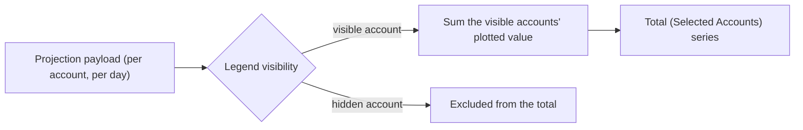

# Projection Selected-Accounts Total PRD

**Status:** Proposed
**Priority:** Medium
**Last Updated:** 2026-10-04
**Feature ID:** 028
**Scope:** The projections chart's combined series changes from a fixed **all-accounts** total to the **total of the accounts currently shown in the legend**. Hiding an account removes it from the total, so the total always matches what is on screen, for every metric. The series is relabelled `Total (Selected Accounts)`. The client composes the total by summing the visible accounts, which makes the server's all-accounts aggregate redundant; it is removed, and the chart's timeline is re-sourced from the accounts. The design is settled: verified current behaviour is stated as fact, the requirements record the intended behaviour, and the decisions taken are recorded in _Settled Decisions_ and _Resolved Decisions_.
**Audience:** Future implementation agent(s), reviewers, and maintainers.
**Sequencing:** Builds on [PRD-025 — Projection Chart Improvements](PRD-025-projection-chart-improvements.md) (Complete), which reworked the chart's legend and control bar — relabelling the series group `Accounts`, moving the combined total's existing toggle outside that group, and adding the `Include` deductions — and moved `balance` composition to the client; and on [PRD-023 — Dynamic Accrual Calculation](PRD-023-dynamic-accrual-calculation.md), which defines the projection payload.

## Purpose

Make the chart's combined series answer the question the legend is already asking: show the total for the accounts the reader has chosen, instead of a total that silently includes accounts hidden from the chart.

## Problem Statement

1. **The total and the legend disagree.** The legend lets a reader narrow the chart to a set of accounts, but the combined series is the sum of **every** account in the payload. Hiding an account changes the lines and bars on screen but not the total, so the total no longer matches what the reader is looking at.
2. **The aggregate a reader wants is the selected one.** "How much do my joint accounts total?" is a question the legend already expresses; today it can only be answered by adding the account series by eye, because the only total available is the all-accounts one.
3. **The all-accounts total is the one value the server computes twice.** The server builds a combined series across every account in the same day loop that builds the per-account series, and the client plots it. Once the client composes the total from the accounts it already holds, that server series has no consumer — it is duplicated work on the wire and in the code.

## Current Behaviour

Verified against the code on 2026-10-04.

**Client** (`Source/Client/pot-react/src`)

- `features/projections/hooks/useProjectionChartData.ts` — emits one `ChartDataPoint` per date. The timeline comes from the server's combined series (`sortedDates = data.global.map(db => db.date)`), and the combined point is the server's aggregate (`point['global'] = resolveMetricValue(globalBalance, metric, include)`). The series label is `Total (All Accounts)` (`config['global'] = { label: 'Total (All Accounts)', color: … }`), and `seriesKeys` is every account `rowId` followed by `'global'`.
- `features/projections/components/ChartControls.tsx` — `TOTAL_SERIES_KEY = 'global'`; the legend renders one toggle per account inside a group labelled `Accounts`, then a divider, then the total's own toggle. The total toggle only controls whether the total series is drawn; it does not filter the accounts.
- `features/projections/components/ProjectionChart.tsx` — series visibility is derived from `hiddenSeries`, and hiding a series only stops it being drawn. The bar tooltip deliberately reveals **all** accounts for the day when the total is hovered, "even when some account series are currently hidden in the chart legend".
- `features/projections/utils/chartHelpers.ts` — the combined series is drawn slightly heavier (`getStrokeWidth` returns `2` for `'global'`).
- `useApiGetProjection` is called only by `ProjectionsPage`; no other feature reads the projection payload.

**Server** (`Source/Server`)

- `Pot.App/Features/Projections/Models/Output.cs` — `Output` carries `Accounts` and a combined `Global` (`DateProjection[]`).
- `Pot.App/Features/Projections/ProjectionsService.cs` — the day loop accumulates the combined series per day across every account (`globalStarting`, `globalIncome`, `globalExpenses`, `globalAccrualSettledByPayments`, `globalDailyAccrual`, `globalAccrued`, `globalArrears`, `globalReserved`, plus the combined item lists) and maps it with the same `MapToDateBalanceAvailable`.
- `Pot.AspNetCore/Features/Projections/Get/Response.cs` — exposes `global` unchanged.
- Every account is published with the **same date points**: each account's `Dates` is built from the same day loop and filtered by `date >= StartDate`, so the timeline can be derived from any account.

**Consumption audit — who reads the combined series**

| Consumer                                                           | Use                                                                                                                                                      | Survives this change?                                            |
| ------------------------------------------------------------------ | -------------------------------------------------------------------------------------------------------------------------------------------------------- | ---------------------------------------------------------------- |
| `useProjectionChartData`                                           | the chart's total series **and** the timeline                                                                                                            | total is replaced by the client sum; timeline must be re-sourced |
| Bar tooltip (`ProjectionChart`)                                    | reveal-all-accounts on total hover                                                                                                                       | reveals only the selected accounts (OD-04)                       |
| `ProjectionsServiceFixture` (`Pot.App.Tests`)                      | many assertions incl. `Should_Publish_Global_Components_As_The_Sum_Of_The_Accounts`                                                                      | updated or removed with the aggregate                            |
| `ProjectionComponentsFixture` (`Pot.AspNetCore.Integration.Tests`) | reads `global` and asserts non-negative components                                                                                                       | updated with the response shape                                  |
| Client tests and factories                                         | `projectionFactory`, `useProjectionChartData.test`, `ProjectionChart.test`, `ChartControls.test`, `useProjections.test`, e2e `projectionsRendering.test` | updated                                                          |
| Postman `Get Projections` request                                  | a request only, no `global` assertions                                                                                                                   | unaffected                                                       |

No other feature, endpoint or server caller reads the combined series.

## Proposed Solution

The requirements below are settled; implementation has not started. Decision references (`S-nn`, `OD-nn`) point to _Settled Decisions_ and _Resolved Decisions_.

- **R1 — The total follows the legend.** The combined series is the sum of the accounts currently shown in the `Accounts` legend, for the selected metric and the displayed period. Hiding an account removes its contribution; showing it re-adds it. This **replaces** the existing all-accounts total rather than joining it (S-1).
- **R2 — Every metric.** The rule applies to `Account Balances`, `Incomes`, `Expenses` and `Operational Accruals` alike. For `Account Balances` the total is the sum of each visible account's already-composed value (so the `Include` deductions of PRD-025 apply per account, then the total).
- **R3 — The common case is unchanged.** With no account hidden, the total equals today's all-accounts total. The total only differs once an account is hidden.
- **R4 — The client composes the total.** The total is the sum of the visible accounts' plotted values, computed in the client from the per-account series the chart already holds. The server's `global` member is not used for it.
- **R5 — The total has its own show/hide toggle, as today.** The total remains a separate toggle outside the account group (PRD-025's layout); hiding it draws no total. Its own visibility is independent of the account selection.
- **R6 — Tooltip and details follow the selection.** The total's tooltip and any detail surface list only the selected accounts (OD-04). A hidden account is by definition not in the total, so the current reveal-all-accounts-on-total-hover behaviour is replaced.
- **R7 — Empty state.** When every account is hidden there is nothing to total, so the existing `No account selected` empty state applies (unchanged from PRD-025).
- **R8 — Naming.** The series is labelled `Total (Selected Accounts)` (OD-01).
- **R9 — Remove the server's combined series.** Because its only consumer is the total being replaced, `Output.Global`, `Response.Global`, the loop's combined accumulators and the combined item lists are removed, leaving one source of truth for the total (OD-02). This is an API break; client and server ship together (see _Deployment_), so no compatibility period is needed.
- **R10 — The timeline comes from the first account's `dates`.** With the combined series removed, the chart's date axis is derived from the first account's `dates` (every account publishes the same date points, A-01), guarded for an empty account list (OD-03). A payload with no accounts keeps its existing no-data behaviour.
- **R11 — No other API change.** Beyond R9/R10, the projections request, response and `ProjectionOptions` are untouched. No new payload member, no account filter, no schema change.

## Resolved Decisions

Resolved on 2026-10-04; these were the open decisions and are now settled.

| ID    | Decision                                                | Notes                                                                                                                                                                                            |
| ----- | ------------------------------------------------------- | ------------------------------------------------------------------------------------------------------------------------------------------------------------------------------------------------ |
| OD-01 | **The series label.** `Total (Selected Accounts)`.      | Chosen because it states the rule in the legend and matches the existing verbose style.                                                                                                          |
| OD-02 | **Remove the server's combined series.**                | Its only consumer is the total being replaced. Removed (R9), accepting the API break; client and server deploy together.                                                                         |
| OD-03 | **Timeline source.** The first account's `dates` (R10). | Every account shares the same date points, so any account works; generating the range would duplicate the server's window logic. The first account's `dates`, guarded for an empty account list. |
| OD-04 | **The total's tooltip.**                                | Reveals only the selected accounts (R6); a hidden account is by definition not in the total. This replaces the previous reveal-all-accounts-on-total-hover behaviour.                            |
| OD-05 | **Single-account selection.** Left as-is.               | No special case; with one account visible the total may duplicate that account's series, as it already can today.                                                                                |

## Settled Decisions

| ID  | Decision                                                                                                                                                     | By whom / when   |
| --- | ------------------------------------------------------------------------------------------------------------------------------------------------------------ | ---------------- |
| S-1 | Replace the total's semantics with the total of the selected (legend-visible) accounts. No second all-accounts total is kept alongside.                      | User, 2026-10-04 |
| S-2 | The rule applies to every metric — `Account Balances` (with the `Include` deductions applied per account), `Incomes`, `Expenses` and `Operational Accruals`. | User, 2026-10-04 |
| S-3 | The `Include` deductions stay balance-only and per account; the total is the sum of the visible accounts' composed values.                                   | User, 2026-10-04 |

## Assumptions

| ID   | Assumption                                                                                                                                                                                    | Requirement |
| ---- | --------------------------------------------------------------------------------------------------------------------------------------------------------------------------------------------- | ----------- |
| A-01 | Every account in the payload publishes the same date points (verified in `ProjectionsService`: one day loop, filtered by `date >= StartDate`), so a timeline can be derived from any account. | R10, OD-03  |
| A-02 | Summing the visible accounts' composed values reproduces the server's current all-accounts total when nothing is hidden, within floating-point tolerance.                                     | R3, R4      |
| A-03 | The total is summed from the same per-account values the chart already plots, so it needs no new server field and respects each account's composition.                                        | R4, R11     |
| A-04 | An empty account list keeps the existing no-data behaviour whether or not the timeline is derived from accounts.                                                                              | R7, R10     |

## Non-Goals

- **No new metric or chart type.** This changes the existing combined series, nothing else.
- **No change to the account toggles' meaning.** They still show/hide account series; they now also drive the total.
- **No change to the per-account series** or to the `Accounts` group layout beyond the total's label.
- **No settlement, accrual or budgeting work.** The total sums the values already plotted.
- **No schema change.**

## Tests

Conventions follow the client test setup in `Source/Client/pot-react/tests`.

- **Client (chart data)** — the total equals the sum of the visible accounts for each metric; hiding an account changes the total and re-showing restores it; with nothing hidden the total equals the all-accounts total; all accounts hidden yields the `No account selected` empty state; the total for `Account Balances` follows the `Include` switches per account.
- **Client (controls/legend)** — the total toggle is labelled `Total (Selected Accounts)` and remains a separate toggle outside the `Accounts` group; the account toggles drive the total; the total's own visibility is independent.
- **Client (tooltip)** — the total's tooltip reports only the selected accounts.
- **Server** — the response no longer carries `global`; the combined-series aggregation and its accumulators are gone; the payload still publishes every account with its date points.
- **Integration** — the response shape is asserted without `global`; the component invariants that ran over the combined series run over the account series.
- **Client (timeline)** — the date axis is derived from the first account's `dates`, guarded for an empty account list.
- **E2E** — toggling an account off/on changes the plotted total by that account's value.

## Design Notes (Rationale and Rejected Alternatives)

- **Why the total series is the right home.** The capability needed is an aggregate for a chosen set of accounts. The legend already expresses that choice, and the chart already has a combined series, so no new metric, chart type or parameter is needed.
- **Rejected: adding a second, selected total beside the all-accounts one.** Two totals are identical whenever nothing is hidden and would clutter the legend; replacing the existing total is simpler and matches the intuitive "what you see is what is summed" rule (S-1).
- **Why the server aggregate is removed.** The audit found no consumer other than the chart's total series. Once the client sums the visible accounts it must compute the total anyway, so the server's all-accounts aggregate would be duplicated work and a dead payload member. The accepted trade-off is the API break and the test churn (R9).
- **Caution: the timeline.** The client currently uses the combined series purely to obtain the date axis. Removing the combined series while leaving the timeline unsourced would blank the chart, so R9 and R10 must move together.

## Deployment

Client and server ship together, so removing the combined series from the projections response needs no compatibility period (the same reasoning PRD-025 used when it removed the derived `available` member).

## Related Documents

- [PRD-025 — Projection Chart Improvements](PRD-025-projection-chart-improvements.md): relabelled the series group `Accounts`, moved the combined total's existing toggle outside it, added the `Include` deductions and moved `balance` composition to the client — the chart surface this feature builds on.
- [PRD-023 — Dynamic Accrual Calculation](PRD-023-dynamic-accrual-calculation.md): defines the projection payload, `IncomeReceived`, `ExpensesPaid` and the assumed-payment basis.
- [PRD-024 — Settlement Ledger](PRD-024-settlement-ledger.md): the (unimplemented) actual-payment history; this feature reads only the projection's forecast movements.
- [PRD-018 — Site Locale and Time Zone Settings](PRD-018-site-locale-settings.md): the site-local date and currency assumptions the chart inherits.
